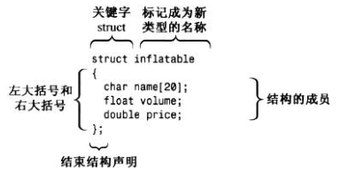
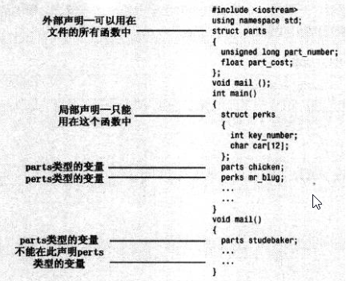

### struct的使用


```c
inflatable hat；   
inflatable woopie_cushion     
inflatable mainframe   

struct inflatable goose；   //C语言结构体对象声明，与C++结构体声明都可以
inflatable Vincent；   //只有C++结构体声明可以用
```
由于hat的类型是inflatable，因此可以使用成员运算符（.）来访问各个成员。例如，hat.volume指的是结构的volume成员，hat.privce,指的是price成员。



指向结构体变量的指针 
要注意的是，只有“指针变量名”后面才能加“->”，千万不要在成员名后面加“->”
以下 3 种形式是等价的： 
• 结构体变量.成员名
• (*指针变量).成员名
• 指针变量->成员名


### 与class的区别

https://blog.csdn.net/yuechuxuan/article/details/81673953

struct能包含成员函数吗？ 能

struct能继承吗？ 能

struct能实现多态吗？ 能

既然这些它都能实现，那它和class还能有什么区别？

最本质的一个区别就是默认的访问控制，默认的继承访问权限：struct是public的，class是private的。

struct作为数据结构的实现体，它默认的数据访问控制是public的，而class作为对象的实现体，它默认的成员变量访问控制是private的

我依旧强调struct是一种数据结构的实现体，虽然它是可以像class一样的用。我依旧将struct里的变量叫数据，class内的变量叫成员，虽然它们并无区别。
到底是用struct还是class，完全看个人的喜好，你可以将程序里所有的class全部替换成struct，它依旧可以很正常的运行。但我给出的最好建议，还是：当你觉得你要做的更像是一种数据结构的话，那么用struct，如果你要做的更像是一种对象的话，那么用class。