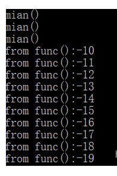
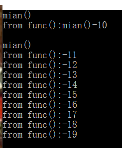
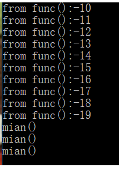
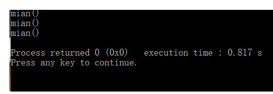

# C++11多线程join()和detach()

### 简介

每一个程序至少拥有一个线程，那就是执行main()函数的主线程，而多线程则是出现两个或两个以上的线程并行运行，即主线程和子线程在同一时间段同时运行。而在这个过程中会出现几种情况：

- 主线程先运行结束
- 子线程先运行结束
- 主子线程同时结束

在一些情况下需要在子线程结束后主线程才能结束，而一些情况则不需要等待，但需注意一点，并不是主线程结束了其他子线程就立即停止，其他子线程会进入后台运行


### join()

join()函数是一个等待线程完成函数，主线程需要等待子线程运行结束了才可以结束。

```c++
#include <iostream>
#include <thread>
using namespace std;

void func()
{
   for(int i = -10; i > -20; i--)
    {
        cout << "from func():" << i << endl;
    }
}

int main()			//主线程
{
	cout << "mian()" << endl;
    cout << "mian()" << endl;
    cout << "mian()" << endl;
	thread t(func);	//子线程
	t.join();		//等待子线程结束后才进入主线程
	return 0;
}
```



```c++
#include <iostream>
#include <thread>
using namespace std;

void func()
{
   for(int i = -10; i > -20; i--)
    {
        cout << "from func():" << i << endl;
    }
}

int main()			//主线程
{
	thread t(func);	//子线程
	cout << "mian()" << endl;
    cout << "mian()" << endl;
    cout << "mian()" << endl;
	t.join();		//等待子线程结束后才进入主线程
	return 0;
}
```



```c++
#include <iostream>
#include <thread>
using namespace std;

void func()
{
   for(int i = -10; i > -20; i--)
    {
        cout << "from func():" << i << endl;
    }
}

int main()			//主线程
{
	thread t(func);	//子线程
	t.join();		//等待子线程结束后才进入主线程
	cout << "mian()" << endl;
    cout << "mian()" << endl;
    cout << "mian()" << endl;
	return 0;
}
```



### detach()

称为分离线程函数，使用detach()函数会让线程在后台运行，即说明主线程不会等待子线程运行结束才结束。

通常称分离线程为守护线程(daemon threads),UNIX中守护线程是指，没有任何显式的用户接口，并在后台运行的线程。这种线程的特点就是长时间运行；线程的生命周期可能会从某一个应用起始到结束，可能会在后台监视文件系统，还有可能对缓存进行清理，亦或对数据结构进行优化。另一方面，分离线程的另一方面只能确定线程什么时候结束，发后即忘(fire andforget)的任务就使用到线程的这种方式。


```c++
#include <iostream>
#include <thread>
using namespace std;

void func()
{
   for(int i = -10; i > -20; i--)
    {
        cout << "from func():" << i << endl;
    }
}

int main()			//主线程
{
	cout << "mian()" << endl;
    cout << "mian()" << endl;
    cout << "mian()" << endl;
	thread t(func);	//子线程
	t.detach();		//分离子线程
	return 0;
}
```



### 总结

- join()函数是一个等待线程函数，主线程需等待子线程运行结束后才可以结束（注意不是才可以运行，运行是并行的），如果打算等待对应线程，则需要细心挑选调用join()的位置。
- detach()函数是子线程的分离函数，当调用该函数后，线程就被分离到后台运行，主线程不需要等待该线程结束才结束。


### Reference

https://blog.csdn.net/qq_36784975/article/details/87699113

https://www.cnblogs.com/adorkable/p/12722209.html