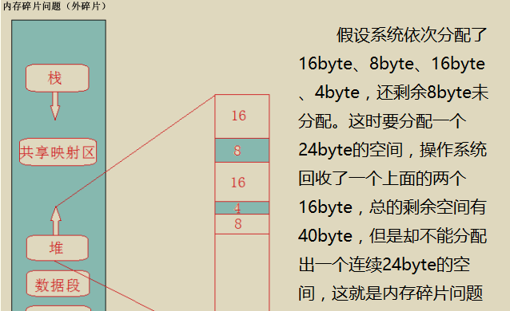

## STL内存池

**内存池出现原因：内存碎片**

首先我们需要明确, 内存池的目的到底是什么?  首先你要知道的是, 我们每次使用**new T**来初始化类型T的时候, 其实发生了两步操作。

- 一个叫**内存分配**, 这一步使用的其实不是new而是operator new(也可以认为就是C语言中的malloc), 这一步是直接和操作系统打交道的, 操作系统可能需要经过相对繁琐的过程才能将一块指向空闲内存的指针返回给用户, 所以这也是new比较耗时的一部分。
- 而第二步就是使用**构造函数初始化该内存**。

​		既然内存分配耗时, 那我们很容易想到的就是一次性分配一大块内存, 然后在用户需要的时候再划分其中一部分给用户, 这样的话, **一次分配, 多次使用, 自然而然提高了效率**, 而用来管理这所谓的一大块内存的数据结构, 也就是今天我们要说的内存池。

　　另外一个好处在于, 频繁地使用new将导致系统内存空间碎片化严重, 容易导致的后果就是很难找到一块**连续**的大块内存, 造成**内存碎片（非连续）**，空间利用率低。

## 内存申请

当申请的内存大小大于128byte时，就启动第一级分配器通过malloc直接向系统的堆空间分配；

如果申请的内存大小小于128byte时，就启动第二级分配器，从一个预先分配好的内存池中取一块内存交付给用户，这个内存池由16个不同大小（8的倍数，8~128byte）的空闲列表组成，allocator会根据申请内存的大小（将这个大小round up成8的倍数）从对应的空闲块列表取表头块给用户。

这种做法有两个优点：

- 小对象的快速分配。小对象是从内存池分配的，这个内存池是系统调用一次malloc分配一块足够大的区域给程序备用，当内存池耗尽时再向系统申请一块新的区域，整个过程类似于批发和零售，起先是由allocator向总经商批发一定量的货物，然后零售给用户，与每次都总经商要一个货物再零售给用户的过程相比，显然是快捷了。当然，这里的一个问题时，内存池会带来一些内存的浪费，比如当只需分配一个小对象时，为了这个小对象可能要申请一大块的内存池，但这个浪费还是值得的，况且这种情况在实际应用中也并不多见。
- 避免了内存碎片的生成。程序中的小对象的分配极易造成内存碎片，给操作系统的内存管理带来了很大压力，系统中碎片的增多不但会影响内存分配的速度，而且会极大地降低内存的利用率。以内存池组织小对象的内存，从系统的角度看，只是一大块内存池，看不到小对象内存的分配和释放。

### 第一级分配器

template<int inst>

class __malloc_alloc_template {…} ;

1.allocate()直接使用malloc()，deallocate()直接使用free()。

2.模拟C++的set_new_handler()以处理内存不足的状况。第一级配置器以malloc()，free()，realloc()等C函数执行实际的内存配置、释放、重配置操作。

### 第二级配置器

template<bool threads,int inst>

class __default_alloc_template {…} ;

1.维护16个自由链表(free lists)，负责16种小型区块的次配置能力。内存池(memory pool)以malloc()配置而得。如果内存不足，转调用第一级配置器。

2.如果需求区块大于128byte，就转调用第一级配置器。

有16个free-lists。各自管理大小分别为8、16、24、32、40、48、56、64、72、80、88、96、104、112、120、128 bytes的小额区块。