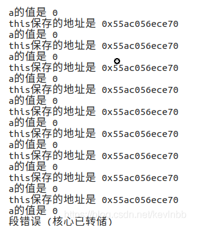

**构造函数不能声明为虚函数**，在执行构造函数前对象尚未完成创建，虚函数表还不存在。 

**析构函数可以被声明为虚函数**，基类的析构函数一般建议声明为虚函数。  


``` c++
#include <iostream>
using namespace std;

class base {
public:
    base() {
        cout << "base constructor" << endl;
        int *b = new int[5];
    }
    ~base() {
        cout << "base destructor" << endl;
        delete[] b;
    }

private:
    int *b;
};

class derived : public base {
public:
    derived() {
        cout << "derived constructor" << endl;
        int *d = new int[8];
    }
    ~derived() {
        cout << "derived destructor" << endl;
        delete[] d;
    }

private:
    int *d;
};

int main()
{
    base *pBase = new derived;
    cout << "---" << endl;
    delete pBase;

    return 0;
}
//output  
base constructor
derived constructor
---
base destructor
```
上面定义了两个类：一个基类base，一个派生类derived。 

基类和派生类都分别定义了各自的构造函数和析构函数。 

基类和派生类中各有一个int型指针成员变量： 

在基类的构造函数中，给指针变量b分配了5个int型空间；基类的析构函数用于将b所指的空间释放掉； 

在派生类的构造函数中，指针成员变量d被分配了8个int型空间；派生类的析构函数是为了释放掉d指针所指向的存储空间。 

在主函数中创建一个基类类型的指针pBase，指向一个派生类对象，之后释放掉pBase指针所指向的对象的存储空间。  

首先，基类的构造函数被调用（base constructor）； 

其次，派生类的构造函数也被调用（derived constructor）； 

最后，基类的析构函数被调用（base destructor）。 

但是却没有调用派生类的析构函数，这样会导致d指针所指向的整型存储空间不会被释放，从而造成内存泄漏。  

需要将基类的析构函数声明为虚函数。  
``` C++
virtual ~base() 
{
    cout << "base destructor" << endl;
    delete[] b;
}
```
基类的析构函数声明为虚函数之后，子类的析构函数也自动成为虚析构函数，在主函数中基类指针pBase指向的是派生类对象，当delete释放pBase指针所指向的存储空间时，

首先执行派生类的析构函数（derived destructor）

然后执行基类的析构函数（base destructor）

综上所述，将基类的析构函数设为虚函数，可以保证派生类被正确地释放。 


#### 析构函数

析构所属那个对象的内存，根本不是由析构函数释放的，而是后面的free，因为你那个对象的内存布局是编译时就确定下来了的，所以仅对于这个析构所属的对象来说，哪怕没有析构函数，内存依旧可以正确释放。
但析构有什么用呢？那是因为如果你那个对象又持有了其他资源，比如其他new对象的指针，文件句柄，互斥量等，那些资源编译器不知道该如何释放它们，那就得靠你的析构来正确释放了。  

指针变量本身是个size_t大小的整形，比如你的class成员只有一个指针，在32位系统上，这个对象占用4字节内存，你delete掉以后，这4个字节会释放掉。如果“对象的内存空间”指的是这个对象本身占用的空间，就是sizeof(object)，那么的确被释放掉了。但通过指针申请的空间并没有被释放，这里出现了内存泄漏。所有裸指针，都需要手动delete。

``` c++
#include<iostream>  
#include<cstring>

using namespace std;  
char* getname(void);

int main(void)  
{   
    char* name;
    name = getname();
    cout << "The length of " << name << " is " << strlen(name) << endl;
    delete [] name;

    name = getname();
    cout << "The length of " << name << " is " << strlen(name) << endl;
    delete [] name;

    system("pause");
}  

char* getname()
{
    char temp[80];
    cout << "Enter last name: ";
    cin >> temp;
    char* pn = new char[strlen(temp)+1];
    strcpy(pn, temp);

    return pn;
}
```

**在类A的析构函数中，delete一个非A类对象通常是没有问题的。但是，**
**在类A的析构函数中，delete一个类A的对象，就会造成死循环，也就是说是不可以的。**

delete和new的操作顺序相反，先调用析构函数，再释放这块内存。

```c++
// 考虑在析构函数中调用delete this，会发生什么
#include <iostream>
using namespace std;

class foo
{
private:
	int a;
public:
	foo() {
		a = 10;
	}
	~foo() {
		a = 0;
		cout << "a的值是 " << a << endl;
		cout << "this保存的地址是 " << this << endl;
		delete this;
		cout << "a的值是 " << a << endl;
		cout << "this保存的地址是 " << this << endl;
	}
};

int main(int argc, char const *argv[])
{
	foo* f = new foo();
	delete f;
	return 0;
}


```



在析构函数中调用delete，delete又去调用析构函数，死循环。


### Reference

https://blog.csdn.net/Master_Cui/article/details/109461561
