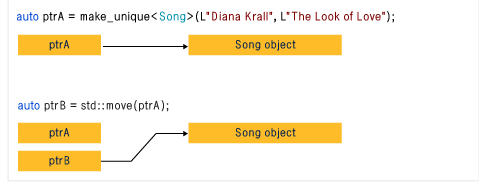

### unique_ptr 

unique_ptr 不共享它的指针。它无法复制到其他 unique_ptr，无法通过值传递到函数，也无法用于需要副本的任何标准模板库 (STL) 算法。

**只能移动unique_ptr**。这意味着，内存资源所有权将转移到另一 unique_ptr，并且**原始 unique_ptr 不再拥有此资源**。我们建议你将对象限制为由一个所有者所有，因为多个所有权会使程序逻辑变得复杂。

因此，当需要智能指针用于纯 C++ 对象时，可使用 unique_ptr，而当构造 unique_ptr 时，可使用make_unique 函数。

std::unique_ptr 实现了独享所有权的语义。一个非空的 std::unique_ptr 总是拥有它所指向的资源。转移一个 std::unique_ptr 将会把所有权也从源指针转移给目标指针（源指针被置空）。拷贝一个 std::unique_ptr 将不被允许，因为如果你拷贝一个 std::unique_ptr ,那么拷贝结束后，这两个 std::unique_ptr 都会指向相同的资源，它们都认为自己拥有这块资源（所以都会企图释放）。因此 std::unique_ptr 是一个仅能移动（move_only）的类型。当指针析构时，它所拥有的资源也被销毁。默认情况下，资源的析构是伴随着调用 std::unique_ptr 内部的原始指针的 delete 操作的。




### 创建unique_ptr

unique_ptr 不像 shared_ptr 一样拥有标准库函数 make_shared 来创建一个 shared_ptr 实例。要想创建一个 unique_ptr，我们需要将一个new 操作符返回的指针传递给 unique_ptr 的构造函数。

**std::make_unique 是 C++14 才有的特性。**

```c++
// 示例：
int main()
{
    // 创建一个unique_ptr实例
    unique_ptr<int> pInt(new int(5));
    cout << *pInt;
}
```


### 无法进行复制构造和赋值操作

```c++
// 示例：
int main() 
{
    // 创建一个unique_ptr实例
    unique_ptr<int> pInt(new int(5));
    unique_ptr<int> pInt2(pInt);    // 报错
    unique_ptr<int> pInt3 = pInt;   // 报错
}
```


### 可以进行移动构造和移动赋值操作

unique_ptr 虽然没有支持普通的拷贝和赋值操作，但却提供了一种移动机制来将指针的所有权从一个 unique_ptr 转移给另一个 unique_ptr 。如果需要转移所有权，可以使用std::move()函数。

```c++
// 示例：
int main() 
{
    unique_ptr<int> pInt(new int(5));
    unique_ptr<int> pInt2 = std::move(pInt);    // 转移所有权
    //cout << *pInt << endl; // 出错，pInt为空
    cout << *pInt2 << endl;
    unique_ptr<int> pInt3(std::move(pInt2));
}
```


### 使用

**返回函数内动态申请的资源**？

```c++
unique_ptr<int> Func(int p)
{
    unique_ptr<int> pInt(new int(p));
    return pInt;    // 返回unique_ptr
}

int main() {
    int p = 5;
    unique_ptr<int> ret = Func(p);
    cout << *ret << endl;
    // 函数结束后，自动释放资源
}
```

当函数返回一个对象，理论上会产生临时变量，会导致新对象的构造和旧对象的析构。

1. 如果支持move构造，那么调用move构造。

2. 如果不支持move，那就调用copy构造。

3. 如果不支持copy，那就报错吧。


**在容器中保存unique_ptr**

```c++
int main() 
{
    vector<unique_ptr<int>> vec;
    unique_ptr<int> p(new int(5));
    vec.push_back(std::move(p));    // 使用移动语义
}
```

