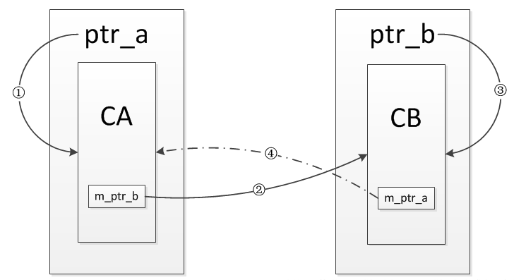

### weak_ptr

​		该类型指针通常不单独使用，只能和shared_ptr搭配使用。借助 weak_ptr 类型指针， 我们可以获取 shared_ptr 指针的一些状态信息，比如有多少指向相同的 shared_ptr 指针、shared_ptr 指针指向的堆内存是否已经被释放等等。

​		**weak_ptr是用来解决shared_ptr相互引用时的死锁问题**，如果说两个shared_ptr相互引用,那么这两个指针的引用计数永远不可能下降为0，资源永远不会释放。它是对对象的一种弱引用，不会增加对象的引用计数，和shared_ptr之间可以相互转化，shared_ptr可以直接赋值给它，它可以通过调用lock函数来获得shared_ptr。

**weak_ptr指针的创建**

1. 可以创建一个空 weak_ptr 指针，例如：

```
std::weak_ptr<int> wp1;
```

2. 凭借已有的 weak_ptr 指针，可以创建一个新的 weak_ptr 指针，例如：

```
std::weak_ptr<int> wp2 (wp1);
```

若 wp1 为空指针，则 wp2 也为空指针；反之，如果 wp1 指向某一 shared_ptr 指针拥有的堆内存，则 wp2 也指向该块存储空间（可以访问，但无所有权）。

3. weak_ptr 指针更常用于指向某一 shared_ptr 指针拥有的堆内存，因为在构建 weak_ptr 指针对象时，可以利用已有的 shared_ptr 指针为其初始化。例如：

```
std::shared_ptr<int> sp (new int);
std::weak_ptr<int> wp3 (sp);
```

由此，wp3 指针和 sp 指针有相同的指针。再次强调，weak_ptr 类型指针不会导致堆内存空间的引用计数增加或减少。


### **weak_ptr提供的成员方法**

| 成员方法    | 功 能                                                        |
| ----------- | ------------------------------------------------------------ |
| operator=() | 重载 = 赋值运算符，是的 weak_ptr 指针可以直接被 weak_ptr 或者 shared_ptr 类型指针赋值。 |
| swap(x)     | 其中 x 表示一个同类型的 weak_ptr 类型指针，该函数可以互换 2 个同类型 weak_ptr 指针的内容。 |
| reset()     | 将当前 weak_ptr 指针置为空指针。                             |
| use_count() | 查看指向和当前 weak_ptr 指针相同的 shared_ptr 指针的数量。   |
| expired()   | 判断当前 weak_ptr 指针为否过期（指针为空，或者指向的堆内存已经被释放）。 |
| lock()      | 如果当前 weak_ptr 已经过期，则该函数会返回一个空的 shared_ptr 指针；反之，该函数返回一个和当前 weak_ptr 指向相同的 shared_ptr 指针 |


### 循环引用

```c++
class CB;
class CA
{
public:
    CA() { cout << "CA() called! " << endl; }
    ~CA() { cout << "~CA() called! " << endl; }
    void set_ptr(shared_ptr<CB>& ptr) { m_ptr_b = ptr; }
    void b_use_count() { cout << "b use count : " << m_ptr_b.use_count() << endl; }
    void show() { cout << "this is class CA!" << endl; }
private:
    shared_ptr<CB> m_ptr_b;
};

class CB
{
public:
    CB() { cout << "CB() called! " << endl; }
    ~CB() { cout << "~CB() called! " << endl; }
    void set_ptr(shared_ptr<CA>& ptr) { m_ptr_a = ptr; }
    void a_use_count() { cout << "a use count : " << m_ptr_a.use_count() << endl; }
    void show() { cout << "this is class CB!" << endl; }
private:
    shared_ptr<CA> m_ptr_a;
};

void test_refer_to_each_other()
{
    shared_ptr<CA> ptr_a(new CA());
    shared_ptr<CB> ptr_b(new CB());

    cout << "a use count : " << ptr_a.use_count() << endl;
    cout << "b use count : " << ptr_b.use_count() << endl;

    ptr_a->set_ptr(ptr_b);
    ptr_b->set_ptr(ptr_a);

    cout << "a use count : " << ptr_a.use_count() << endl;
    cout << "b use count : " << ptr_b.use_count() << endl;
}
```

​		最后CA和CB的对象并没有被析构，其中的引用效果如下图所示，起初定义完ptr_a和ptr_b时，只有①③两条引用，然后调用函数set_ptr后又增加了②④两条引用，当test_refer_to_each_other这个函数返回时，对象ptr_a和ptr_b被销毁，也就是①③两条引用会被断开，但是②④两条引用依然存在，每一个的引用计数都不为0，结果就导致其指向的内部对象无法析构，造成内存泄漏。


**解决**

解决这种状况的办法就是将两个类中的一个成员变量改为`weak_ptr`对象，因为`weak_ptr`不会增加引用计数，使得引用形不成环，最后就可以正常的释放内部的对象，不会造成内存泄漏，比如将`CB`中的成员变量改为`weak_ptr`对象，代码如下：

```c++
class CB
{
public:
    CB() { cout << "CB() called! " << endl; }
    ~CB() { cout << "~CB() called! " << endl; }
    void set_ptr(shared_ptr<CA>& ptr) { m_ptr_a = ptr; }
    void a_use_count() { cout << "a use count : " << m_ptr_a.use_count() << endl; }
    void show() { cout << "this is class CB!" << endl; }
private:
    weak_ptr<CA> m_ptr_a;
};
```

​		CA和CB的对象都被正常的析构了，引用关系如下图所示，流程与上一例子相似，但是不同的是④这条引用是通过weak_ptr建立的，并不会增加引用计数，也就是说CA的对象只有一个引用计数，而CB的对象只有2个引用计数，当test_refer_to_each_other这个函数返回时，对象ptr_a和ptr_b被销毁，也就是①③两条引用会被断开，此时CA对象的引用计数会减为0，对象被销毁，其内部的m_ptr_b成员变量也会被析构，导致CB对象的引用计数会减为0，对象被销毁，进而解决了引用成环的问题。




### Reference

https://blog.csdn.net/qq_34992845/article/details/69218843
