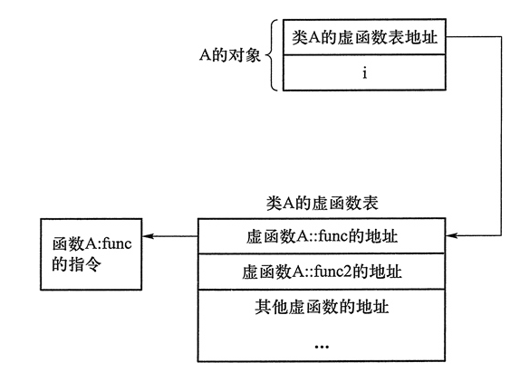
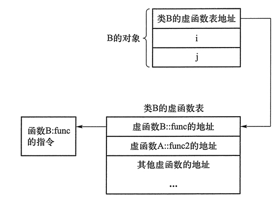

### C++ 虚函数表

#### 虚表

”多态“的关键在于通过基类指针或引用调用一个虚函数时，编译时不确定到底调用的是基类还是派生类的函数，运行时确定，核心是虚函数表，简称虚表。

```c++
#include <iostream>
using namespace std;
class A
{
public:
    int i;
    virtual void func() {}
    virtual void func2() {}
};
class B : public A
{
    int j;
    void func() {}
};
int main()
{
    cout << sizeof(A) << ", " << sizeof(B);  //输出 8,12
    return 0;
}

//在 32 位编译模式下，程序的运行结果是：
//8, 12

//如果将程序中的 virtual 关键字去掉，输出结果变为：
//4, 8
```

有了虚函数之后，对象所占用的存储空间比没有虚函数时多了4个字节。实际上，任何有虚函数的类及其派生类的对象都包含这多出来的4个字节——它位于对象存储空间的最前端，存放的是虚表的地址。






虚表是一个指针数组，其元素是虚函数的指针，每个元素对应一个虚函数的函数指针。但普通函数的调用不经过虚表，所以虚表的元素并不包含普通函数的函数指针。

