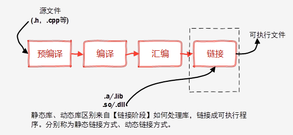
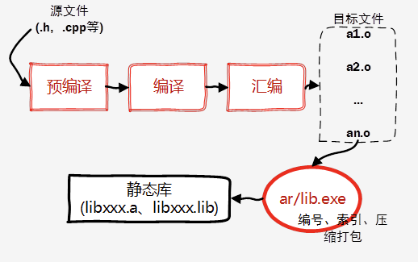
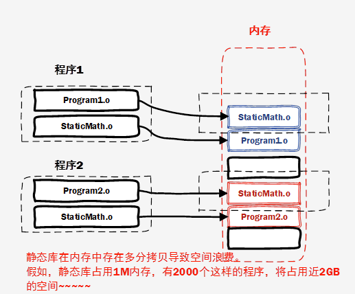

### 什么是库？

库是写好的，现有的，成熟的，可以复用的代码。**现实中每个程序都要依赖很多基础的底层库，不可能每个人的代码都从零开始，因此库的存在意义非同寻常**。

本质上来说，库是一种可执行代码的二进制形式，可以被操作系统载入内存执行。库有两种：静态库（.a、.lib）和动态库（.so、.dll）。

所谓静态、动态是指链接。回顾一下，将一个程序编译成可执行程序的步骤：

### 静态库

　　之所以称为【静态库】，是因为在链接阶段，**会将汇编生成的目标文件.o与引用到的库一起链接打包到可执行文件中**。因此对应的链接方式称为静态链接。

　　试想一下，静态库与汇编生成的目标文件一起链接为可执行文件，那么静态库必定跟.o文件格式相似。其实一个静态库可以简单看成是**一组目标文件（.o/.obj文件）的集合**，即很多目标文件经过压缩打包后形成的一个文件。静态库特点总结如下：

- 静态库对函数库的链接是放在编译时期完成的。
- 程序在运行时与函数库再无瓜葛，移植方便。
- 浪费空间和资源，因为所有相关的目标文件与牵涉到的函数库被链接合成一个可执行文件。 

Linux下使用***ar\***工具、Windows下vs使用***lib.exe\***，将目标文件压缩到一起，并且对其进行编号和索引，以便于查找和检索。一般创建静态库的步骤如图所示：

### 动态库

为什么还需要动态库，其实也就是静态库的特点导致。

- 空间浪费是静态库的一个问题。

- 另一个问题是静态库对程序的更新、部署和发布页会带来麻烦。如果静态库libxx.lib更新了，所有使用它的应用程序都需要重新编译、发布给用户（对于玩家来说，只是一个很小的改动，却导致整个程序重新下载，全量更新）。

　　动态库在程序编译时并不会被连接到目标代码中，而是在程序运行是才被载入。**不同的应用程序如果调用相同的库，那么在内存里只需要有一份该共享库的实例**，规避了空间浪费问题。动态库在程序运行时才被载入，也解决了静态库对程序的更新、部署和发布页会带来麻烦。用户只需要更新动态库即可，**增量更新**。

动态库特点总结：

- 动态库把对一些库函数的链接载入推迟到程序运行的时期。　
- 可以实现进程之间的资源共享。（因此动态库也称为共享库）
- 将一些程序升级变得简单。
- 甚至可以真正做到链接载入完全由程序员在程序代码中控制（**显示调用**）。　

### 动态库的显式调用

**在Linux下显示调用动态库**

\#include<dlfcn.h>提供了下面几个接口：

- void * **dlopen**( const char * pathname, int mode )：函数以指定模式打开指定的动态连接库文件，并返回一个句柄给调用进程。
- void* **dlsym**(void* handle,const char* symbol)：dlsym根据动态链接库操作句柄(pHandle)与符号(symbol)，返回符号对应的地址。使用这个函数不但可以获取函数地址，也可以获取变量地址。
- int **dlclose** (void *handle)：dlclose用于关闭指定句柄的动态链接库，只有当此动态链接库的使用计数为0时,才会真正被系统卸载。
- const char *dlerror(void)：当动态链接库操作函数执行失败时，dlerror可以返回出错信息，返回值为NULL时表示操作函数执行成功。

**在Windows下显示调用动态库**

　　应用程序必须进行函数调用，以在运行时显示加载DLL。为显示链接到DLL，应用程序必须：

- 调用 **LoadLibrary**（或相似的函数）以加载 DLL 和获取模块句柄。
- 调用 **GetProcAddress**，以获取指向应用程序要调用的每个导出函数的函数指针。由于应用程序是通过指针调用 DLL 的函数，编译器不生成外部引用，故无需与导入库链接。
- 使用完 DLL 后调用 **FreeLibrary**。

### Reference

https://www.cnblogs.com/codingmengmeng/p/6046481.html

