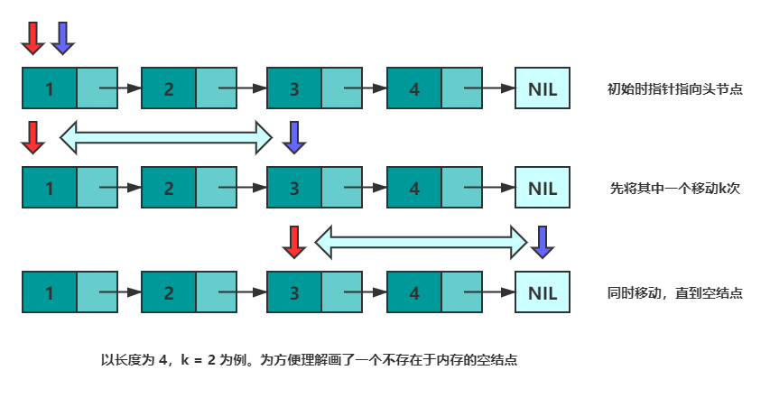

## 链表

### 141.环形链表

相爱相杀好基友——数组与链表
作为线性表的两种存储方式 —— 链表和数组，这对相爱相杀的好基友有着各自的优缺点。接下来，我们梳理一下这两种方式。

<font color='red'>**数组**</font>，所有元素都连续的存储于一段内存中，且每个元素占用的内存大小相同。这使得数组具备了通过下标快速访问数据的能力。

但连续存储的缺点也很明显，增加容量，增删元素的成本很高，时间复杂度均为 O(n)。增加数组容量需要先申请一块新的内存，然后复制原有的元素。如果需要的话，可能还要删除原先的内存。


删除元素时需要移动被删除元素之后的所有元素以保证所有元素是连续的。增加元素时需要移动指定位置及之后的所有元素，然后将新增元素插入到指定位置，如果容量不足的话还需要先进行扩容操作。


总结一下数组的优缺点：

优点：可以根据偏移实现快速的随机读写。

缺点：扩容，增删元素极慢。

<font color='red'>**链表**</font>，由若干个结点组成，每个结点包含数据域和指针域。结点结构如下图所示：


一般来讲，链表中只会有一个结点的指针域为空，该结点为尾结点，其他结点的指针域都会存储一个结点的内存地址。链表中也只会有一个结点的内存地址没有存储在其他结点的指针域，该结点称为头结点。


链表的存储方式使得它可以高效的在指定位置插入与删除，时间复杂度均为 O(1)。
在结点 p 之后**增加**一个结点 q 总共分三步：

- 申请一段内存用以存储 q (可以使用内存池避免频繁申请和销毁内存)。
- 将 p 的指针域数据复制到 q 的指针域。
- 更新 p 的指针域为 q 的地址。

**删除**结点 p 之后的结点 q 总共分两步：

- 将 q 的指针域复制到 p 的指针域。
- 释放 q 结点的内存。

链表的主要代码

```c++
#include <bits/stdc++.h>

using namespace std;
//定义一个结点模板
template<typename T>
struct Node {
	T data;
	Node *next;
	Node() : next(nullptr) {}
	Node(const T &d) : data(d), next(nullptr) {}
};

//删除 p 结点后面的元素
template<typename T>
void Remove(Node<T> *p) {
	if (p == nullptr || p->next == nullptr) {
		return;
	}
	auto tmp = p->next->next;
	delete p->next;
	p->next = tmp;
}

//在 p 结点后面插入元素
template<typename T>
void Insert(Node<T> *p, const T &data) {
	auto tmp = new Node<T>(data);
	tmp->next = p->next;
	p->next = tmp;
}

//遍历链表
template<typename T, typename V>
void Walk(Node<T> *p, const V &vistor) {
	while(p != nullptr) {
		vistor(p);
		p = p->next;
	}
}
  
int main() {
	auto p = new Node<int>(1);
	Insert(p, 2);
	int sum = 0;
	Walk(p, [&sum](const Node<int> *p) -> void { sum += p->data; });
	cout << sum << endl;
	Remove(p);
	sum = 0;
	Walk(p, [&sum](const Node<int> *p) -> void { sum += p->data; });
	cout << sum << endl;
	return 0;
}
```

**面试问题总结**

无法高效获取长度，无法根据偏移快速访问元素，是链表的两个劣势。然而面试的时候经常碰见诸如<font color='red'>获取倒数第k个元素，获取中间位置的元素，判断链表是否存在环，判断环的长度等</font>和长度与位置有关的问题。这些问题都可以通过灵活运用双指针来解决。

Tips：双指针并不是固定的公式，而是一种思维方式~

先来看"**倒数第k个元素的问题**"。设有两个指针 p 和 q，初始时均指向头结点。首先，先让 p 沿着 next 移动 k 次。此时，p 指向第 k+1个结点，q 指向头节点，两个指针的距离为 k 。然后，同时移动 p 和 q，直到 p 指向空，此时 q 即指向倒数第 k 个结点。可以参考下图来理解：



```c++
class Solution {
public:
    ListNode* getKthFromEnd(ListNode* head, int k) {
        ListNode *p = head, *q = head; //初始化
        while(k--) {   //将 p指针移动 k 次
            p = p->next;
        }
        while(p != nullptr) {//同时移动，直到 p == nullptr
            p = p->next;
            q = q->next;
        }
        return q;
    }
};
```

**获取中间元素的问题**。设有两个指针 fast 和 slow，初始时指向头节点。每次移动时，fast向后走两次，slow向后走一次，直到 fast 无法向后走两次。这使得在每轮移动之后。fast 和 slow 的距离就会增加一。设链表有 n 个元素，那么最多移动 n/2 轮。当 n 为奇数时，slow 恰好指向中间结点，当 n 为 偶数时，slow 恰好指向中间两个结点的靠前一个(可以考虑下如何使其指向后一个结点呢？)。


下述代码实现了 n 为偶数时慢指针指向靠后结点。

```c++
class Solution {
public:
    ListNode* middleNode(ListNode* head) {
        ListNode *p = head, *q = head;
        while(q != nullptr && q->next != nullptr) {
            p = p->next;
            q = q->next->next;
        }
        return p;
    } 
};
```

**是否存在环的问题**。如果将尾结点的 next 指针指向其他任意一个结点，那么链表就存在了一个环。

上一部分中，总结快慢指针的特性 —— 每轮移动之后两者的距离会加一。下面会继续用该特性解决环的问题。
当一个链表有环时，快慢指针都会陷入环中进行无限次移动，然后变成了追及问题。想象一下在操场跑步的场景，只要一直跑下去，快的总会追上慢的。当两个指针都进入环后，每轮移动使得慢指针到快指针的距离增加一，同时快指针到慢指针的距离也减少一，只要一直移动下去，快指针总会追上慢指针。


根据上述表述得出，如果一个链表存在环，那么快慢指针必然会相遇。实现代码如下：

```c++
class Solution {
public:
    bool hasCycle(ListNode *head) {
        ListNode *slow = head;
        ListNode *fast = head;
        while(fast != nullptr) {
            fast = fast->next;
            if(fast != nullptr) {
                fast = fast->next;
            }
            if(fast == slow) {
                return true;
            }
            slow = slow->next;
        }
        return nullptr;
    }
};
```

最后一个问题，如果存在环，如何判断环的长度呢？方法是，快慢指针相遇后继续移动，直到第二次相遇。两次相遇间的移动次数即为环的长度。


## 搜索

### 深度优先搜索

​		DFS在搜索到一个新的节点时，立即对该新节点进行遍历，因此遍历需要使用**先入后出的栈**来实现，也可以用与栈等价的**递归**来实现。

​		DFS也可以用来检测环路，记录每个遍历过的节点的父节点，若一个节点被再次遍历且父节点不同，则说明有环。也可以用拓扑排序判断是否有环路，若最后存在入度不为0的点，则说明有环。

​		有时候我们可能需要对已经搜索过的节点进行标记，以防止在遍历时重复搜索某个节点，这种做法叫做**状态记录或记忆化**。


#### 695、岛屿的最大面积

一般来说，深度优先搜索的题可以分为主函数和辅函数，主函数用来遍历所有的搜索位置，判断是否可以开始搜索，如果可以即在辅函数进行搜索。辅函数负责深度优先搜索的递归调用。当然，我们可以使用栈stack实现深度优先搜索。

递归

- 我们想知道网格中每个连通形状的面积，然后取最大值。

- 如果我们在一个土地上，以 4 个方向探索与之相连的每一个土地（以及与这些土地相连的土地），那么探索过的土地总数将是该连通形状的面积。

- 为了确保每个土地访问不超过一次，我们每次经过一块土地时，将这块土地的值置为 0。这样我们就不会多次访问同一土地。


栈

我们可以用栈来实现深度优先搜索算法。这种方法本质与方法一相同，唯一的区别是：

- 方法一通过函数的调用来表示接下来想要遍历哪些土地，让下一层函数来访问这些土地。而方法二把接下来想要遍历的土地放在栈里，然后在取出这些土地的时候访问它们。

- 访问每一片土地时，我们将对围绕它四个方向进行探索，找到还未访问的土地，加入到栈 stack 中；

- 另外，只要栈 stack 不为空，就说明我们还有土地待访问，那么就从栈中取出一个元素并访问。


```c++
// 递归
class Solution
{
	private:
		int dfs(vector<vector<int>>&grid, int cur_i, int cur_j)
		{
			if (cur_i < 0 || cur_j < 0 || cur_i == grid.size() || cur_j == grid[0].size()
				|| grid[cur_i][cur_j] != 1)
			{
				return 0;
			}

			grid[cur_i][cur_j] = 0;
			int di[4] = { 0, 0, 1, -1 };
			int dj[4] = { 1, -1, 0, 0 };
			int ans = 1;
			for (int index = 0; index != 4; ++index)
			{
				int next_i = cur_i + di[index], next_j = cur_j + dj[index];
				ans += dfs(grid, next_i, next_j);
			}
			return ans;
		}

	public:
		int maxAreaOfIsland(vector<vector<int>>&grid)
		{
			int ans = 0;
			for (int i = 0; i != grid.size(); ++i)
			{
				for (int j = 0; j != grid[0].size(); ++j)
				{
					ans = max(ans, dfs(grid, i, j));
				}
			}
			return ans;
		}
};

// 栈
class Solution
{
	public:
		int maxAreaOfIsland(vector<vector<int>>& grid)
		{
			int ans = 0;
			for (int i = 0; i < grid.size(); ++i)
			{
				for (int j = 0; j < grid[0].size(); ++j)
				{
					int cur = 0;
					stack<int> stacki;
					stack<int> stackj;
					stacki.push(i);
					stackj.push(j);
					while (!stacki.empty())
					{
						int cur_i = stacki.top(), cur_j = stackj.top();
						stacki.pop(); stackj.pop();
						if (cur_i < 0 || cur_j < 0 || cur_i == grid.size() || cur_j == grid[0].size()
							|| grid[cur_i][cur_j] != 1)
						{
							continue;
						}

						++cur;
						grid[cur_i][cur_j] = 0;
						int di[4] = { 0, 0, 1, -1 };
						int dj[4] = { 1, -1, 0, 0 };
						for (int index = 0; index != 4; ++index)
						{
							int next_i = cur_i + di[index], next_j = cur_j + dj[index];
							stacki.push(next_i); stackj.push(next_j);
						}
					}
					ans = max(ans, cur);
				}
			}
            return ans;
		}
};
```


#### 剑指567 朋友圈

```c++
int findCircleNum(vector<vector<int>>& friends)
{
	int n = friends.size(), count = 0;
	vector<bool> visited(n, false);
	for (int i = 0; i < n; ++i)
	{
		if (!visited[i])
		{
			dfs(friends, i, visited);
			++count;
		}
	}
	return count;
}

void dfs(vector<vector<int>>& friends, int i, vector<bool>& visited)
{
	visited[i] = true;
	for (int k = 0; k < friends.size(); ++k)
	{
		if (friends[i][k] == 1 && !visited[k])
		{
			dfs(friends, k, visited);
		}
	}
}
```


#### 417、太平洋大西洋水流问题

```c++
class Solution 
{
    public:
    vector<int> direction{ -1, 0, 1, 0, -1 };

    vector<vector<int>> pacificAtlantic(vector<vector<int>>& matirx)
    {
        if (matirx.empty() || matirx[0].empty())
        {
            return {};
        }

        vector<vector<int>> ans;
        int m = matirx.size(), n = matirx[0].size();
        vector<vector<bool>> can_reach_p(m, vector<bool>(n, false));
        vector<vector<bool>> can_reach_a(m, vector<bool>(n, false));
        for (int i = 0; i < m; ++i)
        {
            dfs(matirx, can_reach_p, i, 0);
            dfs(matirx, can_reach_a, i, n-1);
        }
        for (int i = 0; i < n; ++i)
        {
            dfs(matirx, can_reach_p, 0, i);
            dfs(matirx, can_reach_a, m-1, i);
        }
        for (int i = 0; i < m; i++)
        {
            for (int j = 0; j < n; ++j)
            {
                if (can_reach_p[i][j] && can_reach_a[i][j])
                {
                    ans.push_back(vector<int>{i, j});
                }
            }
        }
        return ans;
    }

    void dfs(const vector<vector<int>>& matirx, vector<vector<bool>>& can_reach,
        int r, int c)
    {
        if (can_reach[r][c]) return;

        can_reach[r][c] = true;
        int x, y;
        for (int i = 0; i < 4; ++i)
        {
            x = r + direction[i], y = c + direction[i + 1];
            if (x >= 0 && x < matirx.size() &&
                y >= 0 && y < matirx[0].size() &&
                matirx[r][c] <= matirx[x][y])
            {
                dfs(matirx, can_reach, x, y);
            }
        }
    }
};
```


### 回溯

​		回溯法是优先搜索的一种特殊情况，又称为试探法，常用于需要记录节点状态的深度优先搜索。通常来说，排列、组合、选择类问题使用回溯法比较方便。

​		在搜索到某一节点的时候，如果我们发现目前的节点（及其子节点）并不是需求目标时，我们回退到原来的节点继续搜索，**并且把在目前节点修改的状态还原**。这样的好处在于我们始终只对图的总状态进行修改，而非每次遍历时新建一个图来储存状态。

​		在具体写法上，与普通的深度优先搜索一样，都有【修改当前节点状态】——【递归子节点】的步骤，只是多了回溯的步骤，变成了【修改当前节点状态】——【递归子节点】——【回改当前节点】。

​		小诀窍：按引用传递状态，所有状态修改在递归完成后回改。

​		修改一般有两种情况：一种是修改最后一位输出，比如排列组合；一种是修改访问标记，比如矩阵里搜索字符串。


#### 46、全排列

给定一个**不含重复数字**的数组 `nums` ，返回其 **所有可能的全排列** 。你可以 **按任意顺序** 返回答案。

```c++
class Solution
 {
    private:
        vector<vector<int>> res;
        vector<int> path;

    public:
        vector<vector<int>> permute(vector<int>& nums)
        {
            int n = nums.size();
            vector<bool> used(n, false);
            
            backtrack(nums, used);
            return res;
        }

        void backtrack(vector<int>& nums, vector<bool>& used)
        {
            if (path.size() == nums.size())
            {
                res.push_back(path);
                return;
            }

            for (int i = 0; i < nums.size(); i++)
            {
                if (used[i] == true) continue;
                used[i] = true;
                path.push_back(nums[i]);
                backtrack(nums, used);
                path.pop_back();
                used[i] = false;
            }
        }
};
```

​	

#### 77、组合

```c++
class Solution 
{
    private:
        vector<vector<int>> res;
        vector<int> tmp;

    public:
        vector<vector<int>> combine(int n, int k) 
        {
            backTracking(n, k, 1);
            return res;
        }

        void backTracking(int n, int k, int cur)
        {
            if(tmp.size() == k)
            {
                res.push_back(tmp);
                return;
            }

            for(int i = cur; i <= n; i++)
            {
                tmp.push_back(i);
                backTracking(n, k, i+1);
                tmp.pop_back();
            }
        }
};
```

