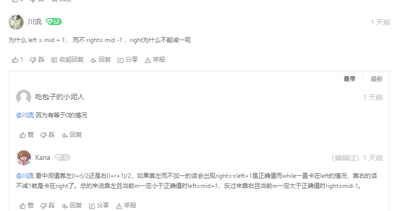

一般而言，当一个题目出现以下特性时，你就应该立即联想到它可能需要使用二分查找：

- 待查找的数组**有序或者部分有序**
- 要求时间复杂度低于O(n)，或者直接要求时间复杂度为**O(log n)**



**标准二分查找**

```c++
int BinarySerach(vector<int> nums, int target)
{
    int left = 0;
    int right = nums.size() -1;
    
    while(left <= right)
    {
        int mid = left + (right - left)/2;
        if(nums[mid] == target)
        {
            return mid;
        }
        if(nums[mid] < target)
        {
			left = mid + 1；
        }
        if(nums[mid] > target)
        {
            right = mid - 1;
        }
    }
    return left;
}
```

- 循环条件中包含了 `left == right`的情况，则我们必须在每次循环中改变 `left` 和 `right`的指向，以防止进入死循环

- 循环终止的条件包括：

  找到了目标值

  `left > right` （这种情况发生于当left, mid, right指向同一个数时，这个数还不是目标值，则整个查找结束。）


**左边界版**

target在数组中重复存在时，输出最左侧元素的下标

```c++
int BinarySerach(vector<int> nums, int target)
{
    int left = 0, right = nums.size();
    while(left <= right)
    {
		int mid = left + (right - left)/2;
        if(nums[mid] < target)
        {
            left = mid + 1;
		}
        else if(nums[mid] > target)
        {
            right = mid - 1;
        }
        else
        {
            right = mid - 1; // 找到target了也不返回，进一步缩小区域
        }
        
        // 循环退出条件 left = right + 1
        if（ left >= nums.size() || nums[left] != target) //没找到
            return -1;
        
        return left;
    }
}
```


**右边界版**

target在数组中重复存在时，输出最右侧元素的下标

```c++
int BinarySerach(vector<int> nums, int target)
{
    int left = 0, right = nums.size();
    while(left <= right)
    {
		int mid = left + (right - left)/2;
        if(nums[mid] < target)
        {
            left = mid + 1;
		}
        else if(nums[mid] > target)
        {
            right = mid - 1;
        }
        else
        {
            left = mid + 1; // 找到target了也不返回，进一步缩小区域
        }
        
        // 循环退出条件 left = right + 1
        // 找不到的两种情况：left为0时，right为-1；
        // left越界了，仍找不到满足的元素，此时right为数组最后一个元素
        if（ right < 0 || nums[right] != target) 
            return -1;
        
        return right;
    }
}
```


### 34. 在排序数组中查找元素的第一个和最后一个位置

**当搜索左边界时：**找到 target 时不要立即返回，而是缩小 "搜索区间" 的上界 high，在区间 [low, mid - 1] 中继续搜索，即不断向左收缩，达到锁定左侧边界的目的。

**当搜索右边界时：**找到 target 时不要立即返回，而是增大 "搜索区间" 的下界 low，在区间 [mid + 1, high]中继续搜索，即不断向右收缩，达到锁定右侧边界的目的。


**第 1 部分：查找 target 出现的第 1 个位置**

二分查找的基本用法是在一个有序数组里查找目标元素，具体是看区间中间元素的值 nums[mid] 与 target 的大小关系。

- 如果等于，就可以直接返回；
- 如果严格大于，就往右边查找；
- 如果严格小于，就往左边查找。

就这 3 种情况，先判断等于，然后再判断大于还是小于，符合人们正常的思维。

- 如果当前看到的元素 恰好等于 target，那么当前元素有可能是 target 出现的第 1 个位置，由于我们要找第 1 个位置，此时我们应该向左边继续查找；
- 如果当前看到的元素 严格大于 target，那么当前元素一定不是要找的 target 出现的第 1 个位置，第 1 个位置肯定出现在 mid 的 左边 ，因此就需要在 [left, mid] 区间里继续查找；
- 如果当前看到的元素 严格小于 target，那么当前元素一定不是要找的 target 出现的第 1 个位置，第 1 个位置肯定出现在 mid 的 右边 ，因此就需要在 [mid + 1, right] 区间里继续查找。

**第 2 部分：查找 target 出现的最后 1 个位置**

```c++
class Solution 
{
    public:
        vector<int> searchRange(vector<int>& nums, int target) 
        {
            vector<int> range = {-1 , -1};
            if(nums.size() == 0)
            {
                return range;
            }

            //找最后一个小于target的值
            int left = 0, right = nums.size()-1;
            int lastLessThanTarget = 0;
            while(left <= right)
            {
                int mid = left + (right - left)/2;
                if(nums[mid] < target)
                {
                    left = mid + 1;
                }
                else
                {
                    right = mid - 1; //最后一次left = right = mid 循环的时候
                                     // right - 1了所以指向target前一个
                    				// 等于target也要继续往左边寻找
                }
            }
            firstIndex = right + 1;

            //找第一个大于target的值
            left = 0;
            right = nums.size()-1;
            int firstLargeThanTarget = 0;
            while(left <= right)
            {
                int mid = left + (right - left)/2;
                if(nums[mid] <= target)
                {
                    left = mid + 1;
                }
                else
                {
                    right = mid - 1; // 同样是最后一次循环 left = right = mid的时候
                                     // right - 1 指向了前一个
                }
            }
            lastIndex = right;

            if(firstIndex <= lastIndex && lastIndex < nums.size()
            && nums[firstIndex] == target && nums[lastIndex] == target)
            return vector<int> {firstIndex, lastIndex};

            return range;
        }
};
```


### Reference

https://zhuanlan.zhihu.com/p/72545170

https://leetcode-cn.com/problems/find-first-and-last-position-of-element-in-sorted-array/solution/da-jia-bu-yao-kan-labuladong-de-jie-fa-fei-chang-2/