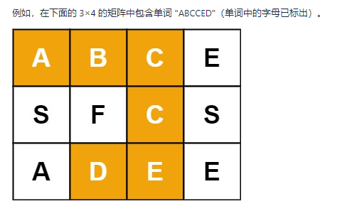

### 回溯算法

#### [剑指 Offer 38. 字符串的排列](https://leetcode-cn.com/problems/zi-fu-chuan-de-pai-lie-lcof/)

输入一个字符串，打印出该字符串中字符的所有排列。

你可以以任意顺序返回这个字符串数组，但里面不能有重复元素。

```c++
class Solution
{
    private:
        vector<string> res;
        vector<bool> vis;

    public:
        vector<string> permutation(string s) 
        {
            int n = s.size();
            vis.resize(n);
            sort(s.begin(), s.end());

            string str;
            backTracking(str, 0, n, s);

            return res;
        }

        void backTracking(string& str, int i, int n, string& s)
        {
            if(i == n)
            {
                res.push_back(str);
                return;
            }

            for(int j = 0; j < n; j++)
            {
                if(vis[j] || (j > 0 && s[j] == s[j-1] && vis[j-1] == false))
                {
                    continue;
                }

                vis[j] = true;
                str.push_back(s[j]);
                backTracking(str, i+1, n, s);
                str.pop_back();
                vis[j] = false;
            }
        }
};
```


#### [剑指 Offer 12. 矩阵中的路径](https://leetcode-cn.com/problems/ju-zhen-zhong-de-lu-jing-lcof/)

给定一个 m x n 二维字符网格 board 和一个字符串单词 word 。如果 word 存在于网格中，返回 true ；否则，返回 false 。

单词必须按照字母顺序，通过相邻的单元格内的字母构成，其中“相邻”单元格是那些水平相邻或垂直相邻的单元格。同一个单元格内的字母不允许被重复使用。



```c++
class Solution 
{
    public:
        bool exist(vector<vector<char>>& board, string word) 
        {
            rows = board.size();
            cols = board[0].size();
            for(int i = 0; i < rows; i++)
            {
                for(int j = 0; j < cols; j++)
                {
                    if(dfs(board, word, i, j, 0))
                        return true;
                }
            }
            return false;
        }

    private:
        int rows, cols;
        bool dfs(vector<vector<char>>& board, string& word, int i, int j, int k)
        {
            if(i >= rows || i < 0 || j >= cols || j < 0 || board[i][j] != word[k])
                return false;
            if(k == word.size()-1) return true;

            board[i][j] = '\0';
            int dx[4] = {-1, 0, 1, 0};
            int dy[4] = {0, 1, 0, -1};
            for(int z = 0; z < 4; z++)
            {
                int m = i + dx[z]; int n = j + dy[z];
                if(dfs(board, word, m, n, k+1))
                    return true; 
            }
            board[i][j] = word[k];
            return false;
        }
};
```


#### [剑指 Offer 13. 机器人的运动范围](https://leetcode-cn.com/problems/ji-qi-ren-de-yun-dong-fan-wei-lcof/)

```c++
class Solution {
public:
    // 全局变量统计个数
    int count = 0;
    int movingCount(int m, int n, int k) {
        vector<vector<bool>> visited(m, vector<bool>(n, false));
        backtrack(m, n, k, 0, 0, visited);
        return count;
    }

    void backtrack(int m, int n, int k, int i, int j, vector<vector<bool>>& visited){
        // 结束条件 base cases
        if(i >= m || i < 0 || j < 0 || j >= n || sums(i, j) > k || visited[i][j])  return;

        count++;
        // 做选择
        visited[i][j] = true;

        // 方向数组
        int dx[4] = {1, 0, 0, -1}, dy[4] = {0, 1, -1, 0};
        for(int t = 0; t < 4; t++){
            int p = i + dx[t];
            int q = j + dy[t];
            backtrack(m, n, k, p, q, visited);
        }
    }

    /* 计算坐标 (i, j) 两个数的数位和之和 */
    int sums(int i, int j){
        int sum = 0;
        while(i != 0){
            sum += i % 10;
            i /= 10;
        }

        while(j != 0){
            sum += j % 10;
            j /= 10;
        }

        return sum;
    }
};
```

★★★★★★★本题和其他回溯算法的题目有一个巨大的不一样的点，就是没有撤销选择这一步骤，这是因为这道题不是说要找到一条路径，所以说当寻找第二条路时原来第一条找过的点可以撤销，重新使用；这道题是要让我们找到所有可达解，所以只要走过的点，就永远不能再走了。

