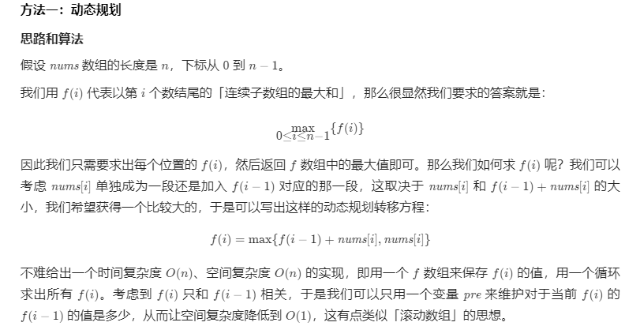

剑指 Offer 42. 连续子数组的最大和

输入一个整型数组，数组中的一个或连续多个整数组成一个子数组。求所有子数组的和的最大值。

要求时间复杂度为O(n)。

解：



```c++
class Solution 
{
    public:
        int maxSubArray(vector<int>& nums) 
        {
            int F_n_1 = 0, F_n = nums[0];
            for (const auto &x: nums) 
            {
                F_n_1 = max(F_n_1 + x, x); 
                F_n = max(F_n, F_n_1); 
            }
            return F_n;
        }
};
```

