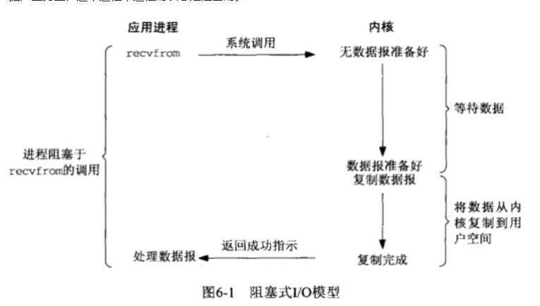
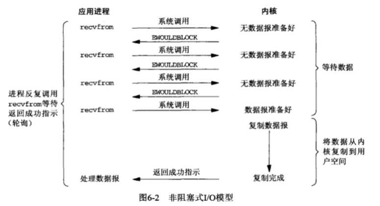
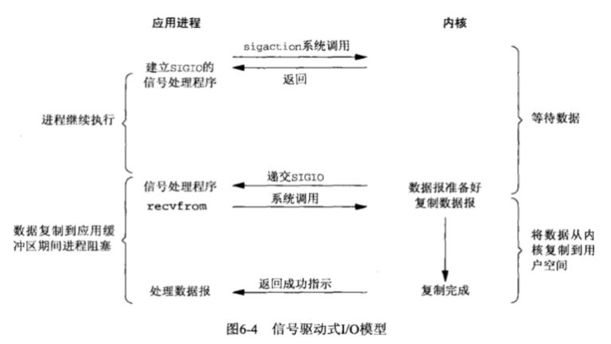
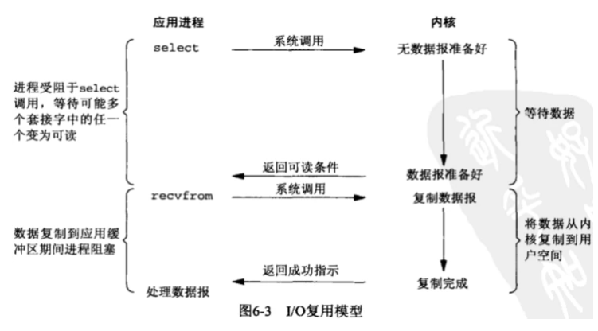

### **阻塞IO**

调用者调用了某个函数，等待这个函数返回，期间什么也不做，不停的去检查这个函数有没有返回，必须等这个函数返回才能进行下一步动作

如上图所示，在linux中，用户态进程调用recvfrom系统调用接收数据，当前内核中并没有准备好数据，该用户态进程将一直在此等待，不会进行其他的操作，待内核态准备好数据，将数据从内核态拷贝到用户空间内存，然后recvfrom返回成功的指示，此时用户态进行才解除阻塞的状态，处理收到的数据。

### 非阻塞IO

非阻塞等待，每隔一段时间就去检测IO事件是否就绪。没有就绪就可以做其他事。

​		如上图，用户态进程调用recvfrom接收数据，当前并没有数据报文产生，此时recvfrom返回EWOULDBLOCK，用户态进程会一直调用recvfrom询问内核，待内核准备好数据的时候，之后用户态进程不再询问内核，待数据从内核复制到用户空间，recvfrom成功返回，用户态进程开始处理数据。

### 信号驱动IO

与阻塞式IO和非阻塞式有了一个本质区别，用户态进程不再等待内核态的数据准备好，直接可以去做别的事情

信号驱动IO:linux用套接口进行信号驱动IO，安装一个信号处理函数，进程继续运行并不阻塞，当IO时间就绪，进程收到SIGIO信号。然后处理IO事件。

​		如上图所示，当需要等待数据的时候，首先用户态会向内核发送一个信号，告诉内核我要什么数据，然后用户态就不管了，做别的事情去了，而当内核态中的数据准备好之后，内核立马发给用户态一个信号，说”数据准备好了，快来查收“，用户态进程收到之后，立马调用recvfrom，等待数据从内核空间复制到用户空间，待完成之后recvfrom返回成功指示，用户态进程才处理别的事情。

### IO复用/多路转接IO

linux用select/poll函数实现IO复用模型，这两个函数也会使进程阻塞，但是和阻塞IO所不同的是这两个函数可以同时阻塞多个IO操作。而且可以同时对多个读操作、写操作的IO函数进行检测。知道有数据可读或可写时，才真正调用IO操作函数

套用到I/O复用模型上，可以对应到如下应用场景：如果一个进程需要等到多种不同的消息，那么一般的做法就是开启多条线程，每个线程接收一类消息，如果每个线程都是采用阻塞式I/O模型，那么每个线程在消息未产生的时候就会阻塞，也就是说在多线程中使用阻塞式I/O。I/O复用就是基于上述的场景中，无需采用多线程监听消息的方式，进程直接监听所有的消息类型，这其中就涉及到select、poll、epoll等不同的方法。

如上图所示，用户态进程采用select的方法，通过select可以等待多个不同类型的消息，如果其中有一个类型的消息准备好，则select会返回信息，然后用户态进程调用recvfrom接收数据。

可以将select复用机制看作是一个描述符集合的管理，进程通过向这个集合中放入不同的描述符，用来等待不同的消息产生，然后通过select统一的进行管理，让其可以同时等待这个集合中任意一个事件的产生。

I/O复用和阻塞式I/O很相似，不同的是，**I/O复用等待多类事件**，**阻塞式I/O只等待一类事件**，另外，在I/O复用中，会产生两个系统调用（如上图，select和recvfrom），而阻塞式I/O只产生一个系统调用。那么这就涉及到具体的性能问题，当只存在一类事件的时候，使用阻塞式I/O模型的性能会更好，当存在多种不同类型的事件时，I/O复用的性能要好的多，因为阻塞式I/O模型只能监听一类事件，所以这个时候需要使用多线程进行处理。

**异步IO:**

linux中，可以调用aio_read函数告诉内核描述字缓冲区指针和缓冲区的大小、文件偏移及通知的方式，然后立即返回，当内核将数据拷贝到缓冲区后，再通知应用程序。

同步IO

Reference

https://segmentfault.com/a/1190000016359495
