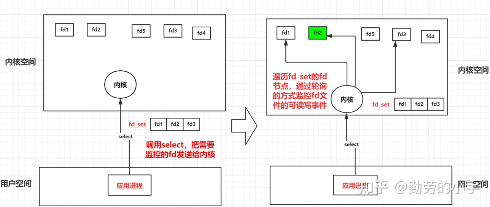
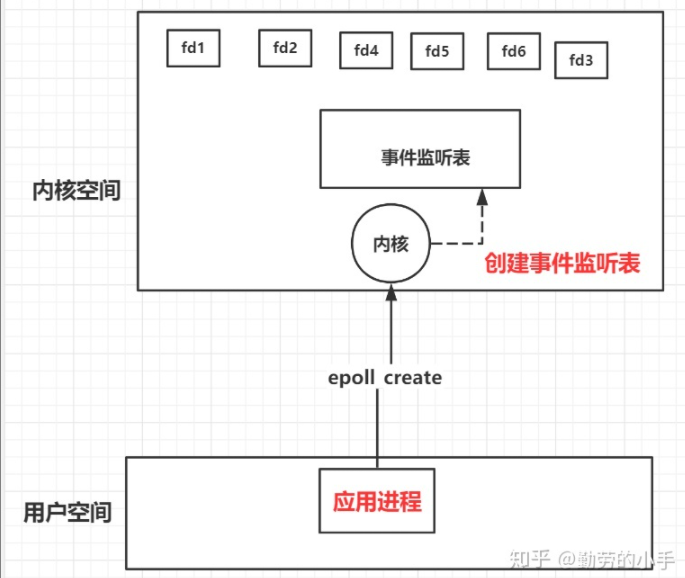
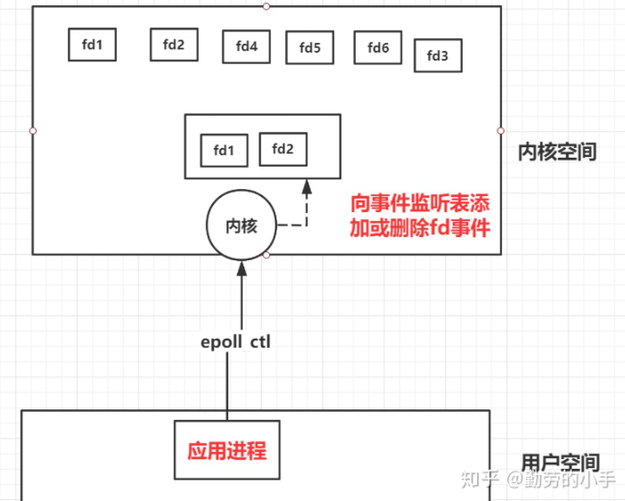
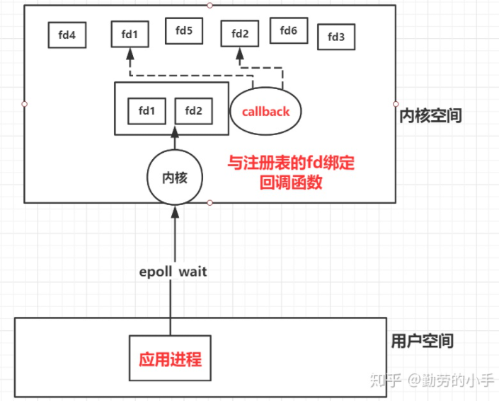
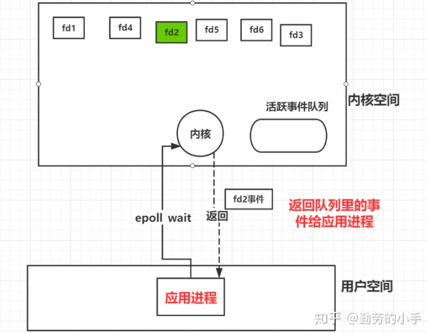

`select、poll、epoll都是IO多路复用模型的解决方案，目标是为了解决单个应用进程能同时处理多个网络连接的问题。


## **select**

应用进程想要通过select 去监控多个连接（也就是fd）的话需要经向大概如下的流程：

1. 在调用select之前告诉select 应用进程需要监控哪些fd可读、可写、异常事件，这些分别都存在一个fd_set数组中。
2. 然后应用进程调用select的时候把3个fd_set传给内核（**这里也就产生了一次fd_set在用户空间到内核空间的复制**），内核收到fd_set后对fd_set进行遍历，然后一个个去扫描对应fd是否满足可读写事件。



3. 如果发现了有对应的fd有读写事件后，内核会把fd_set里没有事件状态的fd句柄清除，然后把有事件的fd返回给应用进程（**这里又会把fd_set从内核空间复制用户空间**）。

4. 最后应用进程收到了select返回的活跃事件类型的fd句柄后，再向对应的fd发起数据读取或者写入数据操作。


缺点

- 每调用一次select 就需要3个事件类型的fd_set需从用户空间**拷贝**到内核空间去，返回时select也会把保留了活跃事件的fd_set返回(从内核拷贝到用户空间)。当fd_set数据大的时候，这个过程消耗是很大的。
- select需要逐个**遍历**fd_set集合 ，然后去检查对应fd的可读写状态，如果fd_set 数据量多，那么遍历fd_set 就是一个比较耗时的过程。
- fd_set是个集合类型的数据结构有长度限制,32位系统长度1024,62位系统长度2048，这个就限制了select最多能同时监控1024个连接。


## **poll**

​		在早期计算机网络并不发达，所以并发网络请求并不会很高，select模型也足够使用了，但是随着网络的高速发展，高并发的网络请求程序越来越多，而select模式下 fd_set 长度限制就开始成为了致命的缺陷。

​		吸取了select的教训，poll模式就不再使用数组的方式来保存自己所监控的fd信息了，poll模型里面通过使用链表的形式来保存自己监控的fd信息，正是这样poll模型里面是没有了连接限制，可以支持高并发的请求。

​		和select还有一点不同的是保存在链表里的需要监控的fd信息采用的是pollfd的文件格式，select 调用返回的fd_set是只包含了上次返回的活跃事件的fd_set集合，下一次调用select又需要把这几个fd_set清空，重新添加上自己感兴趣的fd和事件类型，而poll采用的pollfd 保存着对应fd需要监控的事件集合，也保存了一个当返回于激活事件的fd集合。 所以重新发请求时不需要重置感兴趣的事件类型参数。

```c++
struct polifd
{
	int fd; //文件描述符
	short events;	//注册的事件
	short revents;	//实际发生的事件，由内核填充
}
```

其他方面与select没有多大区别，select的问题poll上也存在。


## **epoll**

不同于select 和poll的直接调用方式，epoll采用的是一组方法调用的方式，它的工作流程大致如下：

**1、创建内核事件表（epoll_create）**。

这里主要是向内核申请创建一个fd的文件描述符作为内核事件表（B+树结构的文件，没有数量限制），这个描述符用来保存应用进程需要监控哪些fd和对应类型的事件。



**2、添加或移出监控的fd和事件类型（epoll_ctl）。**

调用此方法可以是向内核的内核事件表 动态的添加和移出fd 和对应事件类型。



**3、epoll_wait 绑定回调事件**

内核向事件表的fd绑定一个回调函数。



当监控的fd活跃时，会调用callback函数把事件加到一个活跃事件队列里。


最后在epoll_wait 返回的时候内核会把活跃事件队列里的fd和事件类型返回给应用进程。



​		最后，从epoll整体思路上来看，采用事先就在内核创建一个事件监听表，后面只需要往里面添加移出对应事件，因为本身事件表就在内核空间，所以就避免了向select、poll一样每次都要把自己需要监听的事件列表传输过去，然后又传回来，这也就避免了事件信息需要在用户空间和内核空间相互拷贝的问题。

​		然后epoll并不是像select一样去遍历事件列表，然后逐个轮询的监控fd的事件状态，而是事先就建立了fd与之对应的回调函数，当事件激活后主动回调callback函数，这也就避免了遍历事件列表的这个操作,所以epoll并不会像select和poll一样随着监控的fd变多而效率降低，这种事件机制也是epoll要比select和poll高效的主要原因。


## **Reference**

https://zhuanlan.zhihu.com/p/126278747

