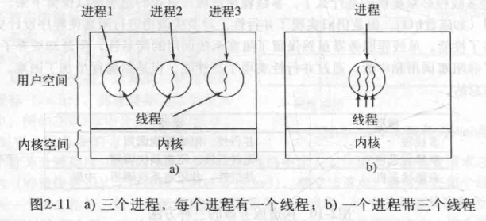

## 现代操作系统

### 进程与线程

#### 2.1进程

2.1.1进程模型

**进程**是对正在运行程序的一个**抽象**。

一个瞬间只能运行一个**进程**，但在1秒钟内可能运行多个**进程**

2.1.2进程的创建

**守护进程**：停留在后台处理如电子邮件、web页面、打印之类活动的进程称为守护进程。UNIX中利用ps程序列出在运行的进程，windows任务管理器。

在UNIX中，只有一个系统调用用来创建新进程，fork。创建一个与调用进程相同的副本，两个进程拥有相同的内存映像、相同的环境字符串和同样的打开文件，通常子进程接着执行execve或一个类似的系统调用，修改内存映像并运行一个新的程序。

在windows中正相反，CreateProcess既处理进程的创建，也负责把正确的程序装入进程。

进程创建之后，父进程和子进程有各自不同的地址空间。

2.2.3进程的终止

正常退出

出错退出

严重错误

2.1.4进程的层次结构

进程只有一个父进程，但是可以有0.1.2.3多个子进程。

2.1.5进程的状态

运行态（该时刻进程实际占用CPU）

就绪态（可运行，但是因为其他进程正在运行而暂时停止）

阻塞态（除非某种外部事件发生，否则进程不能运行）

2.1.6进程的实现

2.1.7多道程序设计模型

CPU利用率 1-p^n

#### 2.2 线程

2.21线程的使用

为什么需要在一个进程中再有一类进程？

在许多应用中同时发生着多种活动，某些活动随着时间的推移会被阻塞。通过将这些应用程序分解成可以准并行运行的多个顺序线程，程序设计模型会变得简单。

需要线程对同一个文件进行操作的情况，多个线程可以共享内存，多个进程是不能工作的。

2.2.2经典的线程模型

进程模型基于两种独立的概念：资源分组与执行。

**进程用于把资源集中到一起，而线程则是在CPU上被调度执行的实体。**

在同一个进程中并行运行多个线程，是对在同一计算机上并行运行多个进程的模拟。

多个线程共享同一个地址空间和其他资源，多个进程共享物理内存、磁盘、打印机和其他资源。

通过在多个**进程**之间来回切换，系统制造了不同的顺序进程并行运行的假象。多线程的工作方式也是类似的，CPU在线程之间的快速切换，制造了线程并行运行的假象。

线程之间是没有保护的，不可能也没有必要。

资源管理的单位是进程而非线程。

每个线程有自己的堆栈，存放相应过程的局部变量以及调用完成之后使用的返回地址。

2.2.3POSIX线程

pthread线程包

2.2.4在用户空间中实现线程

整个线程包放在用户空间中，用户级线程包可以在不支持线程的操作系统上实现。

2.2.5在内核中实现线程

2.2.6混合实现

#### 2.3进程间通信

同样的问题和解决方法适用于线程。

一个进程如何把信息传递给另一个

两个或多个进程在关键活动中不会交叉

正确的顺序，A产生数据B打印数据，B在打印之前必须等待A。

2.3.1竞争条件

当两个或多个进程读写某些共享数据，最后的结果取决于进程运行的精确时序。

2.3.2临界区

怎样避免竞争条件？凡是涉及共享内存、共享文件以及共享任何资源的情况都会引发类似的错误。

避免：某种阻止多个进程同时读写共享数据的途径。**（互斥）**

把对共享内存进行访问的程序片段称作临界区。

2.3.3忙等待的互斥

1.屏蔽中断

在单处理器系统中，最简单的方法就是使每个进程在刚刚进入临界区后立即屏蔽所有中断，这样在屏蔽中断之后CPU将不会被切换到其他进程。

不好！

2.锁变量

设想有一个共享锁变量，初始值为0，当一个进程想进入其临界区时，首先测试这把锁，如果该锁的值为0，则该进程将其设为1并进入临界区，若锁的值已经为1，则进程将等待直到其值变为0.

0就表示临界区内没有进程，1表示已经有某个进程进入临界区。

3.严格轮换法

连续一个变量直到某个值出现为止，成为忙等待。只有在有理由认为等待时间是非常短的情况下才使用忙等待。用于忙等待的锁，称为**自旋锁**。

4.Peterson互斥算法

5.TSL指令（跳过了）

2.3.4睡眠与唤醒

4、5都有忙等待的缺点，这些解法的**本质**上是：当一个进程想要进入临界区时，先检查是否允许进入，若不允许，则该进程原地等待，直到允许为止。

浪费CPU的时间，也可能引起意想不到的结果。（优先级反转问题）

sleep是一个引起调用进程阻塞的系统调用，即被挂起，直到另外一个进程将其唤醒。

wakeup调用有一个参数，即要被唤醒的系统调用。

2.3.5信号量

引入一个新的变量类型，信号量。

一旦一个信号量操作开始，则在该操作完成或阻塞之前，其他进程均不允许访问该信号量。

原子操作：一组相关联的操作要么都不间断的执行，要么都不执行。

2.3.6互斥量

如果不需要信号量的计数能力，有时可以使用信号量的一个简化版本，成为互斥量。互斥量仅仅适用于管理共享资源或一小段代码。

互斥量是一个可以处于两态之一的变量，解锁和加锁。

当一个线程（或进程）需要访问临界区时，它调用mutex_lock，如果该互斥量当前是解锁的，则此调用成功，调用线程可自由进入该临界区，如果该互斥量已经加锁，调用线程被阻塞，直到在临界区中的线程完成并调用mutex_unlock。如果多个线程被阻塞在该互斥量上，则随机选择一个线程允许它获得锁。

POSIX线程—Pthreads是POSIX的线程标准，定义了创建和操纵线程的一套API。Pthread提供许多可以用来同步线程的函数，其基本机制是使用一个可以被锁定和解锁的互斥量来保护每个临界区。

