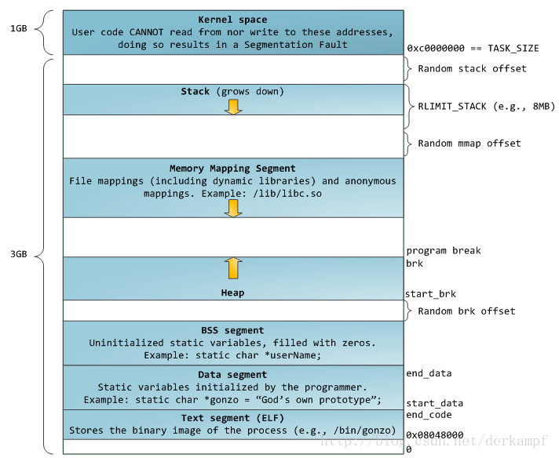

## 程序的内存分布

**栈：**由编译器决定在需要时分配，通常是局部变量

**堆：**一般由程序员分配释放

**自由存储区：**malloc等分配的内存块，和堆十分相似，不过是用free来释放的

**全局/静态存储区：**全局变量和静态变量被分配到同一块内存中，在C语言中，全局变量又分为初始化和未初始化的，在C++中没有这个区分，共占用同一块内存区

**常量存储区：**存放常量

