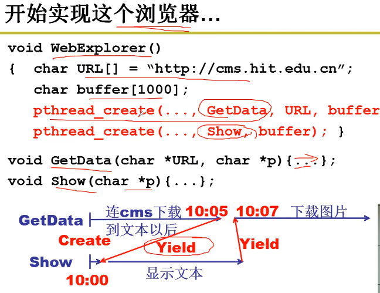
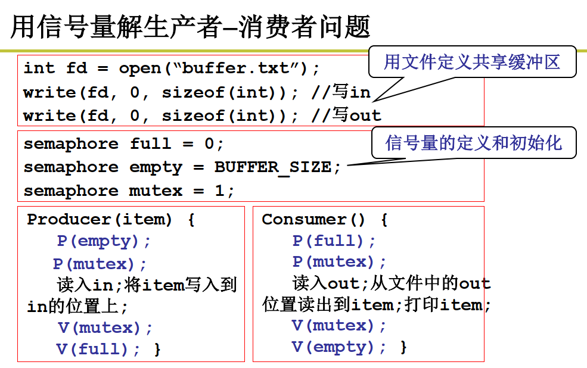

## 操作系统

管理计算机硬件的软件系统

### 操作系统接口

操作系统接口。连接操作系统和应用软件，表现为一些函数。

即系统调用，接口表现为函数调用，由系统提供,所以称作系统调用。

POSIX：Portable Operating System Interface Of Unix

### 系统调用的实现 （System Call！）

**将内核程序和用户程序隔离**

区分内核态和用户态。

当前程序在什么态，由于PC—CS：IP是当前指令，所以用CS最低两位表示：0内核态，3用户态。

初始DPL = 0 、CPL = 3。

硬件提供了主动进入内核的方法，进入内核的唯一方法。int 指令使CS中的CPL更改为0，进入内核。

系统调用的核心：

- 用户程序中包含int指令的代码
- 操作系统写中断处理，获取想调程序的编号
- 操作系统根据编号执行相应的代码

### 学习任务

掌握CPU管理、内存管理，磁盘管理、终端设备管理。

进程、进程管理、地址（*p = 7）、虚拟内存、文件系统、文件、设备文件、设备驱动

### CPU管理

工作原理：取址执行

有IO指令和无IO指令计算时间的差别

一个CPU上交替执行多个程序：并发

### 多进程图像

PCB：Process Control Block 用来记录进程信息的数据结构

进程调度：FIFO、Priority

内存管理的主要内容：多进程的地址空间分离

如何形成多进程图像？

- 读写PCB
- 操作寄存器完成切换
- 调度程序
- 进程的同步与合作
- 有地址映射

### 用户级线程

线程之间共享资源

Create？Yield？

### 内核级线程

用户栈 内核栈

### 内核级线程实现

### P13 操作系统之“树”

### P14 CPU调度策略

FIFO？

Priority？

**如何合理的调度？**

- 吞吐量和响应时间有矛盾
- 前台任务和后台任务的关注点不同
- IO密集型和CPU密集型任务有各自的特点

**基本CPU调度算法**

**FCFS（First Come First Served）**

如何降低周转时间：**SJF（短作业优先）**

那响应时间怎么办？**RR：按时间片轮转调度**，时间片大：响应时间长；时间片小，吞吐量小。

同时存在要求周转时间和响应时间两种任务？

死板的执行优先级调度会产生饥饿。

### P15 一个实际的schedule函数

### P16 进程同步与信号量

多个进程合理有序的向前执行，控制这个有序过程的关键是信号。

**引入信号量** 

生产者——消费者模式

存在多个生产者时，无法唤醒其他生产者，counter无法满足要求了。

### P17 信号量临界区保护

**什么是信号量？**

通过对这个量的访问和修改，让大家有序推进。

**临界区：**一段代码一次只允许一个进程进入。读写信号量的代码一定是临界区

**临界区代码保护原则**

基本原则：互斥进入

好的临界区保护原则：有空让进、有限等待

1.轮换法

2.标记法

3.Peterson算法

**临界区保护的另一类解法**

只允许一个进程进入，另一个进程进入时意味着什么？

被调度：另一个进程只有被调度才能执行，才能进入临界区，，如何阻止调度？

关中断。

原子保护法

**用临界区保护信号量，用信号量实现同步**

### P18 信号量的代码实现

### P19 死锁处理

**死锁的处理方法**

- **死锁预防**

  

- **死锁避免**

  

  

  m-资源个数 n-进程个数，时间复杂度高

- **死锁检测+恢复**

  

- **死锁忽略**

  

  

### P20 内存的使用和分段

引入分段：是将整个程序一起载入内存中吗？

### P21 内存分区与分页

内存怎么分割？

**固定分区与可变分区**

但物理内存采用分页方式。

**引入分页：解决内存分区导致的内存效率问题**

内存的角度上，空间浪费少；用户的角度上，支持分段

MMU去算

