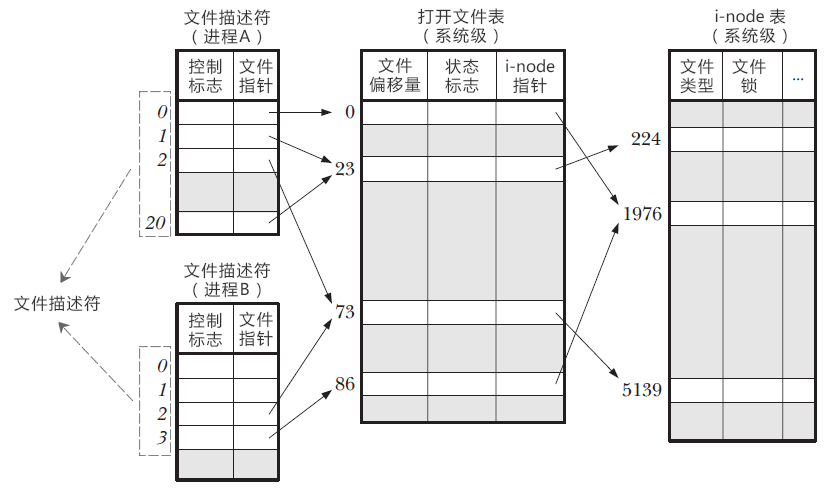

Linux下一切都是文件，比如C++源文件、视频文件、shell脚本、可执行文件等。

一个Linux进程可以打开成百上千个文件，为了表示和区分已经打开的文件，Linux会给每个文件分配一个编号（ID），这个编号就是一个整数，被称为文件描述符（File Descriptor）。

## 文件描述符是什么

一个Linux进程启动后，会在内核空间中创建一个PCB控制块，PCB内部有一个文件描述表，记录当前进程所有可用的文件描述符，即当前进程所有打开的文件。

除了文件描述符表，系统还需要维护另外两张表：

- 打开文件表（Open file table）
- i-node 表（i-node table）

通过文件描述符——可以找到文件指针——从而进入打开文件表。该表存储了以下信息：

- 文件偏移量，也就是文件内部指针偏移量。调用 read() 或者 write() 函数时，文件偏移量会自动更新，当然也可以使用 lseek() 直接修改。
- 状态标志，比如只读模式、读写模式、追加模式、覆盖模式等。
- i-node 表指针。

然而，要想真正读写文件，还得通过打开文件表的 i-node 指针进入 i-node 表，该表包含了诸如以下的信息：

- 文件类型，例如常规文件、套接字或 FIFO。
- 文件大小。
- 时间戳，比如创建时间、更新时间。
- 文件锁。

对上图的进一步说明：

- 在进程 A 中，文件描述符 1 和 20 都指向了同一个打开文件表项，标号为 23（指向了打开文件表中下标为 23 的数组元素），这可能是通过调用 dup()、dup2()、fcntl() 或者对同一个文件多次调用了 open() 函数形成的。
- 进程 A 的文件描述符 2 和进程 B 的文件描述符 2 都指向了同一个文件，这可能是在调用 fork() 后出现的（即进程 A、B 是父子进程关系），或者是不同的进程独自去调用 open() 函数打开了同一个文件，此时进程内部的描述符正好分配到与其他进程打开该文件的描述符一样。
- 进程 A 的描述符 0 和进程 B 的描述符 3 分别指向不同的打开文件表项，但这些表项均指向 i-node 表的同一个条目（标号为 1976）；换言之，它们指向了同一个文件。发生这种情况是因为每个进程各自对同一个文件发起了 open() 调用。同一个进程两次打开同一个文件，也会发生类似情况。 

## Reference

http://c.biancheng.net/view/3066.html