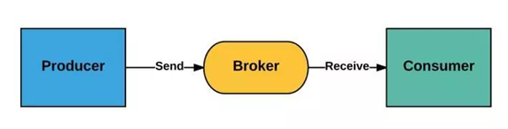

### 一、什么是消息队列

消息队列（Message Queue，简称MQ），指保存消息的一个容器，本质是个队列。

消息（Message）是指在应用之间传送的数据，消息可以非常简单，比如只包含文本字符串，也可以更复杂，可能包含嵌入对象。

消息队列（Message Queue）是一种应用间的通信方式，消息发送后可以立即返回，有消息系统来确保信息的可靠专递，消息发布者只

管把消息发布到MQ中而不管谁来取，消息使用者只管从MQ中取消息而不管谁发布的，这样发布者和使用者都不用知道对方的存在。

Producer：消息生产者，负责产生和发送消息到 Broker；

Broker：消息处理中心。负责消息存储、确认、重试等，一般其中会包含多个 queue；

Consumer：消息消费者，负责从 Broker 中获取消息，并进行相应处理；

### 二、为什么需要消息队列

1、屏蔽异构平台的细节：发送方、接收方系统之间不需要了解双方，只需认识消息。

2、异步：消息堆积能力；发送方接收方不需同时在线，发送方接收方不需同时扩容（削峰）。

3、解耦：防止引入过多的API给系统的稳定性带来风险；调用方使用不当会给被调用方系统造成压力，被调用方处理不当会降低调用方系

统的响应能力。

4、复用：一次发送多次消费。

5、可靠：一次保证消息的传递。如果发送消息时接收者不可用，消息队列会保留消息，直到成功地传递它。

6、提供路由：发送者无需与接收者建立连接，双方通过消息队列保证消息能够从发送者路由到接收者，甚至对于本来网络不易互通的两

个服务，也可以提供消息路由。

**Reference**

https://www.zhihu.com/question/54152397/answer/1847120125
