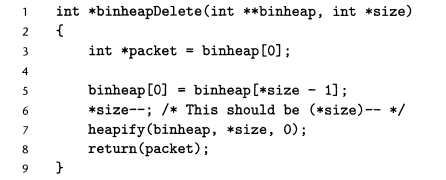
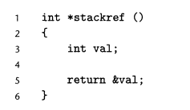

### 进程控制

#### 获取进程pid

每个进程都有一个唯一的正数（非零）进程ID（PID）。

getpid，getppid返回一个pid_t的整数值。

#### 创建和终止进程

新创建的子进程几乎但不完全和父进程相同。

fork函数只调用一次但是返回两次。在父进程中返回子进程的pid，在子进程中返回0.

父进程和子进程是并发运行的独立进程。不同的系统上交替执行的顺序可能不同。

#### 回收子进程

一个终止了但是还未被回收的进程称为**僵死进程**。

#### 让进程休眠

sleep函数将一个进程挂起一段指定的时间

pause，该函数让调用函数休眠，直到该进程收到一个信号。

#### 加载并运行程序

execve函数在当前进程的上下文中加载并运行一个新程序。


------

**程序和进程的区别**

程序是一堆代码和数据；程序可以作为目标文件存在于磁盘上，或者作为段存在于地址空间中。

进程是执行中程序的一个具体的实例；程序总是运行在某个进程的上下文中。

fork在新的子进程中运行相同的程序。

execve函数在当前进程的上下文中加载并运行一个新的程序。它会覆盖当前进程的地址空间，但并没有创建一个新进程。

------


### 信号

一个信号就是一条小消息，它通知进程系统中发生了一个某种类型的事件。

每种信号类型都对应于某种系统事件，底层的硬件异常是由内核异常处理程序处理的，正常情况下对用户进程而言是不可见的。


### 虚拟地址

CPU通过生成一个虚拟地址来访问主存，这个虚拟地址在被送到内存之前先转换成适当的物理地址（地址翻译）。

CPU芯片上的内存管理单元（MMU），利用存放在主存中的查询表来动态翻译虚拟地址，表的内容由操作系统管理。

#### <font color='red'>动态内存分配</font>

动态内存分配器维护着一个进程的虚拟内存区域，称为堆。

**malloc和free**

C标准库提供了malloc的显示分配器，程序通过调用malloc函数来从堆中分配内存块。

malloc返回一个指针，指向大小为至少size字节的内存块，这个块会为可能包含在这个块中的任何数据对象类型做对齐。在32位模式中，malloc返回的块的地址总是8的倍数，在64位模式中，该地址总是16的倍数。

**为什么要使用动态内存分配？**

程序使用动态内存分配的最重要的原因是直到程序实际运行时，才知道某些数据结构的大小。

```c++
#include <csapp.h>

int main()
{
    int* array, i ,n;
    scanf("%d", &n);
    array = (int*)Malloc(n* sizeof(int));
    for(int i = 0; i < n; ++i)
    {
        scanf("%d", &array[i]);
    }
    free(array);
    exit(0);
}
```

**C程序中常见的内存有关的错误**

1.<font color='red'>简接引用坏指针</font>

例如scanf，正确的使用是传递给scanf一个格式串和变量的地址。

scanf("%d", &val);

而不是，

scanf("%d", val);

2.<font color='red'>读取未初始化的内存</font>

3.<font color='red'>栈缓冲区溢出</font>

4.<font color='red'>假设指向对象的指针和它们指向的对象是相同大小的</font>

5.<font color='red'>错位错误</font>

6.<font color='red'>引用指针，而不是它所指的对象</font>



——和*优先级相同，从右向左结合，减少了指针自己的值

7.<font color='red'>误解指针运算</font>

8.<font color='red'>引用不存在的变量</font>



9.<font color='red'>引用空闲堆块中的数据</font>

10.<font color='red'>内存泄漏</font>

