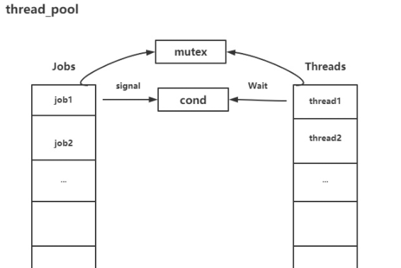

### 什么是线程池？

线程池的概念在之前的文章中曾经多次的讲解过，线程池就是为了解决线程在程序中因频繁创建和销毁而消耗大量时间而存在的。它可以有效的控制程序中线程的数量，尤其是在需要处理大量短任务的情况下，更是鲜有成效。

即在程序开始正式任务之前，先创建出一些线程，这些线程在程序不会被销毁，而且程序在运行中也不会再去创建线程。这样在程序的运行期间就提高了效率。

思路：先创建出一组线程，利用条件变量将线程阻塞。一旦任务队列向任务队列中添加了任务，则唤醒一个线程取执行该任务。如果此时任务队列中有任务但无线程，则任务等待执行线程结束后再取执行。

### **线程池设计的基本思想**

清楚了线程池设计的目的，接下来思考如何设计一个线程池。

线程池的**基本思想**为：**生产者-消费者模型**。使用两个链表分别表示**生产者**（待处理的工作任务`Jobs`）和**消费者**（包括所有线程`Threads`），并通过一些同步原语来协调二者之间的工作。如下图：

线程池初始化时，会创建一定数量的线程并放入`Threads`链表中，每个线程处理函数开启一个死循环，通过**条件变量等待信号的到来**；当有新的任务到来时，会加入`Jobs`中，并同时**通过信号唤醒线程**处理相应任务。这就是一个简单的线程池设计思路。

### Reference

https://blog.csdn.net/qq_39038983/article/details/90695625

https://blog.csdn.net/m0_50488845/article/details/116942245