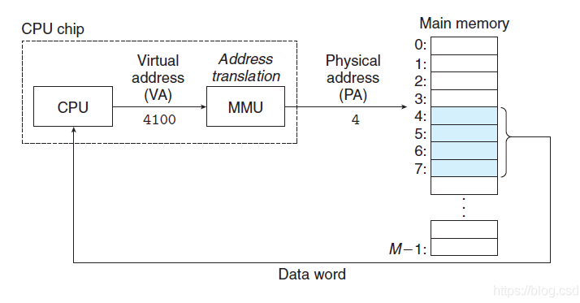
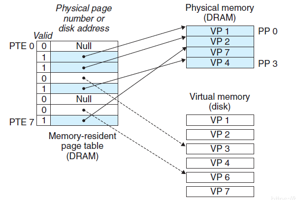
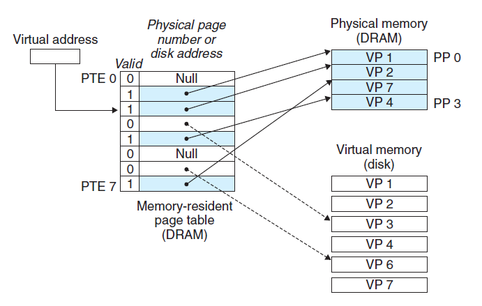
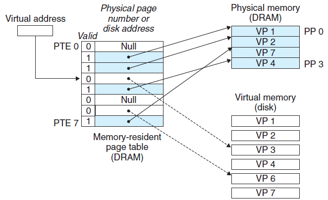
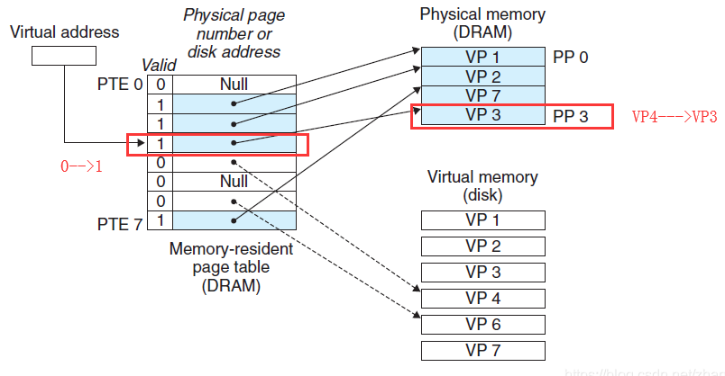

### 什么是虚拟内存？

​		虚拟内存是计算机系统内存管理的一种技术。它**使得应用程序认为它拥有连续可用的内存**（一个连续完整的地址空间），而实际上，它通常是被分隔成多个物理内存碎片，还有部分暂时存储在外部磁盘存储器上，在需要时进行数据交换。与没有使用虚拟内存技术的系统相比，使用这种技术的系统使得大型程序的编写变得更容易，对真正的物理内存（例如RAM）的使用也更有效率。

​		对虚拟内存的定义是基于对地址空间的重定义的，即把地址空间定义为「连续的虚拟内存地址」，以借此「欺骗」程序，使它们以为自己正在使用一大块的「连续」地址。

​		也就是说虚拟内存能提供一大块连续的地址空间，对程序来说它是连续的，完整的，实际上虚拟内存是映射在多个物理内存碎片上，还有部分映射到了外部磁盘存储器上。虚拟内存有以下两个优点：

1. 虚拟内存地址空间是连续的，没有碎片

2. 虚拟内存的最大空间就是cup的最大寻址空间，不受内存大小的限制，能提供比内存更大的地址空间
   

### 虚拟内存是如何工作的呢？

​		创建一个进程时，操作系统（32位系统）会为该进程分配一个4GB 大小的虚拟内存。 之所以是4GB ，是因为在 32 位的操作系统中，一个指针长度是 4 字节（32位， 2的32次方个地址寻址能力是从 0x00000000~0xFFFFFFFF ）即为 4GB 大小的容量。

​		一个进程用到的虚拟地址是由内存区域表来管理的，实际用不了4G。而用到的内存区域，会通过页表映射到物理内存。所以每个进程都可以使用同样的虚拟内存地址而不冲突，因为它们的物理地址实际上是不同的。比如进程A的0x12345678虚拟地址和进程B的的0x12345678虚拟地址映射的物理地址是不同的的。

​		我们现在使用的64位系统，虚拟内存最大有多大呢？是2的64次方吗？那将会有16EB的虚拟地址空间，1EB有多大呢？1EB = 1,000 PB = 1,000,000 TB =  1,000,000,000 GB 毫无疑问这是个非常巨大的数字，我们的系统根本不需要如此巨大的虚拟内存。现代的操作系统，比如，Windows在AMD64上的实现仅应用了最大256TB的虚拟内存。

​	cup要访问虚拟内存地址时，需要经过地址翻译成物理地址才能访问。比如下图（来自《深入理解计算机系统》）中，cpu要访问虚拟地址4100，需要通过专用的硬件内存管理单元（memory management unit）MMU来翻译成对应的内存物理地址4，然后cpu在内存地址4的位置上取到数据返回。

虚拟内存被分为一块块固定的大小，成为虚拟页（Virtual Page）简称VP，对应的物理内存也被分成一块块同样的大小，成为物理页（Physical Page）简称PP。磁盘和内存之间是以页为单位进行数据交换的。

cpu怎么知道某一个虚拟页是否缓存了数据？缓存在内存中还是磁盘中呢？

这就需要一张表格来记录了，这就是**页表**。

页表第一列valid 如果是0表示该虚拟页未被缓存，1表示已经缓存了数据。

第二列蓝色的表示数据缓存在内存中，白色的表示数据缓存在磁盘中。

### 页命中

​		当cpu要访问PTE2（箭头所指的位置）的数据时，发现valid标志位为1，所以表示该虚拟页已经被缓存了，由于页表中的地址指向内存中的VP2数据块，所以cpu直接从内存中读取数据VP2，这种情况就叫做页命中。

### 缺页

​		当cpu要访问PTE3（箭头所指的位置）的数据时，发现valid标志位为0，所以表示该虚拟页未被缓存，这时会触发一个缺页异常，cup根据页表第二列的指针找到磁盘中对应的数据块VP3，然后根据规则选择一个内存中的牺牲页，把VP3覆盖到内存中。

上图中的内存中的vp4被替换成了VP3，valid的值从0变成1。

缺页异常返回后，会重启缺页指令，并更新虚拟地址，cpu再次访问PTE3的时候就能命中页，取到数据了。

### 总结

​		当每个进程创建的时候，内核会为每个进程分配虚拟内存，这个时候数据和代码还在磁盘上，当运行到对应的程序时，进程去寻找页表，如果发现页表中地址没有存放在物理内存上，而是在磁盘上，于是发生缺页异常，于是将磁盘上的数据拷贝到物理内存中并更新页表，下次再访问该虚拟地址时就能命中了。

