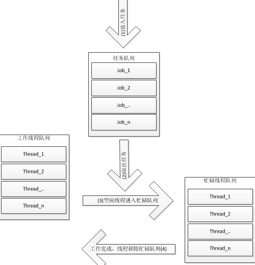

### 为什么要使用线程池？

​		目前的大多数网络服务器，包括Web服务器、Email服务器以及数据库服务器等都具有一个共同点，就是单位时间内必须处理数目巨大的连接请求，但处理时间却相对较短。
​       传统多线程方案中我们采用的服务器模型则是一旦接受到请求之后，即创建一个新的线程，由该线程执行任务。任务执行完毕后，线程退出，这就是是“即时创建，即时销毁”的策略。尽管与创建进程相比，创建线程的时间已经大大的缩短，但是如果提交给线程的任务是执行时间较短，而且执行次数极其频繁，那么服务器将处于不停的创建线程，销毁线程的状态。

我们将传统方案中的线程执行过程分为三个过程：T1、T2、T3。

T1：线程创建时间
T2：线程执行时间，包括线程的同步等时间
T3：线程销毁时间

我们可以看出，线程本身的开销所占的比例为(T1+T3) / (T1+T2+T3)。如果线程执行的时间很短的话，这比开销可能占到20%-50%左右。如果任务执行时间很长的话，这笔开销将是不可忽略的。

​       除此之外，线程池能够减少创建的线程个数。通常线程池所允许的并发线程是有上界的，如果同时需要并发的线程数超过上界，那么一部分线程将会等待。而传统方案中，如果同时请求数目为2000，那么最坏情况下，系统可能需要产生2000个线程。尽管这不是一个很大的数目，但是也有部分机器可能达不到这种要求。
​       因此线程池的出现正是着眼于减少线程本身带来的开销。线程池采用预创建的技术，在应用程序启动之后，将立即创建一定数量的线程(N1)，放入空闲队列中。这些线程都是处于阻塞（Suspended）状态，不消耗CPU，但占用较小的内存空间。当任务到来后，缓冲池选择一个空闲线程，把任务传入此线程中运行。当N1个线程都在处理任务后，缓冲池自动创建一定数量的新线程，用于处理更多的任务。在任务执行完毕后线程也不退出，而是继续保持在池中等待下一次的任务。当系统比较空闲时，大部分线程都一直处于暂停状态，线程池自动销毁一部分线程，回收系统资源。
​      基于这种预创建技术，线程池将线程创建和销毁本身所带来的开销分摊到了各个具体的任务上，执行次数越多，每个任务所分担到的线程本身开销则越小，不过我们另外可能需要考虑进去线程之间同步所带来的开销

### 小结

​		线程本身存在开销，无止尽的开新线程会给系统产生大量消耗，而线程本来就是可重用的资源，不需要每次使用时都进行初始化，因此可以采用有限个线程个数处理无限的任务。

​		**线程池**，简单来说就是已经有一堆创建好的线程，初始时处于空闲状态，当有新的任务进来，从线程池中取出一个空闲的线程处理任务，然后当任务处理完成后，该线程被重新放回到线程池中，拱其他的任务使用，当线程池中的线程都在处理任务时，就没有空闲线程供使用，此时，若有新的任务产生，只能等待线程池中有线程结束任务空闲才能执行，下面是线程池的工作原理图：

**Reference**

https://blog.csdn.net/caoshangpa/article/details/80374651

https://www.cnblogs.com/yangang92/p/5485868.html