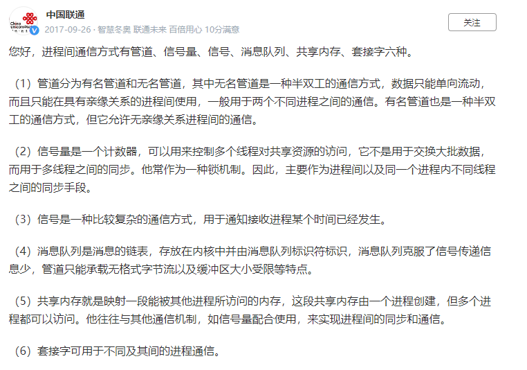
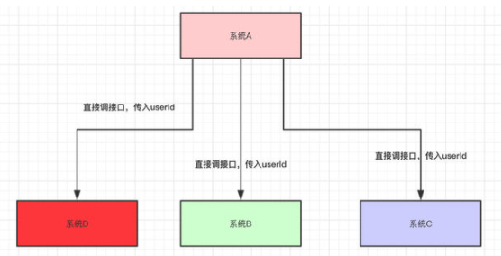
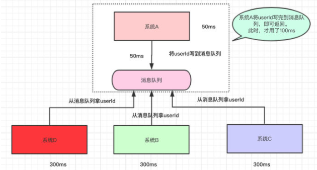
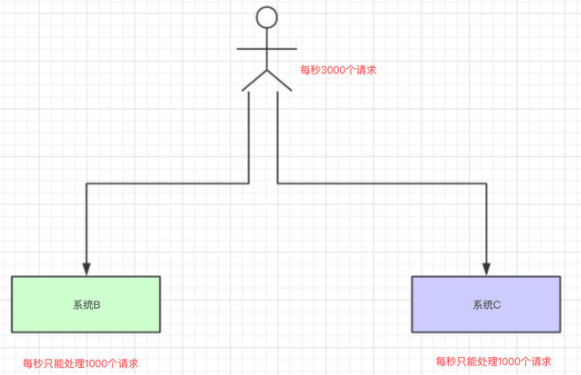
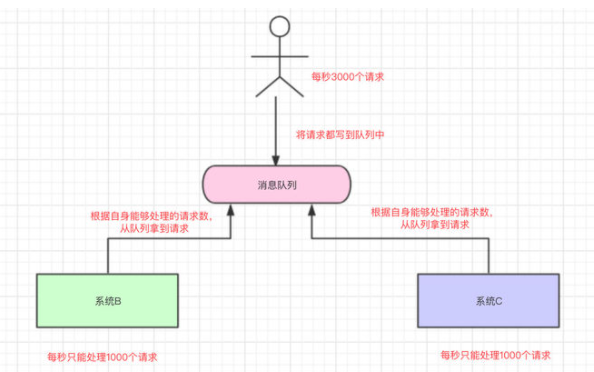
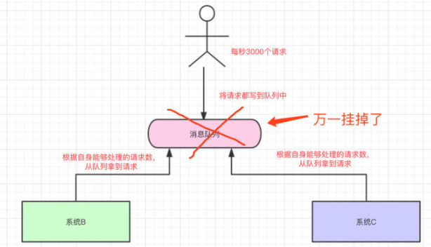
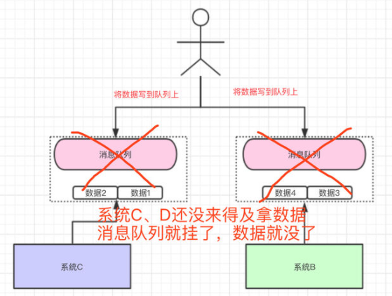

		进程间通信（IPC，Interprocess communication）是一组编程接口，让程序员能够协调不同的进程，使之

能在一个操作系统里同时运行，并相互传递、交换信息。这使得一个程序能够在同一时间里处理许多用户的要

求。因为即使只有一个用户发出要求，也可能导致一个操作系统中多个进程的运行，进程之间必须互相通话。IPC

接口就提供了这种可能性。每个IPC方法均有它自己的优点和局限性，一般，对于单个程序而言使用所有的IPC方

法是不常见的。


### 进程间的通信方式

 　  **1、无名管道通信**

　　无名管道（ pipe ）：管道是一种半双工的通信方式，数据只能单向流动，而且只能在具有亲缘关系的进程

间使用。进程的亲缘关系通常是指父子进程关系。

　　**2、高级管道通信**

　　高级管道（popen）：将另一个程序当做一个新的进程在当前程序进程中启动，则它算是当前程序的子进

程，这种方式我们成为高级管道方式。

　　**3、有名管道通信**

　　有名管道 （named pipe） ： 有名管道也是半双工的通信方式，但是它允许无亲缘关系进程间的通信。

　　**4、消息队列通信**

　　消息队列（ message queue ） ： 消息队列是由消息的链表，存放在内核中并由消息队列标识符标识。消

息队列克服了信号传递信息少、管道只能承载无格式字节流以及缓冲区大小受限等缺点。

　　**5、信号量通信**

　　信号量（ semophore ） ： 信号量是一个计数器，可以用来控制多个进程对共享资源的访问。它常作为一

种锁机制，防止某进程正在访问共享资源时，其他进程也访问该资源。因此，主要作为进程间以及同一进程内不

同线程之间的同步手段。

　　**6、信号**

　　信号 （ sinal ）：信号是一种比较复杂的通信方式，用于通知接收进程某个事件已经发生。

　　**7、共享内存通信**

　　共享内存（ shared memory ） ：共享内存就是映射一段能被其他进程所访问的内存，这段共享内存由一

个进程创建，但多个进程都可以访问。共享内存是最快的 IPC 方式，它是针对其他进程间通信方式运行效率低而

专门设计的。它往往与其他通信机制，如信号两，配合使用，来实现进程间的同步和通信。

　　**8、套接字通信**

　　套接字（ socket ） ： 套接口也是一种进程间通信机制，与其他通信机制不同的是，它可用于不同机器间的

进程通信。


### 进程间的通信方式有哪些？各自的优缺点




## 进程间的五种通信方式

https://network.51cto.com/art/201911/606827.htm?mobile

### 一 管道

**特点：**

- 半双工(数据流向仅有一个方向)，具有固定的读端和写端
- 只能用于父进程或兄弟线程之间通信(具有血缘关系的线程之间)
- 一种特殊文件，可以用普通的read、write函数进行读写，但又不是普通文件，不属于任何其它文件系统，仅存在于内存之中

**例子：**


当一个管道建立时，它会创建两个文件描述符：fd[0]为读而打开，fd[1]为写而打开。要关闭管道只需要关闭这两个文件描述符即可。

```c++
#include<stdio.h> 
#include<unistd.h> 
 
int main() 
{ 
     int fd[2]; // 两个文件描述符 
     pid_t pid; 
     char buff[20]; 

     if(pipe(fd) < 0) // 创建管道 
     printf("Create Pipe Error!\n"); 

     if((pid = fork()) < 0) // 创建子进程 
     printf("Fork Error!\n"); 
     else if(pid > 0) // 父进程 
     { 
     	close(fd[0]); // 关闭读端 
     	write(fd[1], "hello world\n", 12); 
     } 
     else 
     { 
     	close(fd[1]); // 关闭写端 
     	read(fd[0], buff, 20); 
     	printf("%s", buff); 
     } 

     return 0; 
} 
```


### 二 命名管道

**特点：**

- 与无名管道不同，命名管道可以在无关进程间通信
- FIFO以一种特殊设备文件形式存在于文件系统中，有路径名与之关联


### 三 消息队列

**特点：**

- 消息队列是面向记录的，其中的消息具有特定的格式以及特定的优先级

- 消息队列独立于发送与接收进程。进程终止时，消息队列及其内容并不会被删除

- 消息队列可以实现消息的随机查询, 消息不一定要以先进先出的次序读取,也可以按消息的类型读取

  

消息队列简单理解为：把要存放的数据放在队列里


把数据放在消息队列里的是生产者

从消息队列里边取数据的是消费者

#### **为什么要用消息队列？**

**1、解耦**


系统A将userId写到消息队列中，系统C和系统D从消息队列中拿数据。**这样有什么好处**？

- 系统A**只负责**把数据写到队列中，谁想要或不想要这个数据(消息)，**系统A一点都不关心**。
- 即便现在系统D不想要userId这个数据了，系统B又突然想要userId这个数据了，都跟系统A无关，系统A一点代码都不用改。
- 系统D拿userId不再经过系统A，而是从消息队列里边拿。**系统D即便挂了或者请求超时，都跟系统A无关，只跟消息队列有关**。

这样一来，系统A与系统B、C、D都**解耦**了。


**2、异步**



假设系统A运算出userId具体的值需要50ms，调用系统B的接口需要300ms，调用系统C的接口需要300ms，调用系统D的接口需要300ms。那么这次请求就需要`50+300+300+300=950ms`



系统A执行完了以后，将userId写到消息队列中，然后就直接返回了(至于其他的操作，则异步处理)。

- 本来整个请求需要用950ms(同步)
- 现在将调用其他系统接口异步化，只需要100ms(异步)


**3、削峰/限流**

假如现在我们每个月要搞一个大促，大促期间并发可能很高，比如每秒3000个请求，假设有两个机器处理请求，每台机器每秒只能处理1000个请求。



系统崩掉。



系统B和系统C**根据自己的能够处理的请求数去消息队列中拿数据**，这样即便有每秒有8000个请求，那只是把请求放在消息队列中，去拿消息队列的消息**由系统自己去控制**，这样就不会把整个系统给搞崩。


#### 使用消息队列会有什么问题？

**1、高可用**

无论是我们使用消息队列来做解耦、异步还是削峰，消息队列**肯定不能是单机**的。试着想一下，如果是单机的消息队列，万一这台机器挂了，那我们整个系统几乎就是不可用了。



所以，当我们项目中使用消息队列，都是得`集群/分布式`的。要做`集群/分布式`就必然希望该消息队列能够提供**现成**的支持，而不是自己写代码手动去实现。


**2、数据丢失问题**

我们将数据写到消息队列上，系统B和C还没来得及取消息队列的数据，就挂掉了。如果没有做任何的措施，我们的数据就丢了。



学过Redis的都知道，Redis可以将数据持久化磁盘上，万一Redis挂了，还能从磁盘从将数据恢复过来。同样地，消息队列中的数据也需要存在别的地方，这样才尽可能减少数据的丢失。

那存在哪呢？

- 磁盘？
- 数据库？
- Redis？
- 分布式文件系统？

同步存储还是异步存储？


**Reference**

https://www.zhihu.com/question/54152397/answer/657234090


### 四 信号量

信号量(semaphore)与已经介绍过的 IPC 结构不同，它是一个计数器。信号量用于实现进程间的互斥与同步，而

不是用于存储进程间通信数据。

**特点：**

- 信号量用于进程间同步，若要在进程间传递数据需要结合共享内存
- 信号量基于操作系统的 PV 操作，程序对信号量的操作都是**原子操作**
- 每次对信号量的 PV 操作不仅限于对信号量值加 1 或减 1，而且可以加减任意正整数
- 支持信号量组


### 五 共享内存

**特点**

- 共享内存是最快的一种 IPC，因为进程是直接对内存进行存取
- 因为多个进程可以同时操作，所以需要进行同步
- 信号量+共享内存通常结合在一起使用，信号量用来同步对共享内存的访问


### 六 socket

