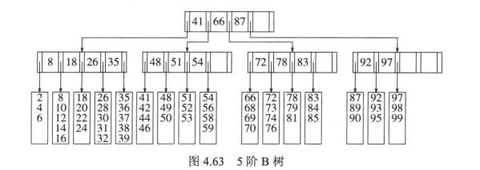

我们始终假设可以把整个数据结构存储到计算机的主存中。可是，如果数据太多主存装不下，就意味着必须把数据结构放在磁盘上。此时大O模型不再适用，大O分析假设所有操作都是相等的。但是，涉及到磁盘IO时，它的速度主要依赖于转动磁盘和移动磁头的时间，考虑到处理器的速度，数十亿条指令却花费相当于120次磁盘访问的时间。

为了节省一次磁盘访问，我们愿意进行大量的计算，几乎在所有情况下，控制运行时间的都是磁盘的访问次数，于是，如果我们把磁盘访问次数减少一半，那么运行时间也将减少一半。

### M叉查找树

我们想要把磁盘访问次数减小到一个非常小的常数，而且我们愿意写一个复杂的程序来做这件事，因为只要不是无理到荒谬的地步，机器指令基本上是不占用时间的。

使用二叉查找树不可能低于logN，从直觉上来看，如果我们有更多的分支，那么就有更少的高度。一棵M叉查找树可以有M路分支，随着分支增加，树的深度在减少。一棵完全二叉树的高度大概是logN（2为底），而一棵完全M叉树的高度大约是logN（M为底。）

**M叉树的建立**

在二叉查找树中，我们需要一个关键字来决定两个分支到底取用哪个分支；

而在M叉树查找树中我们需要M-1个关键字来决定选取哪个分支。

为使这种方案在最坏的情形下有效，我们需要保证M叉查找树以某种方式得到平衡。否则像二叉查找树，它可能退化成一个链表。

### B树

阶为M的B树是一棵具有下列特性的M叉树：

1. 数据项存储在树叶上。

2. 非叶节点存储直到M-1个关键字指示搜索的方向；关键字 i 代表子树 i + 1种的最小的关键字。
3. 树的根或者是一片树叶，或者其儿子树在2和M之间。
4. 除根外，所有非叶节点的儿子树在 M/2 和 M 之间。
5. 所有的树叶都在相同的深度上，并且每片树叶拥有的数据项其个数在 L/2 和 L之间。

每个节点代表一个磁盘区块，于是我们根据所存储的项数多少选择M和L。

