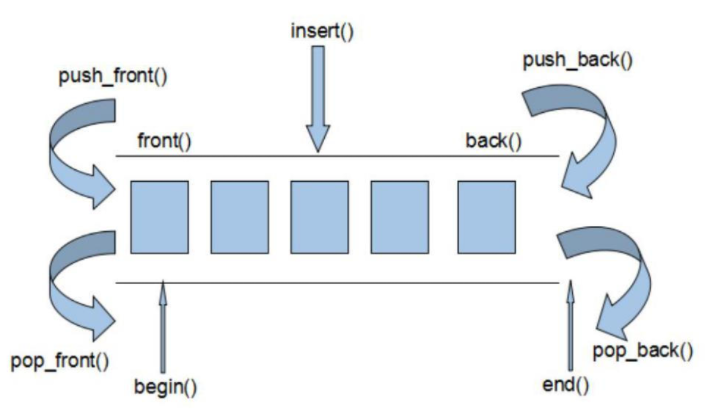

顺序容器：vector、deque、list、forward_list

关联容器：set、map、unordered_set、unordered_map、multiset、multimap、unordered_multiset、unordered_multimap


### Vector

动态数组，内存中有一个指针指向一块连续的内存。支持随机访问数据。

优点：支持随机访问，所以查询效率高

缺点：插入效率低，因为向非尾部插入时需要移动其他元素

使用场景：对象简单，变化较少，需要频繁访问的场景


### deque

vector是单向开口的连续线性空间，deque则是一种双向开口的线性空间，可以在头尾两端分别做元素的插入和删除操作。



deque由一段一段的连续空间组成，一旦要在首端或者尾端增加新空间，便配置一段定量连续空间连接在首端或者尾端。在分段连续的空间上维护其整体连续的假象，迭代器复杂。


### list

双向链表，每个元素的内存单元是不连续的，彼此之间通过存储相互的地址相关联。因为在内存中的单元不连续，不支持随机访问，没有[] 运算符。

优点：任意位置的删除节点和插入节点高效

缺点：内存不连续，不支持随机访问，查找效率低

使用场景：对象变化大，数量变化频繁，删除和插入频繁


### set

内部元素有序，容器中元素的值不能修改，但是可以进行插入、删除操作。

set、map、multiset、multimap底层采用红黑树，红黑树的统计性能要强于一般平衡二叉树，所以被STL选择为关联容器的内部结构。


### map

关联式容器，通过key-value形式存储，并且key是唯一存在的。容器内部元素有序。


### 容器适配器

每个适配器都定义了两个构造函数：默认构造函数创建以空对象，接受一个容器的构造函数拷贝该容器来初始化适配器。

例如，假定deq是一个deque<int>，我们可以用deq来初始化一个新的stack，如下所示：

stack<int> stk(deq);     //从deq拷贝元素到stk

**默认情况下，stack和queue是基于deque实现的，priority_queue是在vector之上实现的**。我们可以在创建一个适配器时将一个命名的顺序容器作为第二个类型参数，来重载默认容器类型：

```c++
//vector上实现的空栈
stack<string,vector<string>> str_stk;  //默认是在deque上实现的，这里显示的指定为在vector上实现
//str_stk2在vector上实现，初始化时保存svec的拷贝
```

- **stack只要求push_back、pop_back和back操作，因此可以使用除array和forward_list之外的任何容器类型来构造stack**。
- **queue适配器要求back、push_back、front和push_front，因此它可以构造与list和deque之上，但不能基于vector构造**。
- **priority_queue除了front、push_back和pop_back操作之外还要求随机访问能力，因此它可以构造于vector和deque之上，但不能基于list构造**。

