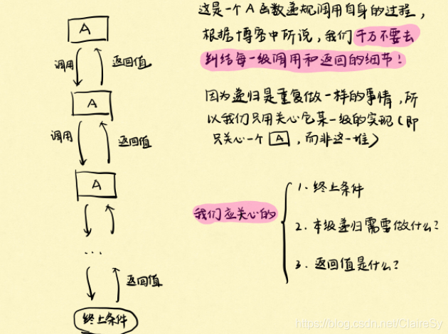
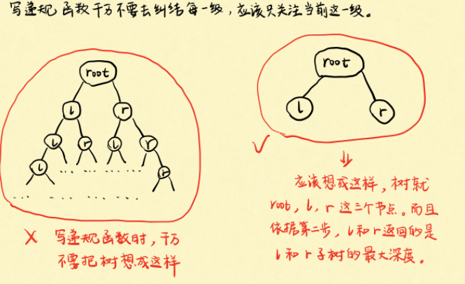
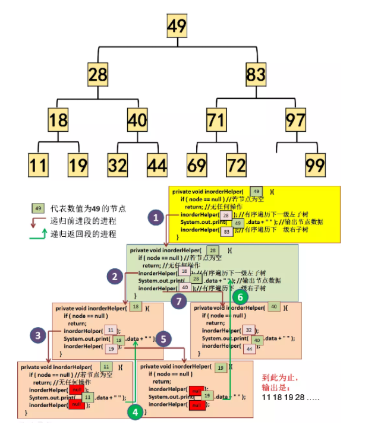
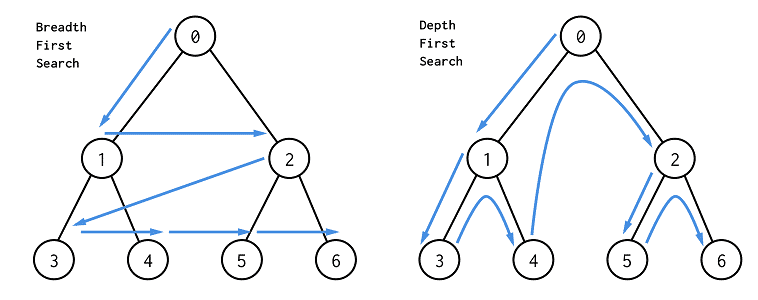

## 二叉树

从二叉树看递归



- 递归条件
- 终止条件

例：二叉树深度（Leetcode.104）

终止条件：树为空时，深度为0

每一级的返回值是当前级对应的树的最大深度。



```c++
int Height(TreeNode* root)
{
	if(root == nullptr) //终止条件
	{
		return 0;
	}
	int leftHeight = Height(root->left);
	int rightHeight = Height(root->right);
	return max(leftHeight, rightHeight) + 1;
}
```



### 递归法的三种遍历

**前序遍历**

根节点——左子树——右子树

```c++
class Solution
{
	public:
    	vector<int> preOrder(TreeNode* root, vector<int>& res)
        {
            vector<int> res;
        	if(root == nullptr)
            {
                return;
			}
            res.push_back(root->val);
            preOrder(root->left, res);
            preOrder(root->right, res);
            return res;
        }
}
```


**中序遍历**

左子树——根节点——右子树

```c++
class Solution
{
	public:
    	vector<int> preOrder(TreeNode* root, vector<int>& res)
        {
            vector<int> res;
        	if(root == nullptr)
            {
                return;
			}
            preOrder(root->left, res);
            res.push_back(root->val);
            preOrder(root->right, res);
            return res;
        }
}
```


**后序遍历**

左子树——右子树——根节点

```c++
class Solution
{
	public:
    	vector<int> preOrder(TreeNode* root, vector<int>& res)
        {
            vector<int> res;
        	if(root == nullptr)
            {
                return;
			}
            preOrder(root->left, res);
            preOrder(root->right, res);
            res.push_back(root->val);
            return res;
        }
}
```


### 迭代法的三种遍历


```c++
// 前序遍历
vector<int> preorderTraversal(TreeNode* root) 
{
    vector<int> res;
    if (root == nullptr) 
        return res;

    stack<TreeNode*> stk;
    while (root != nullptr || !stk.empty()) 
    {
        while (root != nullptr)  // 遍历左子树
        {
            res.emplace_back(root->val); // 遍历的同时放入结果
            stk.emplace(root);
            root = root->left;
        }
        root = stk.top(); // 左子树为空，向上出栈
        stk.pop();
        root = root->right;
    }
    return res;
}
```

```c++
// 中序遍历
vector<int> inorderTraversal(TreeNode* root)
{
    vector<int> res;
    if (root == nullptr) 
        return res;

    stack<TreeNode*> stk;
    while(root != nullptr || !stk.empty()) 
    {
        while(root != nullptr) // 遍历左子树
        {
            stk.push(root);
            root = root->left;
        }
        root = stk.top(); // 左子树为空，出栈
        stk.pop();	
        res.push_back(root->val);  // 放入结果
        root = root->right; // 向上走有右子树
    }
    return res;
}
```

```c++
class Solution {
public:
    vector<int> postorderTraversal(TreeNode *root) {
        vector<int> res;
        if (root == nullptr) {
            return res;
        }

        stack<TreeNode *> stk;
        TreeNode *prev = nullptr;
        while (root != nullptr || !stk.empty()) 
        {
            while (root != nullptr) // 遍历左子树
            {
                stk.emplace(root);
                root = root->left;
            }
            root = stk.top(); // 左子树为空，往上出栈
            stk.pop();
            if (root->right == nullptr || root->right == prev) // 出栈的root没有右子树
            {
                res.emplace_back(root->val);
                prev = root;
                root = nullptr;
            } 
            else // 出栈的root有右子树，继续压栈，搜索右子树的左子树
            {
                stk.emplace(root);
                root = root->right;
            }
        }
        return res;
    }
};
链接：https://leetcode-cn.com/problems/binary-tree-postorder-traversal/solution/er-cha-shu-de-hou-xu-bian-li-by-leetcode-solution/
```


### 二叉树的层次遍历



BFS

BFS使用队列，把当前每个还没有搜索的点依次放入队列，然后弹出队列的头部元素作为当前遍历点。BFS总共有两个模板：

1. 如果不需要确定当前遍历到了那一层：

```c++
while queue 不空：
    cur = queue.pop()
    for 节点 in cur的所有相邻节点：
        if 该节点有效且未访问过：
            queue.push(该节点)
```

2. 如果要确定当前遍历到了哪一层：

 增加level表示当前进行到了哪一层，size表示当前层有多少个元素。

```c++
level = 0
while queue 不空：
    size = queue.size()
    while (size --) {
        cur = queue.pop()
        for 节点 in cur的所有相邻节点：
            if 该节点有效且未被访问过：
                queue.push(该节点)
    }
    level ++;
```


```c++
class Solution {
public:
    vector<vector<int>> levelOrder(TreeNode* root) 
    {
        queue<TreeNode*> que;
        if (root != NULL) que.push(root);
        
        vector<vector<int>> result;
      
        while (!que.empty())
        {
            int size = que.size();
            vector<int> vec;
            // 这里一定要使用固定大小size，不要使用que.size()，因为que.size是不断变化的
            for (int i = 0; i < size; i++) 
            {
                TreeNode* node = que.front();
                que.pop();
                vec.push_back(node->val);
                if (node->left) que.push(node->left);
                if (node->right) que.push(node->right);
            }
            result.push_back(vec);
        }
        
        return result;
    }
};
```


DFS

```c++
class Solution 
{
public:
    vector<vector<int>> levelOrder(TreeNode* root) 
    {
        vector<vector<int>> res;
        dfs(res, root, 0);
        return res;
    }
    
    void dfs(vector<vector<int>>& res, TreeNode* root, int level) 
    {
        if (!root) return;
        
        if (level >= res.size())
            res.push_back(vector<int>());
        
        res[level].push_back(root->val);
        dfs(res, root->left, level + 1);
        dfs(res, root->right, level + 1);
    }
};
```

