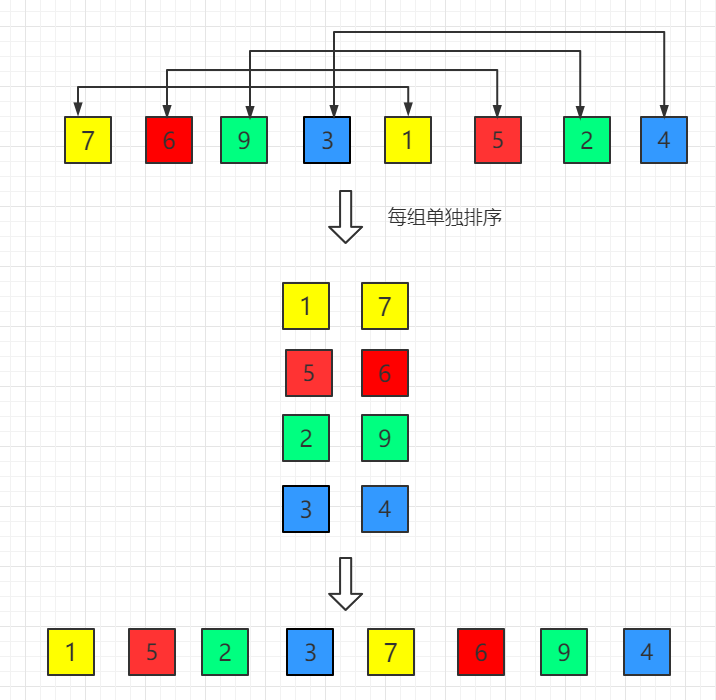
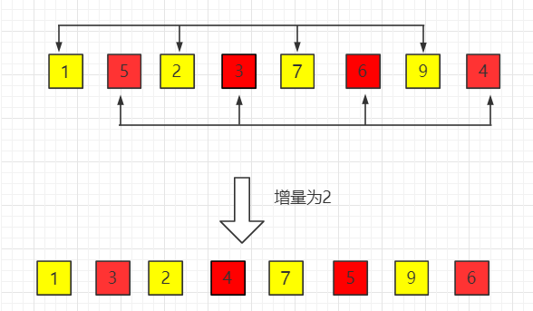
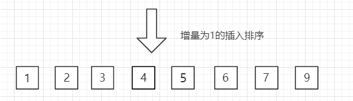

### 概念

希尔排序，发明者Donald Shell，是第一批冲破二次时间屏障的算法之一。

是插入排序的一种，通过比较相距一定间隔的元素来进行，各躺所用的距离随算法的进行而减小，直到只比较相邻元素的最后一趟排序为止。


### 复杂度

希尔排序时间复杂度是 **O(n^(1.3-2))**，空间复杂度为常数阶 **O(1)**。希尔排序没有时间复杂度为 **O(n(logn))** 的快速排序算法快 ，因此对中等大小规模表现良好，但对规模非常大的数据排序不是最优选择，总之比一般 **O(n^2 )** 复杂度的算法快得多。


### 原理

希尔排序的目的是为了加快速度改进插入排序，交换不相邻的元素对数组的局部进行排序，并最终用插入排序将局部有序数组排序。



第一趟：增量为4



第二趟：增量为2



最后一趟：增量为1


### 代码

```c++
/*****************************
*shellSort.h
*****************************/
#include "stdafx.h"
#include <vector>

using namespace std;

template <typename T>
void shellSort(vector<T>& vec)
{
	int gap = vec.size()/2;										// size = 10
	for (; gap != 0; gap = gap/2)								// gap = 5
	{
		shellSort(vec, gap); //以gap步长为参数进行排序
	}
}
template <typename T>
void shellSort(vector<T>& vec, int gap)
{
	int i = gap;												// i = 5
	for (; i < vec.size(); i++) // 从gap 到 vec.size()之间		 //  5 < 10
	{	
		//这种循环交换的思想，省去每次比较都要交换的次数
		T tempValue = vec[i];								    // temp = vec[5]
		int j = i;											 	//  j = i = 5
        														// 5 >= 5 && temp < vec[5-5]
		for (; j >= gap && tempValue < vec[j - gap] ; j = j - gap) //这里其实进行的是倒序循环
		{
			vec[j] = vec[j - gap];								// vec[5] < vec[0]
            													// vec[5] = vec[0]
		}
		vec[j] = tempValue;										// else vec[5] = vec[5]
	}															// i++  i=6
}																// gap = 5/2 = 2
```

