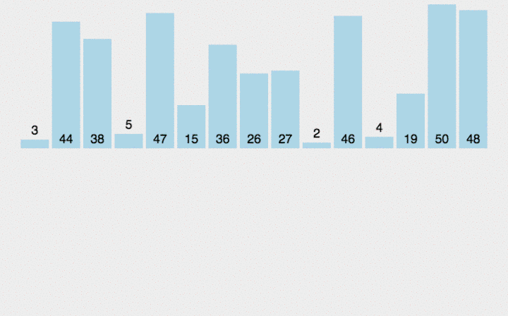

归并排序是建立在归并操作上的一种排序。该算法是经典的分治（divide and conquer）策略，它将问题分（divide）成一些小的问题然后递归求解，而治（conquer）的阶段则将分的阶段解得的各答案修补在一起。





### 代码

```c++
void MergeSort (int arr [], int low,int high) 
{
    if(low>=high) 
    { 
        return;
    } // 终止递归的条件，子序列长度为1
    
    int mid =  low + (high - low)/2;  // 取得序列中间的元素
    
    MergeSort(arr,low,mid);  // 对左半边递归
    
    MergeSort(arr,mid+1,high);  // 对右半边递归
    
    merge(arr,low,mid,high);  // 合并
  }
```

```c++
void Merge(int arr[],int low,int mid,int high)
{
    //low为第1有序区的第1个元素，i指向第1个元素, mid为第1有序区的最后1个元素
    int i = low,j = mid + 1, k=0;  //mid+1为第2有序区第1个元素，j指向第1个元素
    int *temp=new int[high-low+1]; //temp数组暂存合并的有序序列
    
    while(i < =mid && j <= high) 
    {
        if(arr[i]<=arr[j]) //较小的先存入temp中
            temp[k++]=arr[i++];
        else
            temp[k++]=arr[j++];
    }
    
    while(i<=mid)//若比较完之后，第一个有序区仍有剩余，则直接复制到t数组中
        temp[k++]=arr[i++];
    while(j<=high)//同上
        temp[k++]=arr[j++];
    
    for(i=low,k=0;i<=high;i++,k++)//将排好序的存回arr中low到high这区间
		arr[i]=temp[k];
    
    delete []temp;//释放内存，由于指向的是数组，必须用delete []
}
```

