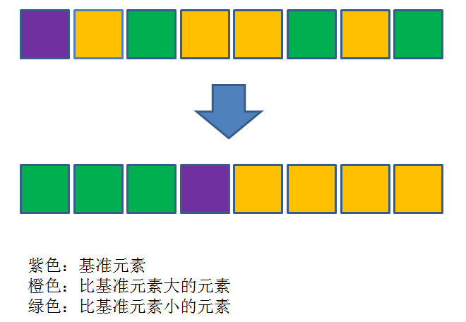
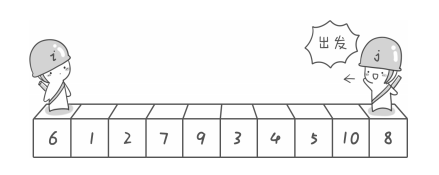

快速排序是从冒泡排序演变而来的算法，但是比冒泡排序要高效得多，所以叫做快速排序。

快速排序之所以快速，是因为它使用了分治法，同冒泡排序一样，快速排序也属于交换排序，通过元素之间的比较和交换位置来达到排序的目的。

不同的是，冒泡排序在每一轮只把一个元素冒泡到数列的一端，而快速排序**在每一轮挑选一个基准元素，并让其他比它大的元素移动到数列一边，比它小的元素移动到数列的另一边，从而把数列拆解成了两个部分。**

### 基本思想

- 1．先从数列中取出一个数作为基准数。

- 2．分区过程，将比这个数大的数全放到它的右边，小于或等于它的数全放到它的左边。

- 3．再对左右区间重复第二步，直到各区间只有一个数。  

  

**基准元素如何选择呢？**

基准元素，英文pivot，用于在分治过程中以此为中心，把其他元素移动到基准元素的左右两边。

那么基准元素如何选择呢？

最简单的方式是选择数列的第一个元素，但是如果有一个原本逆序的数列，期望排序成顺序数列，那么会出现什么情况：这种极端情况下，快速排序需要进行n轮，时间复杂度退化成了n^2。

### 排序过程

注意：基准元素/左游标/右游标都是针对单趟排序而言的， 也就是说在整个排序过程的多趟排序中，各趟排序取得的基准元素/左游标/右游标一般都是不同的。对于基准元素的选取，原则上是任意的，但是一般我们选取数组中第一个元素为基准元素（假设数组随机分布）。

