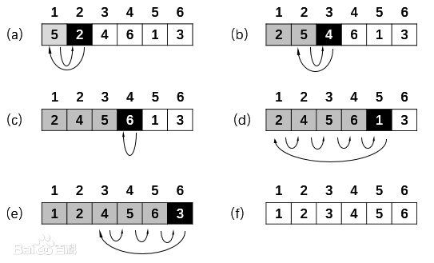

**思想：** 将当前元素与它前面已排好序的元素依次进行比较，最后放置在合适的位置，初始时可从第二个元素开始，认为第一个元素已排好序。

**性能：**算法时间复杂度为O(n2)，在序列规模较小时，性能比较好，且元素比较次数与初始序列杂乱程度相关，最优复杂度为O(n)。

**插入排序步骤**

- 从第一个元素开始，该元素可以认为已被排序
- 取出下一个元素，在已经排序的元素序列中从后向前扫描
- 找到已排序元素小于等于新元素的位置，插入

```c++
void InsertSort(int *a, int len)
{
	for(int i = 1; i < len; ++i)
    {
        int key = a[i];
        int j = i - 1;
        while(j >= 0 && a[j] > key)
        {
        	a[j+1] = a[j]; //大于key的元素后移
            j--;
        }
        a[j+1] = key;
    }
}
```


