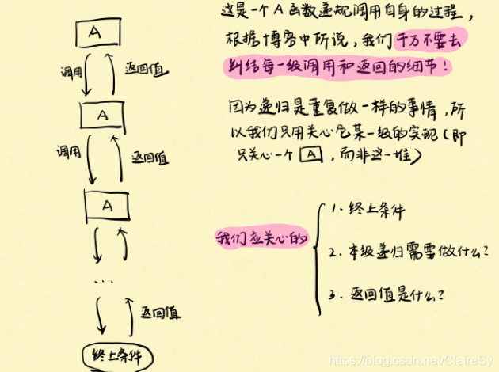

### 二叉树

从二叉树看递归



- 递归条件
- 终止条件

例：二叉树深度（Leetcode.104）

终止条件：树为空时，深度为0

每一级的返回值是当前级对应的树的最大深度。


```c++
int Height(TreeNode* root)
{
	if(root == nullptr)
	{
		return 0;
	}
	int leftHeight = Height(root->left);
	int rightHeight = Height(root->right);
	return max(leftHeight, rightHeight) + 1;
}
```


**迭代法的三种遍历**


```c++
// 前序遍历
vector<int> preorderTraversal(TreeNode* root) 
{
    vector<int> res;
    if (root == nullptr) 
        return res;

    stack<TreeNode*> stk;
    while (root != nullptr || !stk.empty()) 
    {
        while (root != nullptr)  // 遍历左子树
        {
            res.emplace_back(root->val); // 遍历的同时放入结果
            stk.emplace(root);
            root = root->left;
        }
        root = stk.top(); // 左子树为空，向上出栈
        stk.pop();
        root = root->right;
    }
    return res;
}
```

```c++
// 中序遍历
vector<int> inorderTraversal(TreeNode* root)
{
    vector<int> res;
    if (root == nullptr) 
        return res;

    stack<TreeNode*> stk;
    while(root != nullptr || !stk.empty()) 
    {
        while(root != nullptr) // 遍历左子树
        {
            stk.push(root);
            root = root->left;
        }
        root = stk.top(); // 左子树为空，出栈
        stk.pop();	
        res.push_back(root->val);  // 放入结果
        root = root->right; // 向上走有右子树
    }
    return res;
}
```

```c++
class Solution {
public:
    vector<int> postorderTraversal(TreeNode *root) {
        vector<int> res;
        if (root == nullptr) {
            return res;
        }

        stack<TreeNode *> stk;
        TreeNode *prev = nullptr;
        while (root != nullptr || !stk.empty()) 
        {
            while (root != nullptr) // 遍历左子树
            {
                stk.emplace(root);
                root = root->left;
            }
            root = stk.top(); // 左子树为空，往上出栈
            stk.pop();
            if (root->right == nullptr || root->right == prev) // 出栈的root没有右子树
            {
                res.emplace_back(root->val);
                prev = root;
                root = nullptr;
            } 
            else // 出栈的root有右子树，继续压栈，搜索右子树的左子树
            {
                stk.emplace(root);
                root = root->right;
            }
        }
        return res;
    }
};
链接：https://leetcode-cn.com/problems/binary-tree-postorder-traversal/solution/er-cha-shu-de-hou-xu-bian-li-by-leetcode-solution/
```

