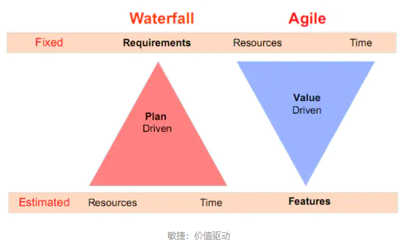

### MVP

**MVP（Minimum Viable Product）最小化可行产品**

MVP通过不断迭代挖掘用户需求，逐步将一个原型产品演变成满足用户需求的商用产品。

### 敏捷

敏捷开发模式：

**Scrum**

### DOD

**DOD（Definition of Done）**

在敏捷软件开发种，存在多级的不同的完成定义。

典型的是迭代的DOD，这又是最初DOD应用的地方。

常见在Scrum中，需要预先定义DOD，常见的DOD条款有：

1. 所有完成的Story得到PO的验证
2. 所有代码得到静态分析，纠正最高级别的不符合项...
3. 所有新增代码得到人工评审
4. 所有完成的Stroy都有对应的测试用例

对于发布有更严格的要求......