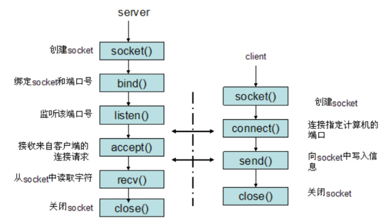

### 1. tcp握手为什么两次不可以？为什么不用四次？

 [三次握手和四次挥手.md](..\..\..\计算机网络\三次握手和四次挥手.md) 

两次不可以：tcp是全双工通信，两次握手只能确定单向数据链路是可以通信的，并不能保证反向的通信正常。

不用四次，本来握手应该和挥手一样都是需要确认两个方向都能联通的，本来模型应该是：

1. 客户端发送syn0给服务器

2. 服务器收到syn0，回复ack(syn0+1)

3. 服务器发送syn1

4. 客户端收到syn1，回复ack(syn1+1)

因为tcp是全双工的，上边的四部确认了数据在两个方向上都是可以正确到达的，但是2，3步没有没有上下的联系，可以将其合并，加快握手效率，所有就变成了3步握手。

### 2. TCP拥塞控制？

​		发送方维持一个叫做拥塞窗口cwnd（congestion window）的状态变量。拥塞窗口的大小取决于网络的拥塞程度，并且动态地在变化。

​		发送方让自己的发送窗口等于拥塞窗口，另外考虑到接受方的接收能力，发送窗口可能小于拥塞窗口。慢开始算法的思路就是，不要一开始就发送大量的数据，先探测一下网络的拥塞程度，也就是说由小到大逐渐增加拥塞窗口的大小。

​		过程cwnd的大小呈指数增长，直到超过慢启动门限，然后进入拥塞避免阶段，cwnd的大小线性增长，当出现网络拥塞(三个重复的ack或者超时)时候，将慢启动门限设置为出现拥塞时候大小的一半，cwnd的大小重新从0开始进入慢启动阶段。

​		快重传和快恢复：快重传要求接收方在收到一个失序的报文段后就立即发出重复确认（为的是使发送方及早知道有报文段没有到达对方）而不要等到自己发送数据时捎带确认。快重传算法规定，发送方只要一连收到三个重复确认就应当立即重传对方尚未收到的报文段，而不必继续等待设置的重传计时器时间到期。

### 3. TCP和UDP的区别和各自适用的场景

|                   | TCP                                                       | UDP                                               |
| ----------------- | --------------------------------------------------------- | ------------------------------------------------- |
| 连接              | TCP是面向连接的传输层协议，即传输数据之前必须先建立好连接 | UDP无连接                                         |
| 服务对象          | TCP是点对点的两点间服务，即一条TCP连接只能有两个端点      | UDP支持一对一，一对多，多对一，多对多的交互通信   |
| 可靠性            | TCP是可靠交付：无差错，不丢失，不重复，按序到达           | UDP是尽最大努力交付，不保证可靠交付               |
| 拥塞控制/流量控制 | TCP有拥塞控制和流量控制保证数据传输的安全性               | UDP没有拥塞控制，网络拥塞不会影响源主机的发送效率 |
| 报文长度          | TCP是动态报文长度，根据接收方窗口大小和网络拥塞程度决定   | UDP面向报文，不合并，不拆分                       |
| 首部开销          | 20字节                                                    | 8字节                                             |

从特点上我们已经知道，TCP 是可靠的但传输速度慢，UDP 是不可靠的但传输速度快。因此在选用具体协议通信时，应该根据通信数据的要求而决定。

若通信数据完整性需让位与通信实时性，则应该选用TCP 协议（如文件传输、重要状态的更新等）；反之，则使用 UDP 协议（如视频传输、实时通信等）。

### 4. http协议

​		HTTP协议是Hyper Text Transfer Protocol（超文本传输协议）的缩写，是用于从万维网（WWW:World Wide Web）服务器传输超文本到本地浏览器的传送协议。

​		HTTP是一个基于TCP/IP通信协议来传递数据（HTML 文件，图片文件，查询结果等）。

​		HTTP是一个属于**应用层**的面向对象的协议，由于其简捷、快速的方式，适用于分布式超媒体信息系统。它于1990年提出，经过几年的使用与发展，得到不断地完善和扩展。目前在WWW中使用的是HTTP/1.0的第六版，HTTP/1.1的规范化工作正在进行之中，而且HTTP-NG（Next Generation of HTTP）的建议已经提出。

​		HTTP协议工作于客户端-服务端架构为上。浏览器作为HTTP客户端通过URL向HTTP服务端即WEB服务器发送所有请求。Web服务器根据接收到的请求后，向客户端发送响应信息。

**HTTP协议特点**

1、简单快速

客户向服务器请求服务时，只需传送请求方法和路径。请求方法常用的有GET、HEAD、POST。每种方法规定了客户与服务器联系的类型不同。由于HTTP协议简单，使得HTTP服务器的程序规模小，因而通信速度很快。

2、灵活

HTTP允许传输任意类型的数据对象。正在传输的类型由Content-Type加以标记。

3、无连接

无连接的含义是限制每次连接只处理一个请求。服务器处理完客户的请求，并收到客户的应答后，即断开连接。采用这种方式可以节省传输时间。

4、无状态

HTTP协议是无状态协议。无状态是指协议对于事务处理没有记忆能力。缺少状态意味着如果后续处理需要前面的信息，则它必须重传，这样可能导致每次连接传送的数据量增大。另一方面，在服务器不需要先前信息时它的应答就较快。

5、支持B/S及C/S模式。

6、默认端口80

7、基于TCP协议

**HTTP过程概述：**

​		HTTP协议定义Web客户端如何从Web服务器请求Web页面，以及服务器如何把Web页面传送给客户端。HTTP协议采用了请求/响应模型。客户端向服务器发送一个请求报文，请求报文包含请求的方法、URL、协议版本、请求头部和请求数据。服务器以一个状态行作为响应，响应的内容包括协议的版本、成功或者错误代码、服务器信息、响应头部和响应数据。

HTTP 请求/响应的步骤如下：

1、客户端连接到Web服务器

一个HTTP客户端，通常是浏览器，与Web服务器的HTTP端口（默认为80）建立一个TCP套接字连接。例如，[http://www.baidu.com](http://www.baidu.com/)。

2、发送HTTP请求

通过TCP套接字，客户端向Web服务器发送一个文本的请求报文，一个请求报文由请求行、请求头部、空行和请求数据4部分组成。

3、服务器接受请求并返回HTTP响应

Web服务器解析请求，定位请求资源。服务器将资源复本写到TCP套接字，由客户端读取。一个响应由状态行、响应头部、空行和响应数据4部分组成。

4、释放连接TCP连接

若connection 模式为close，则服务器主动关闭TCP连接，客户端被动关闭连接，释放TCP连接;若connection 模式为keepalive，则该连接会保持一段时间，在该时间内可以继续接收请求;

5、客户端浏览器解析HTML内容

客户端浏览器首先解析状态行，查看表明请求是否成功的状态代码。然后解析每一个响应头，响应头告知以下为若干字节的HTML文档和文档的字符集。客户端浏览器读取响应数据HTML，根据HTML的语法对其进行格式化，并在浏览器窗口中显示。

举例：

**在浏览器地址栏键入URL，按下回车之后会经历以下流程：**

1、浏览器向 DNS 服务器请求解析该 URL 中的域名所对应的 IP 地址；

2、解析出 IP 地址后，根据该 IP 地址和默认端口80，和服务器建立TCP连接；

3、浏览器发出读取文件（URL中域名后面部分对应的文件）的HTTP 请求，该请求报文作为 TCP 三次握手的第三个报文的数据发送给服务器；

4、服务器对浏览器请求作出响应，并把对应的 html 文本发送给浏览器；

5、释放 TCP连接；

6、浏览器将该 html 文本并显示内容；

### 5. GET和POST的区别

对于GET方式的请求，浏览器会把http header和data一并发送出去，服务器响应200（返回数据）

而对于POST，浏览器先发送header，服务器响应100 continue，浏览器再发送data，服务器响应200 ok（返回数据）

**区别：**

1、get参数通过url传递，post放在request body中。

2、get请求在url中传递的参数是有长度限制的，而post没有。

3、get比post更不安全，因为参数直接暴露在url中，所以不能用来传递敏感信息。

4、get请求只能进行url编码，而post支持多种编码方式。

5、get请求会浏览器主动cache，而post支持多种编码方式。

6、get请求参数会被完整保留在浏览历史记录里，而post中的参数不会被保留。

7、GET和POST本质上就是TCP链接，并无差别。但是由于HTTP的规定和浏览器/服务器的限制，导致他们在应用过程中体现出一些不同。

8、GET产生一个TCP数据包；POST产生两个TCP数据包。

### 6. socket编程中服务器端和客户端主要用到哪些函数

基于TCP的socket：

服务器端程序：

- 创建一个socket，用函数socket()
- 绑定IP地址、端口等信息到socket上，用函数bind()
- 设置允许的最大连接数，用函数listen()
- 接收客户端上来的连接，用函数accept()
- 收发数据，用函数send()和recv()，或者read()和write()
- 关闭网络连接

客户端程序：

- 创建一个socket，用函数socket()
- 设置要连接的对方的IP地址和端口等属性
- 连接服务器，用函数connect()
- 收发数据，用函数send()和recv()，或read()和write()
- 关闭网络连接

### 7. 阻塞，非阻塞，同步，异步

阻塞和非阻塞：调用者在事件没有发生的时候，一直在等待事件发生，不能去处理别的任务这是阻塞。调用者在事件没有发生的时候，可以去处理别的任务这是非阻塞。

同步和异步：调用者必须循环自去查看事件有没有发生，这种情况是同步。调用者不用自己去查看事件有没有发生，而是等待着注册在事件上的回调函数通知自己，这种情况是异步

### 8. Socket编程的send() recv() accept() socket()函数？

send函数用来向TCP连接的另一端发送数据。客户程序一般用send函数向服务器发送请求，而服务器则通常用send函数来向客户程序发送应答,send的作用是将要发送的数据拷贝到缓冲区，协议负责传输。

recv函数用来从TCP连接的另一端接收数据，当应用程序调用recv函数时，recv先等待s的发送缓冲中的数据被协议传送完毕，然后从缓冲区中读取接收到的内容给应用层。

accept函数用了接收一个连接，内核维护了半连接队列和一个已完成连接队列，当队列为空的时候，accept函数阻塞，不为空的时候accept函数从上边取下来一个已完成连接，返回一个文件描述符。
