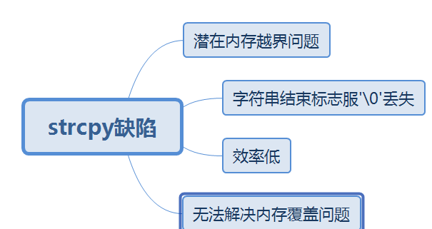

### 腾讯后台开发工程师（实习）**微信支付 

**操作系统** 

1、你知道进程和线程的区别吗？ 

进程（process）是操作系统为正在运行的程序提供的抽象。

线程（thread）是操作系统能够进行运算调度的最小单位。被包含在进程中，是进程的实际运作单位。

2、什么情况下使用多进程，什么情况用多线程？为什么？ 

多线程：io 密集型 （读取网络，读取文件）

多进程：计算 cpu 耗用的多（一个程序就可以理解为一个进程 ）

3、你有写过多线程吗？

无

4、在C++怎么写多线程？

5、你知道协程吗？

6、什么情况下适合用协程呢？

7、什么语言支持协程？C++支持协程吗？

8、解释一下用户态和内核态？ 

9、你有使用Linux吗？ 

10、I/O多路复用了解吗？  

**计算机网络：** 

1、说一下TCP和UDP的区别？ 

2、TCP协议怎么做到可靠的？ 

3、为什么TCP需要三次握手？ 

4、在浏览器输入一个网址，会发生什么？ 

5、HTTP协议都有哪些类型的请求？ 

6、GET和POST的区别？  

**数据库：** 

1、数据库的ACID特性是什么？ 

2、你了解Mysql吗？它有几种引擎？  

**C++:** 

1、构造函数可以是虚函数吗？为什么？ 

2、你用哪个版本呢？C++11有什么特性？ 

3、C++智能指针一定线程安全吗？  

### **深信服春招C++面经** 

一面 

1、static关键词、const关键词 

2、C如何避免内存泄漏（自己用变量计数） 

3、C++怎么实现动态多态、静态多态 

4、STL里面vector和数组区别 

5、map用的数据结构，红黑树特点，与平衡二叉树区别 

6、链表和数组区别 

7、字符串长度左移（算法） 

8、Linux统计文件内容行数 

9、TCP如何保证可靠性 

10、UDP如何实现可靠性（介绍使用自己项目的方法保证）你用的是应用程序保证程序可靠性？ 

11、实习多久？做了哪些项目？ 

12、秋招offer有吗 

13、sizeof和strlen区别，sizeof计算结构体的大小（结构体对齐） 

- **sizeof**是关键字,在编译时就能计算出值,可以计算任何类型
- **strlen**是函数,只有在运行时才能去计算,且只能计算字符型的

14、strcpy的缺点，与之相关的缺点函数有哪些（memcpy（memmove）...） 

二面 

1、手撕memcpy 

2、公司实习主要做了哪些项目，碰到的难点 

3、32位系统malloc最大的申请内存多少 

4、单链表如何查找环（只讲思路，没讲全）  

### **小米春招C++面经** 

https://www.nowcoder.com/discuss/662926?source_id=discuss_experience_nctrack&channel=-1

小米一面：

1、算法：返回倒数第K个链表 

2、数据结构用过哪些 

3、多进程，多线程以及如何通信 

4、多线程之间如何区分 

5、内存管理/内存布局 

6、内存泄漏/越界和死机情况，如何检查和解决

7、项目相关  

小米二面： 

1、简历项目：内存泄漏，QT自动回收机制 

2、项目介绍并提问问题 

3、进程和线程区别 

4、自旋锁和互斥锁，使用场景  

### 2021华为实习生软开C++

https://www.nowcoder.com/discuss/662621?source_id=discuss_experience_nctrack&channel=-1

**C++、C区别**

面向对象、面向过程区别

1、**define、const区别**

（1）就起作用的阶段而言： #define是在编译的预处理阶段起作用，而const是在 编译、运行的时候起作用。

（2）就起作用的方式而言： #define只是简单的字符串替换，没有类型检查。而const有对应的数据类型，是要进行判断的，可以避免一些低级的错误。 

（3）就存储方式而言：#define只是进行展开，有多少地方使用，就替换多少次，它定义的宏常量在内存中有若干个备份；const定义的只读变量在程序运行过程中只有一份备份。

（4）从代码调试的方便程度而言： const常量可以进行调试的，define是不能进行调试的，因为在预编译阶段就已经替换掉了。

2、**堆、栈，new、malloc**

3、**C++11新特性**

4、**多态**

动静多态

5、**vector和list区别（todo：各种容器特点及区别）**

List封装了链表,Vector封装了数组, list和vector得最主要的区别在于vector使用连续内存存储的，他支持[]运算符，而list是以链表形式实现的，不支持[]。 

Vector对于随机访问的速度很快，但是对于插入尤其是在头部插入元素速度很慢，在尾部插入速度很快。List对于随机访问速度慢得多，因为可能要遍历整个链表才能做到，但是对于插入就快的多了，不需要拷贝和移动数据，只需要改变指针的指向就可以了。另外对于新添加的元素，Vector有一套算法，而List可以任意加入。

Map,Set属于标准关联容器，使用了非常高效的平衡检索二叉树：红黑树，他的插入删除效率比其他序列容器高是因为不需要做内存拷贝和内存移动，而直接替换指向节点的指针即可。

Set和Vector的区别在于Set不包含重复的数据。Set和Map的区别在于Set只含有Key，而Map有一个Key和Key所对应的Value两个元素。

Map和Hash_Map的区别是Hash_Map使用了Hash算法来加快查找过程，但是需要更多的内存来存放这些Hash桶元素，因此可以算得上是采用空间来换取时间策略。

6、**dfs、bfs**

### 字节后端—基础架构实习

1、项目

2、C++和C区别

3、值传递/引用传递

4、智能指针

5、虚函数表作用

6、各种锁

7、虚拟地址空间

8、IO多路复用

9、B+树

10、平衡二叉树

11、array和list区别

12、多线程哈希表

13、算法题

- 螺旋打印二维数组
- 多叉树深度优先搜索

### 哔哩哔哩主站技术中心

1、协程？哪些情况下用协程？哪些情况下用协程对整体效率的提升也不高？

协程运行在线程之上，当一个协程执行完成后，可以选择主动让出，让另一个协程运行在当前线程之上。**协程并没有增加线程数量，只是**

**在线程的基础之上通过分时复用的方式运行多个协程**，而且协程的切换在用户态完成，切换的代价比线程从用户态到内核态的代价小

很多。

**协程的注意事项**

实际上协程并不是什么银弹，协程只有在等待IO的过程中才能重复利用线程，上面我们已经讲过了，线程在等待IO的过程中会陷入阻塞状

态，意识到问题没有？

假设协程运行在线程之上，并且协程调用了一个阻塞IO操作，这时候会发生什么？实际上操作系统并不知道协程的存在，它只知道线程，

**因此在协程调用阻塞IO操作的时候，操作系统会让线程进入阻塞状态，当前的协程和其它绑定在该线程之上的协程都会陷入阻塞而得不到调度，这往往是不能接受的。**

2、线程进程

3、进程之间的通信方式

IPC（Inter process communication）

4、线程模型，用户态线程怎么和内核态线程映射的？

5、TCP粘包？

6、TCP处理网络拥塞的机制

7、线程池

8、项目

9、reactor模式

10、二叉树层次遍历

### 哔哩哔哩后端

1、自我介绍 

2、为什么选择b站？ 

3、指针和引用的区别 

4、常用的容器 

5、它们底层的数据结构 

6、`allocator`的实现 

7、操作系统分段、分页 

8、定时器的实现 

9、读写锁 

10、如果读写锁占用很长时间，并且后续还有读者不断占用读锁，这就造成了写者饥饿的问题，怎么解决？ 

11、自旋锁 

12、Volatile

14、跳表 

15、`poll`和`epoll`的区别 

16、http 和 https 的区别 

17、http2 

18、http2 的多路复用和 io 多路复用区别

### 哔哩哔哩视频云C+++实习

https://www.nowcoder.com/discuss/582851?type=2&order=3&pos=33&page=1&source_id=discuss_tag_nctrack&channel=-

**C++**

1、new、malloc区别

返回类型、分配失败返回值、分配大小、数组的处理方式、是否调用构造函数 

2、多态

编译时多态、运行时多态 

3、虚函数实现

vptr、vtable 

4、重载原理

符号表 

5、map

红黑树，定义，自旋

**网络**

1、UDP

2、DNS

3、浏览器输入网址后发生了什么

**操作系统**

1、虚拟内存地址空间

stack、heap、bss、data、text

2、页机制

换页、缺页异常、TLB

3、IPC

管道、信号、消息队列、

**二面**

**网络**

1、拥塞控制

慢启动、拥塞避免、快速重传、快速恢复

2、select、epoll

3、红黑树原理，与AVL的区别

定义、自旋，rebalance频率相对低，适合大量插入删除node的场景

**操作系统**

1、多进程和多线程的选择

多进程可靠性高，创建销毁切换开销大，多线程反之 

2、Linux下C程序的调试

breakpoint、coredump 

3、静态链接、动态链接

libc库，避免代码庞大，节省内存，更新时不需全部重新编译，提高可维护性 

4、内存泄漏

valgrind

### 某个材料转码选手

https://www.nowcoder.com/discuss/667949?type=2&order=3&pos=8&page=1&channel=-1&source_id=discuss_tag_nctrack

#### 网易一面

1、输入URL到地址栏

2、应用层的协议

3、HTTP和HTTPS

4、HTTPS加密过程

5、TCP三次握手四次挥手

6、虚拟内存

7、进程间通信

8、并发问题

9、为什么投递

10、怎么学的C++、数据结构、操作系统、计算机网络

11、项目

12、怎么改进

13、异步IO

14、设计模式

#### 网易二面

1. 有个很大的字符串数组，新的字符串需要判断是否之前出现过

2. 内存空间不够大如何处理

3. C++ const关键字

#### 腾讯一面

1. struct和union的区别

2. 虚函数

3. IO多路复用

4. 指针和引用

5. 进程间通信的方式

6. 锁和死锁

#### 阿里平头哥

阿里[平头哥](https://www.nowcoder.com/jump/super-jump/word?word=平头哥)只记得[算法题](https://www.nowcoder.com/jump/super-jump/word?word=算法题)，其他的八股文问的很少。三个[算法](https://www.nowcoder.com/jump/super-jump/word?word=算法)提，一个是memcopy实现，第二个是[反转链表](https://www.nowcoder.com/jump/super-jump/word?word=反转链表)，第三个是找字符串匹配最长的子字符串，三个[算法题](https://www.nowcoder.com/jump/super-jump/word?word=算法题)两个写出来了，memcopy的实现有问题。

#### 字节一面

字节是最令我意外的公司啦，我一开始完全没有抱希望哈哈哈。 

 一面的[算法题]()是[二叉树]()的右视图，八股文很简单，没什么难度很深的问题 

#### 字节二面

在一个数组中找到两个数相乘等于target，追问是如果是浮点数怎么处理 

手写堆，建堆的时间复杂度及分析 

其他的八股文也很简单，问我会不会数据库，我：不会，哈哈哈，羞愧，逃。。。 

#### 字节三面

算法题是个[动态规划]()，一个环状的双向[链表]()，从0号点出发经过n步以后回到0号点的可能性是多少 

手写智能指针没写过

### 腾讯暑期实习

https://www.nowcoder.com/discuss/668558?type=2&order=3&pos=4&page=1&channel=-1&source_id=discuss_tag_nctrack

一面（1h 20min）： 

  1）自我介绍（最好结合[项目]()） 

  2）[c++]()中（数据结构 堆 和 栈） 

  3）纯虚函数 

  4）虚表指针 和 虚函数表 

  5）计算机网络的相关知识（TCP如何建立连接，具体过程） 

  6）软件测试的基本流程 

  7）手撕代码（[链表]()） 

  二面（1h 30min）: 

  1) 自我介绍 

  2）线层和进程 

  3）进程间通信 

  4）数据结构中堆的底层实现原理 

  5）用过哪些测试方法，自动测试工具 

  6）[c++]()中多态 

  7）死锁怎么产生？如何解决 

  8）数据库事务，隔离级别 

  9）手撕代码（4道） 

  三面（1h 20min） 

  1) 自我介绍 

  2）手撕代码（1-相同最长字符串     2-[动态规划]()      3-数据库        4-操作系统） 

  3）进程之间的通信方式？具体如何实现的？ 

  4）linx常用指令，如何查看当前cpu运行状态。 

  5）在浏览器中输入查询的内容，此时电脑后续进行了那些操作？ 

  6）当前视频面试用的什么通信协议?如何判断？ 

  四面（1h 50min） 

  1 ）深挖项目

  2 ）手撕代码（1-矩阵    2-[动态规划]()     3-文件操作） 

  2）僵尸进程和孤儿进程 

  五面-HR（30min） 

  1) 自我介绍 

  2）介绍[项目]() 

  3）自己从[项目]()中的收获啥的 

  总结： 

  大概前前后后面试持续了接近一个月，所以很多问题都想不起来了。。。。。总的来说面试前几轮比较注重语言基础，后面比较注重计网、操作系统及[项目]()经历。

### 腾讯反复鞭尸

https://www.nowcoder.com/discuss/669381?type=2&order=3&pos=2&page=0&channel=-1&source_id=discuss_tag_nctrack

#### TEG

1. 如何将一个进程挂在到后台，脱离终端运行(不会) 
2. 讲一下进程的通信方式 
3. 你知道共享内存，那你知道mmap的匿名映射是什么吗(不会) 
4. 讲一下进程和线程的区别 
5. 说说网络吧，讲讲http和https 
6. 讲讲TCP和UDP的区别 
7. 讲讲TCP三次握手和四次挥手 
8. Linux学过吧，说说你会的命令（讲了top、free、netstat），他反问，free显示出来的cache，如何将其释放？（不会） 
9. 算法：反转链表

#### IEG 魔方工作室

**一面**

1. 说一下STL吧，你讲讲内存配置器 
2. vector和list的底层是什么，说一下他们的使用场景 
3. 那map和unordered_map呢 
4. 说一下迭代器失效的场景 
5. 进程和线程的区别 
6. 操作系统的内存管理 
7. 说说网络编程吧，讲讲建立TCP的API，越详细越好 
8. 算法：LeetCode78: 子集，有序矩阵中第K小的元素(撕不出最优解，写了个快排)

**二面**

第一道是原创题，将相邻的连续数字合并。比如：[1,2,3,5,6,7,8,10]打印成1-3,5-8,10 

第二道是LeetCode43：字符串相乘，一开始使用了一个vector<int>去处理相乘结果，结果面试官不肯让我用，要求我用一个string去处理。撕不出来

#### IEG 研发效能部

**一面**

1. 讲讲虚函数的实现机制 
2. 构造函数可以设置为virtual吗？析构函数可以吗？ 
3. 讲讲指针和引用，野指针 
4. epoll和select的区别，以及epoll的使用方法 
5. 讲讲vector的扩容 
6. 讲讲map和unordered_map 
7. 讲讲操作系统的内存管理，堆和栈的区别 
8. 一个进程能有几个堆、几个栈？(靠猜，一个进程可以有多个线程，线程拥有自己的栈空间，所以我回答一个堆多个栈) 
9. 栈由操作系统回收，那你知道操作系统具体怎么回收的吗？(不懂，后面才知道其实就是推动栈帧的指针就可以达到回收目的，八股文背傻了不会用) 
10. 二叉树有几种遍历？你说说这些遍历在实际中的应用（我就说了下中序遍历可以在类似于搜索树的结构中得到一个有序序列，他提示下红黑树的插入，我就说了前序遍历的变种可以用于红黑树插入，后序遍历我实在是想不出，他也说那就下一题
11. cpu 的寻址(不会，计组都多少年没碰了) 
12. 聊项目，被问傻了，只能靠猜：listen的时候突然fork，然后一个连接的到来会唤醒两个进程吗？（我瞎猜的） 
13. 算法：LeetCode146: LRUcache

**二面**

1. 聊聊在百度做的东西
2. 讲讲虚函数的实现
3. 构造函数可以设置为virtual吗？析构函数可以吗？
4. 说说stl中有几种map(很好奇面试官没有看之前的面试记录吗，前三个问题和一面一样)
5. volatile关键字是什么意思？它一般用在哪
6. 说一下TCP的三次握手和四次挥手
7. 为什么一定要三次握手，两次可以吗
8. 第三次握手的报文没按时到达，会发生什么情况
9. 四次挥手客户端为什么要等到2MSL才进入CLOSED状态
10. 口述算法：100万个user_key，user_score键值对，找到user_score最大的1万个(我讲了个topk快排，发现面试官好像听不太懂，不明白他是懂装不懂还是怎么了，最后干脆共享屏幕写代码给他看)

#### 字节跳动财经部门

**一面**

1. 讲讲stl中的vector 
2. 讲讲map和unordered_map 
3. 线程安全的map可以怎么实现 
4. 说说指针和引用的区别 
5. const关键字、static关键字 
6. 多态的实现 
7. MySql的索引 
8. left join和right join 
9. 算法：LeetCode135: 分发糖果 

**二面**

1. 什么是死锁？死锁的四个条件？如何避免死锁？ 
2. 进程和线程的区别？ 
3. MySql的索引 
4. 乐观锁和悲观锁 
5. redis中的aof和rdb持久化 
6. 讲讲https和http，并说说https的工作流程 
7. 算法：LeetCode139: 单词拆分 

**三面**

1. 聊项目，不得不说这个面试官水平很高，我每说出一个点他都能就这个点提出问题，并说出我做的不好的地方，然后问我可以怎么改进。真心服气！有本事的面试官还是不少的。 
2. 算法：LeetCode25: K个翻转链表
