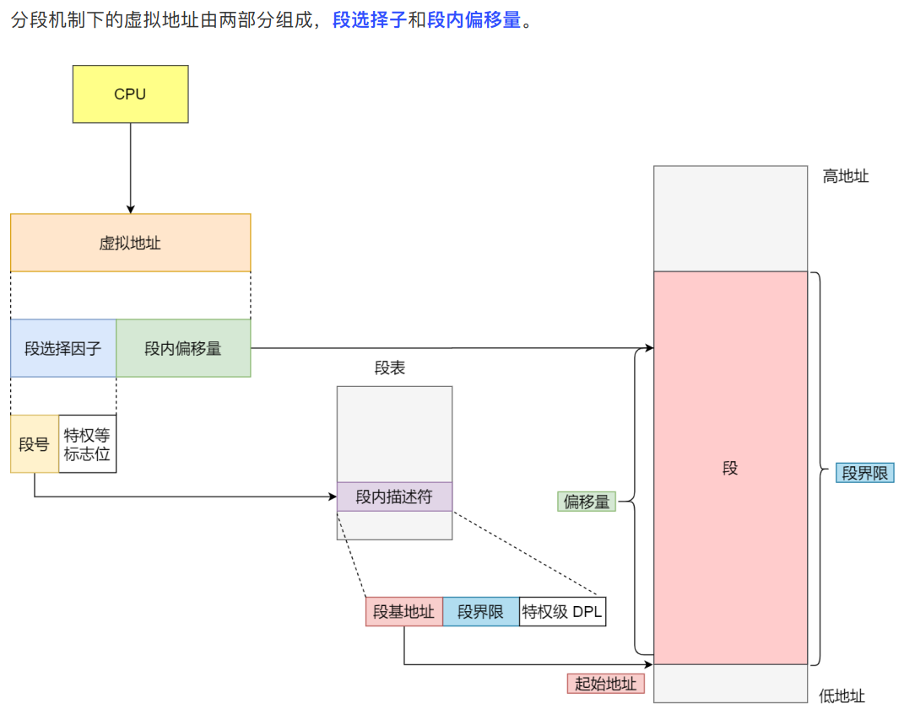
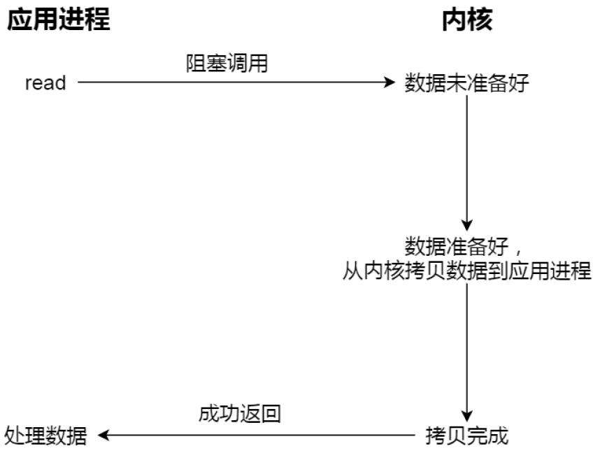
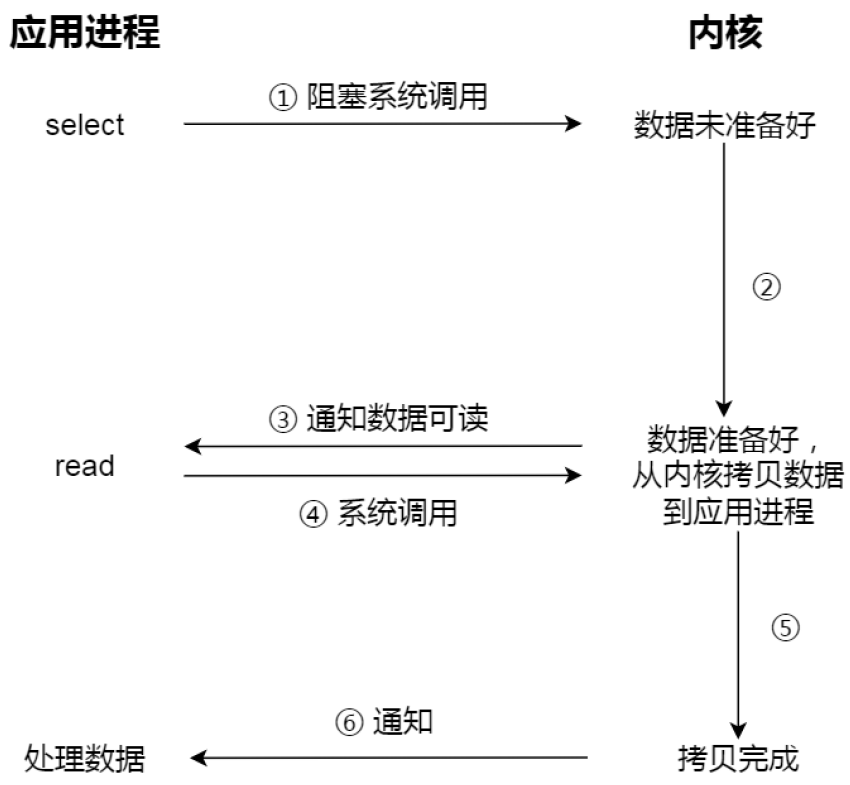

[TOC]

## 硬件结构

**CPU**

32位CPU一次可以计算4个字节。

64位CPU一次可以计算8个字节。

**总线**


### 64位相比32位的优势


### 软件的32位和64位


### CPU Cache


CPU Cache的数据是从内存加载过来的，写回数据的时候也只写回内存。


### 缓存一致性问题

假设A和B核心同时运行两个线程，都操作共同的变量i（初始值为0）。

如果A核心执行了i++操作，先把值写入到L1/L2缓存里，只有在A核心中的这个Cache Block要被替换时，数据才会写入内存。

如果B核心尝试从内存中读取i变量的值，则会读到错误的值，因为A核心还没更新i的值。


### 浮点数不能直接运算

**计算机怎么存小数的？**


计算机存放的小数可能不是一个真实值，两个近似数相加得到的也必然是一个近似数。


## 操作系统结构

### 内核

内核一般会提供四个能力：

管理进程、线程，决定哪个进程、线程使用CPU，也就是进程调度的能力；

管理内存，决定内存的分配和回收，内存管理的能力；

管理硬件设备，为进程与硬件设备提供通信能力，硬件通信能力；

提供系统调用，如果应用程序要运行更高权限运行的服务，用户程序与操作系统之间的接口；


## 内存管理

### 虚拟内存

​		虚拟内存就是说，让物理内存扩充成更大的逻辑内存，从而让程序获得更多的可用内存。虚拟内存使用部分加载的技术，让一个进程或者资源的某些页面加载进内存，从而能够加载更多的进程，甚至能加载比内存大的进程，这样看起来好像内存变大了，这部分内存其实包含了磁盘或者硬盘，并且就叫做虚拟内存。


单片机是没有操作系统的，每次写完代码都要借助工具把程序烧录进去，程序才能跑起来。

另外，单片机的CPU是直接操作内存的物理地址。

这种情况，想要在内存中同时运行两个程序是不可能的。


**操作系统会提供一种机制，将不同进程的虚拟地址和不同内存的物理地址映射起来。**


### 内存分段



**分段有两个问题**

- 内存碎片
- 内存交换效率低


#### 内存碎片

- 外部内存碎片，产生了多个不连续的小物理内存，导致新的程序无法被加载
- 内部内存碎片，程序的所有内存都被装载到了物理内存，但是这个程序有部分内存可能不是很常使用，导致了内存的浪费


解决外部碎片的方法是**内存交换**。

这个内存交换空间，在Linux系统里，就是Swap空间，从硬盘中划分出来的，用于内存与硬盘的空间交换。


#### 内存交换效率低

对于多进程的系统，用分段的方式，内存碎片很容易产生，产生了内存碎片就要重新Swap，如果内存交换的时候，交换的是一个很大的程序，整个机器都会显得卡顿。

为了解决内存分段的内存碎片和内存交换效率低的问题，就出现了内存分页。


### 内存分页

分页是把整个虚拟内存和物理内存空间切成一段段固定尺寸的大小。这样一个连续且尺寸固定的内存空间叫做页。

虚拟地址空间与物理地址空间通过页表来映射。


采用分页，释放的内存都是以页为单位的，就不会产生无法给进程使用的小内存。

如果内存空间不够，操作系统会把其他进程中最近没有使用的内存页面释放掉，【换出】，需要时再加载进来，【换入】。一次性写入磁盘的也只有少数几个页，内存交换的效率就比较高。


#### 虚拟地址和物理地址是怎么映射的


虚拟地址分为两部分，页号和页偏移。页号作为页表的索引，页表包含物理页每页所在物理内存的基地址。基地址与页偏移组合形成物理地址。


### 多级页表


如果某个一级页表的页表项没有被完全填满，那么就不需要创建这个页表项对应的二级页表了，即可以在需要的时候才创建二级页表。

页表一定要覆盖全部虚拟地址空间，不分级的页表需要有100多万个页表项来映射，而二级分页只需要1024个（一级页表覆盖了全部虚拟地址空间，二级页表在需要时创建）。


### 段页式内存管理

实现方式：

- 先将程序划分为多个有逻辑意义的端，也就是分段机制；
- 接着把每个段划分为多个页，也就是对分段划分出的连续空间，在划分固定大小的页；

**段号 + 段内页号 + 页内位移**


### Linux的内存管理方式

页式内存管理。

每个段都是从0地址开始的4G虚拟空间（32位），所有的代码面对的都是线性地址空间（虚拟地址），屏蔽了处理器中的逻辑地址概念，段只被用于访问控制和内存保护。


#### 虚拟地址空间分布


## 进程与线程

### PCB包含什么信息

**进程描述信息**

- 进程标识符
- 用户标识符：进程归属的用户，主要为共享和保护

**进程控制和管理信息**

- 进程当前状态
- 进程优先级

**资源分配清单**

- 有关内存地址空间或虚拟地址空间的信息，所打开文件的列表和所使用的I/O设备信息。

**CPU相关信息**

- CPU中各个寄存器的值，当进程被切换时，CPU的状态信息都会保存在相应的PCB中，以便进程重新执行时，能从断点处继续执行。


### PCB是怎么组织的

通过链表的方式进行组织，把具有相同状态的进程链在一起，组成各种队列。

- 所有处于就绪状态的进程链在一起，成为就绪队列。
- 所有因等待某事件而处于等待状态的进程链在一起就组成各种阻塞队列。


### 进程的控制

**创建进程**

- 为新进程分配一个唯一的进程标识号，并申请一个空白的PCB，PCB是有限的，若申请失败则创建失败。
- 为进程分配资源，此处如果资源不足，进程就会进入等待状态，以等待资源。
- 初始化PCB。
- 如果进程的调度队列能够接纳新进程，就将进程插入就绪队列，等待被调度运行。

**终止进程**

- 查找需要终止的进程PCB。
- 如果处于执行状态，则立即终止该进程的执行，然后将CPU资源分配给其他进程。
- 将该进程所拥有的资源归还。
- 将PCB从所在队列删除。

**阻塞进程**

- 找到将要被阻塞进程标识号对应的PCB。
- 如果该进程为运行状态，则保护其现场，将其状态转为阻塞状态，停止运行。
- 将该PCB插入到阻塞队列中去。

**唤醒进程**

在该事件的阻塞队列中找到相应进程的PCB。

将其从阻塞队列中移出，并置其状态为就绪状态。

把该PCB插入到就绪队列中，等待调度程序调度。


### 进程上下文切换

进程的上下文切换不仅包含虚拟内存、栈、全局变量等用户空间的资源，还包括内核堆栈、寄存器等内核空间的资源。


### 发生进程上下文切换的场景


### 为什么使用线程？

对于多进程的问题：

- 进程之间如何通信，共享数据？
- 维护进程的系统开销很大。


### 线程

**什么是线程？**

线程是进程中的一条执行流程

同一个进程内多个线程之间共享代码段、数据段、打开的文件等资源，但每个线程各自都有一套独立的寄存器和栈，这样可以确保线程的控制流是独立的。


**线程的优点**

- 一个进程中可以有多个线程
- 各个线程之间并发执行
- 各个线程之间可以共享地址空间和文件等资源

**缺点**

- 当进程中一个线程崩溃，会导致所有线程崩溃


### 进程和线程的比较


### 线程的上下文切换

线程是调度的基本单位，进程是资源拥有的基本单位。

操作系统的任务调度，实际调度对象是线程，而进程只是给线程提供了虚拟内存、全局变量等资源。


**线程上下文切换的是什么？**

- 当两个线程属于不同进程，则切换过程和进程一样。
- 当两个线程属于一个进程，虚拟内存共享，只需切换线程的私有数据、寄存器等不共享的资源。


### 线程的实现


**用户线程**

用户线程是基于用户的线程管理库来实现的，那么线程控制块（TCB）也是在库里实现的，操作系统是看不到这个TCB的，只能看到整个进程的PCB。

用户线程的整个线程管理和调度，操作系统不直接参与，而是由用户级线程库函数来完成线程的管理，包括线程的创建、终止、同步和调度等。


**内核线程**

内存线程是由操作系统管理的，线程对应的TCB放在内核中，线程的创建、终止和管理都由操作系统负责。


**轻量级进程LWP**

内核支持的用户线程，每个进程可以有一个或多个LWP，每个LWP跟内核线程是一对一映射的。

LWP只能由内核管理并像普通进程一样被调度，Linux内核是支持LWP的典型例子。

LWP与普通进程的区别在于它只有一个最小的执行上下文和调度程序所需的统计信息。


### 调度

#### 01先来先服务

每次从就绪队列中选择最先进入的进程，然后一直运行，直到进程退出或被阻塞，才会继续从队列中选择第一个进程接着运行。


#### 02最短作业优先

优先选择运行实际最短的进程来运行。

会导致长作业长期不会被运行。


#### 03高响应比优先


计算响应比优先级，把【响应比优先级】最高的进程投入运行。


#### 04时间片轮转


#### 05最高优先级调度


#### 06多级反馈队列


设置多个队列，优先级从高到低，优先级越高时间片越短。

短作业可能在第一级队列很快处理完。对于长作业，如果第一级队列处理不完，可以移入下次队列继续等待被执行，虽然等待时间变长了，但运行时间也变得更长了。


### 进程间通信

每个进程的用户空间是独立的，但内核空间是每个进程共享的，所以进程之间要通信必须通过内核。


#### 管道

**int pipe(int fd[2])**

创建一个匿名管道，并返回两个描述符，一个是读端fd[0]，另一个是写端fd[1]。

管道，就是内核里面的一串缓存。管道传输的数据是无格式的流且大小受限。

匿名管道只能用于父子进程通信。

命名管道在不相关的进程间也能通信，因为命名管道提前创建了一个类型为管道的设备文件，在进程里只要使用这个设备文件，就可以相互通信。

不管是匿名还是命名管道，进程写入的数据都是缓存在内核中，另一个进程读取数据时也是从内核中获取，同时通信数据都遵循先进先出原则。


#### 消息队列


**消息队列不适合比较大数据的传输**，因为内核中每个消息体都会有一个最大长度限制，同时所有队列所包含的全部消息体的总长度也有上限。

**消息队列通信过程中，存在用户态和内核态之间数据拷贝开销**。


#### 共享内存

**mmap**

创建共享内存区域。调用shm_open函数（这是cyber中做法，实际上创建普通文件即可），创建内存文件（默认路径为Linux下sysv共享内存的默认挂载点/dev/shm），参数是文件名和读写权限等，返回一个int文件描述符。

分配大小。调用ftruncate函数，给刚刚创建的文件设置大小即设置内存区域的大小。

映射内存。调用mmap函数，将某块内存映射到刚刚的文件，接下去对该文件的操作都会反映到内存上，注意该函数使用时的参数，映射区域的特性flags需要像cyber中那样设置为MAP_SHARED，这样对映射区域的写入数据会复制回文件内，而且允许其他映射该文件的进程共享。如果设置为MAP_PRIVATE则对映射区域的写入操作会产生一个映射文件的复制，即私人的“写入时复制”（copy on write）对此区域作的任何修改都不会写回原来的文件内容。

读写数据，之后就可以通过直接读写对应内存比如memcpy或cyber中的string*->assign/append函数等来进行操作和通信。


**shm**

```c++
// 创建或打开共享内存
int shmget(key_t key, size_t size, int shmflg);

// 连接到进程地址空间
 void *shmat(int shmid, const void *shmaddr, int shmflg);

// 将共享内存和当前进程脱离
int shmdt(const void *shmaddr);
```


**总结mmap和shm:**
1、mmap是在磁盘上建立一个文件，每个进程地址空间中开辟出一块空间进行磁盘文件映射。而对于shm而言，shm每个进程最终会映射到同一块物理内存。shm保存在物理内存，这样读写的速度要比磁盘要快，但是存储量不是特别大。

2、另外mmap有一个好处是当机器重启，因为mmap把文件保存在磁盘上，这个文件还保存了操作系统同步的映像，所以mmap不会丢失，但是shmget就会丢失。


#### 信号量


#### 信号

信号是进程间通信机制中唯一的异步通信机制，可以在任何时候发送信号给某一进程。

1. 执行默认操作
2. 捕捉信号，执行信号处理函数
3. 忽略信号


#### Socket

跨网络与不同主机上的进程之间通信。也可以用于本机通信。

**int Socket(int domain, int type, int protocal)**


### 生产者消费者问题


### 死锁

**发生条件**

- 互斥条件
- 持有并等待条件
- 不可剥夺条件
- 环路等待条件


**互斥条件**

多线程不能同时使用同一资源。

**持有并等待条件**

线程A在等待资源2的同时并不会释放自己已经持有的资源1。

**不可剥夺条件**

当线程已经持有了资源，在自己使用完之前不能被其他线程获取。

**环路等待条件**

死锁发生的时候，线程获取资源的顺序构成的环形链。


#### 避免死锁发生

**预防**

1. 破坏互斥条件

   有些资源不能同时访问

2. 破坏请求等待条件

   预先分配，进程在运行前一次申请完所需要的全部资源。

3. 破坏不可剥夺条件

   当一个已经保存了某些不可剥夺资源的进程，请求新的资源而得不到满足时，它必须释放已经保持的所有资源。

4. 破环循环等待条件

   采用顺序资源分配法。给系统中的资源编号，必须按编号递增的顺序请求资源，同类资源一次申请完。


### 悲观锁与乐观锁

**互斥锁、自旋锁、读写锁、乐观锁、悲观锁。**


#### 互斥和自旋锁

- 互斥锁加锁失败后，线程会释放CPU，给其他线程；
- 自旋锁加锁失败后，线程会忙等待，直到它拿到锁；

如果能确定被锁住的代码执行时间很短，就不该用互斥锁，而应该选用自旋锁，否则使用互斥锁。

自旋锁和互斥锁使用层面比较相似，但实现层面不同：当加锁失败时，互斥锁用【线程切换】来应对，自旋锁用【忙等待】来应对。


#### 读写锁

读写锁适用于能明确区分读操作和写操作的场景。

工作原理：

- 当【写锁】没有被线程持有时，多个线程能并发的持有读锁。
- 一旦【写锁】被线程持有后，读线程的获取读锁操作会被阻塞，而且其他写线程获取写锁的操作也会被阻塞。

在读多写少的场景，能发挥出优势。

**公平读写锁**：用队列把获取锁的线程排队，不管是写线程还是读线程都按照先进先出的原则加锁即可，这样读线程仍然可以并发，也不会出现饥饿现象。


#### 悲观锁和乐观锁

互斥锁、自旋锁、读写锁都属于悲观锁。

悲观锁认为多线程同时**修改共享资源的概率比较高，于是很容易出现冲突，所以访问共享资源前，先要上锁。**


如果多线程同时修改共享资源的概率比较低，就可以采用乐观锁。

乐观锁假定冲突的概率很低，**先修改完共享资源，在验证这段时间内有没有发生冲突，如果没有其他线程在修改资源，那么操作完成，如果发现有其他线程已经修改过这个资源，就放弃本次操作。**

场景例子：在线文档、SVN、Git

乐观锁虽然去除了加锁解锁的操作，但是一旦发生冲突，重试的成本非常高，所以只有在冲突概率非常低，且加锁成本非常高的场景时，才考虑使用乐观锁。


## 调度算法


抢占式调度：进程正在运行时，可以被打断，使其把CPU让给其他进程。抢占的原则一般有：时间片原则、优先权原则、短作业优先原则。

非抢占式调度：当进程正在运行时，它就会一直运行，直到该进程完成或发生某个事件而被阻塞时，才会把CPU让给其他进程。


#### 内存页面置换算法

**最佳页面置换算法**

置换在未来最长时间不访问的页面。


理想化的算法，实际系统中无法实现，因为程序访问页面时动态的，我们无法预知每个页面在下一次访问前的等待时间。

所以，最佳页面置换算法是为了衡量你的算法效率，算法越接近该算法的效率，说明算法是高效的。


**先进先出算法**

**选择在内存中驻留时间很长的页面进行置换**。


**最近最久未使用的置换算法LRU**

**选择最长时间没有被访问的页面进行置换**。

近似与最优置换算法，最优置换算法是通过未来的使用情况来推测要淘汰的页面，LRU是根据历史的使用情况来推测。


虽然LRU在理论上是可以实现的，但是代价较高。为了完全实现LRU，需要在内存中维护一个所有页面的链表，最近最多使用的在表头，最近最少使用的在表尾。

困难的是，每次访问内存都必须更新整个链表。在链表中找到一个页面，删除，然后移动到表头。


**时钟页面置换算法**


所有页面保存在一个类似钟面的【环形链表】中，一个表针指向最老的页面。

发生缺页中断时，首先检查表针所指向的页面：

- 如果它的访问位是0就淘汰该页面，并把新的页面插入这个位置，然后把表针前移一个位置；
- 如果它的访问位是1就清除访问位，并把表针前移一个位置，重复这个过程直到找到了一个访问位是0的页面为止；


**最不常用算法LFU**

**发生缺页中断时，选择访问次数最少的那个页面，并将其淘汰。**

每个页面设置一个访问计数器，每当一个页面被访问时，该页面的计数器就加一。发生缺页中断时，淘汰计数器值最小的那个页面。


#### 磁盘调度算法

假设有下列一个请求序列，每个数字代表磁道的位置：

98，183，37，122，14，124，65，67


**先来先服务**


**最短寻道时间优先**


可能存在某些请求的饥饿问题。


**扫描算法**

磁头在一个方向上移动，访问所有未完成的请求，直到磁头到达该方向上的最后磁道，才调换方向。


**循环扫描算法**

只有磁头操着某个特定方向移动时，才处理磁道访问请求，而返回时直接快速移动至最靠边缘的磁道，也就是复位，返回中途不处理任何请求。


**LOOK与C-LOOK算法**

扫描和循环扫描都是移动磁盘到最始端或最末端才开始调换方向。

优化的思路就是磁头移动到【最远的请求】位置，然后立即反向移动。

针对扫描算法的优化叫LOOK算法，**反向移动的途中会响应请求**。

针对C-SCAN算法的优化叫C-LOOK。磁头在每个方向上仅仅移动到最远的请求位置，然后立即方向移动，**反向移动的途中不会响应请求**。


## 文件系统


Linux：一切皆文件，不仅普通的文件和目录，块设备、管道、socket等也是统一交给文件系统管理的。

Linux文件系统会为每个文件分配两个数据结构：索引节点（index node）和目录项（directory entry），它们用来记录文件的元信息和目录层次结构。

- 索引节点，inode，用来记录文件元信息，比如inode编号、文件大小、访问权限、创建时间、修改时间、数据在磁盘的位置等。索引节点是文件的唯一标识，它们之间一一对应，也同样会被存储在磁盘中，所以**索引节点同样占用磁盘空间。**
- 目录项，也就是dentry，用来记录文件的名字、索引节点指针以及与其他目录项的层级关联关系。多个目录项关联起来，就会形成目录结构，但是和索引节点不同的是，**目录项是由内核维护的一个数据结构，不存放在磁盘，而是缓存在内存。**


### 目录项和目录是一个东西吗？

不是。目录是个文件，持久化存储在磁盘，而目录项是内核一个数据结构，缓存在内存。

如果查询目录频繁从磁盘读，效率会很低，所以内核会把已经读过的目录用目录项这个数据结构缓存在内存，下次再读到同样的目录时，只需从内存中读就可以。


### 虚拟文件系统

文件系统的种类众多，而操作系统希望对用户提供一个统一的接口，于是再用户层与文件系统中引入了中间层，虚拟文件系统（VFS）。

**VFS定义了一组所有文件系统都支持的数据结构和标准接口**，这样程序员不需要了解文件系统的个工作原理，只需要了解VFS提供的统一接口即可。


### 文件的使用


### 硬链接和软链接

**硬链接**

硬链接是多个目录项中的【索引节点】指向同一个文件，但是inode是不可能跨越文件系统的，每个文件系统都有各自的inode数据结构和链表，所以**硬链接是不可以与跨文件系统的**。**只有删除文件的所有硬链接以及源文件时，系统才会彻底删除该文件。**


**软链接**

软链接相当于重新创建一个文件，这个文件有独立的inode，但是这个**文件的内容是另一个文件的路径**，所以访问软链接的时候，实际相当于访问到了另一个文件，所以软链接是可以跨文件系统的，**甚至目标文件被删除了，链接文件还是在的，只不过指向的文件找不到了。**


### 文件IO

#### 缓冲与非缓冲IO

根据【是否利用标准库缓冲】，可以把文件IO分为缓冲IO和非缓冲IO。

- 缓冲IO，利用的是标准库的缓存实现文件的加速访问，而标准库再通过系统调用访问文件。
- 非缓冲IO，直接通过系统调用访问文件，不经过标准库缓存。


#### 直接与非直接IO

根据是否利用操作系统的缓存，可以把文件分为直接IO和非直接IO。

- 直接IO，不会发生内核缓存和用户程序之间数据复制，而是直接经过文件系统访问磁盘。
- 非直接IO，读操作时，数据从内核缓存中拷贝给用户程序，写操作时，数据从用户程序拷贝给内核缓存，再由内核决定什么时候写入数据到磁盘。


#### 阻塞与非阻塞IO 同步异步IO

**阻塞IO**，阻塞等待的是【内核数据准备好】和【数据从内核态拷贝到用户态】两个过程。



**非阻塞IO**，非阻塞的read请求在数据未准备好的情况下立即返回，可以继续往下执行，此时应用程序不断轮询内核，直到数据准备好，内核将数据拷贝到应用程序缓冲区，read调用才可以获取结果。


注意，访问管道或Socket时，如果设置了**O_NONBLOCK**标志，那么就表示使用的是非阻塞IO，默认是阻塞IO。


**IO多路复用**，如select、poll，通过IO事件分发，当内核数据准备好时，再以事件通知应用程序进行操作。




无论是阻塞IO、非阻塞IO还是IO多路复用都是同步调用。它们在read调用时，内核将数据从内核空间拷贝到应用程序空间时，过程都是需要等待的，也就是说这个过程是同步的，如果内核的拷贝效率不高，read调用就会在这个同步过程中等待较长时间。

真正的异步IO是【内核准备好数据】和【数据从内核态拷贝到用户态】这两个过程都不需要等待的。

当我们发起**aio_read**后就立刻返回，内核自动将数据从内核空间拷贝到应用程序空间。


## 网络系统

### 传统的文件传输有多糟糕？

如果服务端要提供文件传输的功能，我们想到的最简单的方式是：将磁盘上的文件读取出来，然后通过网络协议发送给客户端。


发生了4次用户态和内核态的上下文切换，因为发生了两次系统调用，**read()和write()**。

还发生了4次数据拷贝，两次是DMA的拷贝，另外两次是通过CPU拷贝：

第一次，把磁盘上的数据拷贝到操作系统的内核缓冲区，DMA负责。

第二次，把内核缓冲区的数据拷贝到用户缓冲区，CPU负责。

第三次，把用户缓冲区的数据再拷贝到内核的socket缓冲区，CPU负责。

第四次，把内核socket缓冲区的数据，拷贝到网卡的缓冲区，DMA负责。

**所以，要想提高文件传输的性能，就要减少【用户态与内核态的上下文切换】和【内存拷贝】的次数。**

要减少上下文切换的次数，就要减少系统调用的次数，另外，在文件传输的应用场景中，在用户空间我们并不会对数据再加工，所以数据实际上可以不用搬运到用户空间。


### 如何实现零拷贝?

零拷贝技术实现方式通常有两种：

- mmap + write
- sendfile


**mmap + write**

read()系统调用会把内核缓冲区的数据拷贝到用户缓冲区，为了减少开销，我们可以用mmap()替换read()。

mmap()会直接把内核缓冲区里的数据映射到用户空间，这样操作系统内核与用户空间就不需要再进行任何的数据拷贝操作。


减少一次数据拷贝的过程。


**sendfile**

```c++
#include <sys/socket.h>
ssize_t sendfile(int out_fd, int in_fd, off_t* offset, size_t count);
```

前两个参数分别是目的端和源端的文件描述符，后面两个参数是源端的偏移量和复制数据的长度，返回的是实际复制数据的长度。

可以替代read()和write()，这样就可以减少一次系统调用，也就减少了2次上下文切换的开销。

直接把内核缓冲区的数据拷贝到socket缓冲区里，不再拷贝到用户态，这样就是2次上下文切换，3次数据拷贝。


**如果网卡支持SG-DMA技术**，可以进一步减少通过CPU把内核缓冲区里的数据拷贝到socket缓冲区的过程。


这就是零拷贝技术，因为我们没有在内存层面去拷贝数据，也就是全程没有通过CPU搬运数据，所有的数据都是通过DMA传输的。


### I/O多路复用 select/poll/epoll

**为每个请求分配一个进程/线程的方式不合适，有没有可能只使用一个进程来维护多个Socket呢？**

IO多路复用模型指的是：使用单个进程同时处理多个网络连接IO，他的原理就是select、poll、epoll 不断轮询所负责的所有 socket，当某个socket有数据到达了，就通知用户进程。该模型的优势并不是对于单个连接能处理得更快，而是在于能处理更多的连接。

select/poll/epoll内核提供给用户态的多路复用系统调用，进程可以通过一个系统调用函数从内核获取多个事件。

在获取事件时，先把所有连接（文件描述符）传给内核，再由内核返回产生了事件的连接，然后在用户态中处理这些连接对应的请求即可。


#### select/poll

select实现方式是，将已连接的Socket都放到一个**文件描述符集合**，然后调用select将文件描述符集合**拷贝**到内核里，内核遍历文件描述符集合，检查是否有事件发生，将此Socket标记为可读或可写。再把整个文件描述符**拷贝**回用户态里，用户态再**遍历**找到可读可写的Socket，然后处理。

对于select，需要两次遍历文件描述符集合，还会发生两次拷贝文件描述符集合。

select以固定长度的数组表示文件描述符集合，最大值1024。

poll以链表的形式组织，突破了select文件描述符个数限制，当然还会收到系统文件描述符限制。

但是poll和select本质上没有太大区别，都是使用线性结构存储进程关注的Socket集合，因此都需要遍历文件描述符集合找到可读可写的Socket，时间复杂度为O(n)，而且也需要在用户态与内核态之间拷贝文件描述符集合。


#### epoll

epoll在内核使用红黑树来跟踪进程所有待检测的文件描述符，把需要监控的socket，把需要监控的socket通过epoll_ctl()加入内核的红黑树里（红黑树增删查时间一般O(logn)），这样就不需要每次传入整个Socket集合，只需要传入一个待检测的socket，减少了内核和用户空间的拷贝。

epoll使用事件驱动机制，内核里维护了一个链表来记录就绪事件，当某个socket有事件发生时，通过回调函数内核会将其加入到这个就绪事件列表中，当用户调用epoll_wait()时，只返回有事件发生的文件描述符个数，不需要轮询整个集合。


#### 边缘触发和水平触发

水平触发，当epoll_wait检测到其上有事件发生并通知应用程序时，应用程序可以不立即处理该事件。下一次调用epoll_wait时，还会向应用程序通知该一事件，直到该事件被处理。

边缘触发，当epoll_wait检测到有事件发生并通知应用程序后，应用程序必须立刻处理该事件，后续不会再通知这一事件。

ET模式降低了同一个epoll事件被重复触发的次数。


### Reactor和Proactor

Reactor模式

IO多路复用监听事件，收到事件后，根据事件类型分配给某个进程/线程。

主要由Reactor和处理资源池两个核心部分组成：

- Reactor负责监听和分发事件，事件类型包含连接事件、读写事件；
- 处理资源池负责处理事件，如read — 业务逻辑 — send；

Reactor的数量可以有一个或多个，处理资源池可以是单个进程/线程，也可以是多个进程/线程。


#### 单Reactor 单进程/线程


- **Reactor对象的作用是监听和分发事件；**
- **Acceptor对象的作用是获取连接；**
- **Handler对象的作用是处理业务；**


缺点：

- 只有一个进程，无法充分利用多核CPU的性能。
- Handle对象在业务处理时，整个进程无法处理其他连接事件的，如果业务处理耗时比较长，那么就造成响应的延迟。


#### 单Reactor 多线程/进程


不一样的地方：

- Handler对象不再负责业务处理，只负责数据的接收和发送，Handler对象通过read读取到数据后，会将数据发给子线程里的Processor对象进行业务处理；
- 子线程里的Processor对象就进行业务处理，处理完后，将结果发给主线程中的Handler对象，接着由Handler通过send方法将响应结果发给client；

因为一个Reactor对象承担所有事件的监听和响应，而且只在主线程中运行，在面对瞬间高并发的场景时，容易成为性能瓶颈。


#### 多Reactor 多进程/线程


### Proactor

**Reactor是非阻塞同步网络模式，感知的是就绪可读写事件。**在每次感知到有事件发生后（如可读），就需要进程主动调用read方法完成数据的读取，也就是要应用进程主动将socket接收缓冲中的数据读到应用进程中，这个过程是同步的，读取完数据后应用进程才能处理数据。

**而Proactor是异步网络模式，感知的是已完成的读写事件。**在发起异步读写请求时，需要传入数据缓冲区的地址（用来存放结果数据）等信息，这样系统内核才能自动帮我们把数据的读写工作完成，这里的读写工作全部由操作系统来做，并不需要像Reactor那样还需要应用进程主动发起read/write来读写数据，操作系统完成读写工作后，就会通知应用进程直接处理数据。


## Linux命令

**网络配置如何查看？**

**ifconfig和ip**

这两个命令输出的格式不尽相同，但是输出内容基本相同，比如都包含了IP地址、子网掩码、MAC地址、网关地址、MTU大小、网口的状态以及网路包收发的统计信息。


socket信息如何查看

**netstat或者ss**

查看socket、网络协议栈、网口以及路由表信息。

