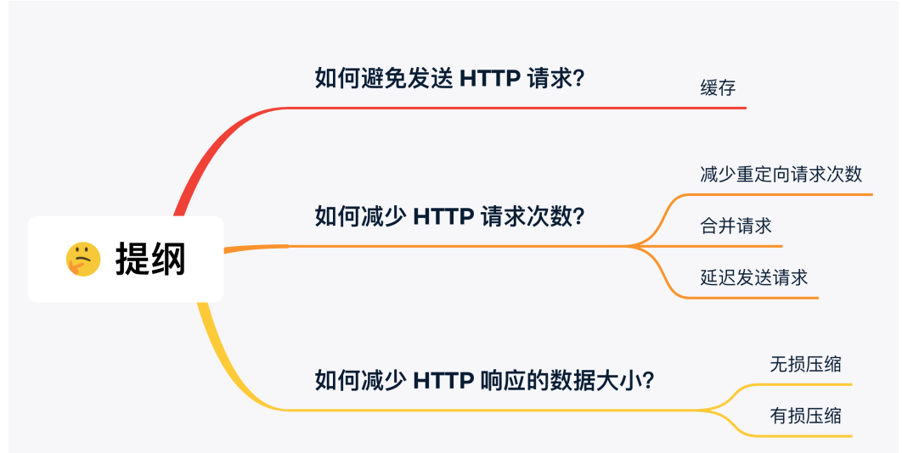

[TOC]


## HTTP篇

### 超文本


### 状态码


### HTTP的缺点

**无状态和明文传输**

cookie技术

cookie实际上是一小段的文本信息。客户端请求服务器，如果服务器要记录该用户的状态，就向客户端浏览器颁发一个cookie，客户端会把cookie保存起来。当浏览器再次请求该网站时，浏览器把请求的网址连同该Cookie一起发送给服务器。服务器检查该cookie，依次来辨认用户状态。


### HTTP和HTTPS的区别


### 数字证书


### HTTPS建立连接


### HTTP1.1对1.0的改进


### HTTP2.0对1.1的改进

1. 头部压缩

   如果同时发出多个请求，他们的头部是一样的或者是类似的，那么，协议会帮你消除重复的部分。

   HPACK算法：在客户端和服务器端同时维护一张头信息表，所有的字段都会存入这个表，生成一个索引号，以后就不发送同样字段了，只发送索引号。

2. 二进制格式

   不再像1.1里纯文本形式的报文，全面采用二进制格式，头信息体和数据体都是二进制，并且统称为帧：头信息帧和数据帧。

   

3. 数据流

   2.0的数据包不是按顺序发送的，同一个连接里连续的数据包，可能属于不同的回应。因此，必须对数据包做标记，指出属于哪个回应。

   每个请求或回应的所有数据包称为一个数据流。

   客户端还可以指定数据流的优先级。

4. 多路复用

   在一个连接中并发多个请求或响应，而不用按照顺序一一对应。

   移除了1.1中的串行请求，不需要排队等待，也就不会再出现队头阻塞的问题。

5. 服务器推送

   服务不再是被动响应，也可以主动向客户端发送消息，如在浏览器刚请求HTML的时候，就提前把可能用到的JS、CSS文件等静态资源发送给客户端。


### HTTP1.1如何优化




### DH密钥交换


### HTTPS如何优化

**产生性能损耗的环节：**

1. TLS协议握手过程
2. 握手后的对称加密报文传输（非常小）


硬件加速！HTTPS协议是计算密集型，有大量需要计算密钥的过程。

软件优化！软件升级

**协议优化！**

密钥交换算法优化，使用RSA密钥交换算法的TLS握手，不仅慢，而且安全性也不高。

证书优化，方便传输——减少证书大小；证书验证优化。

会话复用！

TLS握手的目的就是为了协商出会话密钥。如果我们把首次TLS握手协商的对称加密密钥缓存起来，下次需要建立HTTPS连接时，直接复用这个密钥。

Session ID 和 Session Ticket


## TCP篇

TCP是面向连接的、可靠的、基于字节流的传输层通信协议。

面向连接：一对一才能连接

可靠：无论网络出现怎么样的链路变化，TCP都可以保证一个报文一定能够到达接收端

字节流：消息是没有边界的，无论有多大都可以进行传输。并且是有序的，当前一个消息没有收到的时候，即使收到了后面的字节，也不能交付给应用层处理，重复的报文会自动丢弃。


序号：解决网络包乱序的问题。

确认应答号：解决不丢包的问题。


### UDP和TCP的区别


1. 连接

   TCP是面向连接的传输层协议，传输数据前先要建立连接。

   UDP不需要连接，即刻传输数据。

2. 服务对象

   TCP一对一，UDP一对一、一对多、多对多。

3. 可靠性

   TCP是可靠交付数据，数据可以无差错、不丢失、不重复、按需到达。

   UDP尽最大努力交付，不保证可靠交付数据。

4. 拥塞控制、流量控制

5. 首部开销

6. 传输方式

   流式传输，没有边界，但保证顺序和可靠。

   一个包一个包的发送，有边界，但可能丢包和乱序。

7. 分片不同

   TCP的数据大小大于MSS，会在传输层分片，目标主机收到后，也同样再传输层组装TCP数据包。

   UDP数据大小大于MTU，会在IP层分片。


### TCP和UDP应用场景

TCP面向连接、保证数据可靠交付，常用：

- FTP文件传输
- HTTP/HTTPS

UDP无连接、可以随时发送数据，常用：

- 包总量较少的通信，DNS、SNMP等
- 视频、音频等
- 广播通信


### 为什么是三次握手？


- 避免历史连接

  如果一个旧的SYN报文比一个新的SYN报文早到达了服务端，那么服务端回一个SYN+ACK报文给客户端，客户端根据自身的上下文，判断这是一个历史连接（序列号或者超时），那么客户端就会发送RST报文给服务端，表示终止这次连接。

  如果是两次握手建立连接，就不能判断当前连接是否是历史连接。

- 三次握手才能同步双方初始序列号

- 避免资源浪费

  如果只有两次，每收到一个SYN就主动建立一个连接，会建立多个冗余无效连接。


### IP层会分片，为什么TCP还需要MSS？


### 什么是SYN攻击？如何避免？

**SYN攻击**

攻击者短时间伪造不同IP地址的SYN报文，服务端每接收到一个SYN报文，就进入SYN_RCVD状态，但是服务器发出的报文，无法得到IP主机的应答，久而久之就会占满服务端的SYN接收队列。

**怎么解决？**  

当在服务器上看到大量的半连接状态时，特别是源IP地址是随机的，基本可以断定是一次SYN攻击。

- 缩短超时（SYN Timeout）时间 

- 增加最大半连接数 

- 过滤网关防护 

- **SYN cookies技术**： 

  **当服务器接受到 SYN 报文段时，不直接为该 TCP 分配资源**，而只是打开一个半开的套接字。接着会使用 SYN 报文段的源 Id，目的 Id，端口号以及只有服务器自己知道的一个秘密函数**生成一个 cookie，并把 cookie 作为序列号响应给客户端**。 

  **如果客户端是正常建立连接，将会返回一个确认字段为 cookie + 1 的报文段**。接下来服务器会根据确认报文的源 Id，目的 Id，端口号以及秘密函数计算出一个结果，**如果结果的值 + 1 等于确认字段的值，则证明是刚刚请求连接的客户端，这时候才为该 TCP 分配资源**


### TCP连接断开


### 为什么需要TIME-WAIT

- 防止旧的数据包被接收到

  如果TIME-WAIT没有或者过短，有相同端口的TCP连接被复用后，被延迟到达的报文抵达了客户端，那么客户端是有可能正常接收这个报文的，可能产生数据错乱等问题。

  经过2MSL时间，足以让两个方向上的数据包都被丢弃，使得原来连接的数据包在网络中都自然消失，再出现的数据包一定都是新连接产生的。

- 保证被动关闭连接的一方能被正确的关闭，如果最后一个ACK在网络中丢失了，那么服务端会一直在LASE_ACK状态。


### TIME-WAIT过多的危害

- 内存资源占用

- 端口资源的占用，一个TCP连结恶至少消耗一个本地端口

  

### Socket编程


### listen中backlog的意义？

Linux内核中会维护两个队列

未完成连接队列：接收到一个SYN建立连接请求，处于SYN_RCVD状态

已完成连接队列：已完成TCP三次握手，处于ESTABLISHED状态

```
int listen(int socketfd, int backlog)
```

现在通常认为backlog时accept队列。


### accept发生在三次握手的哪一步？


**客户端connect成功返回是在第二次握手，服务端accept成功返回是在三次握手成功之后。**


### 重传机制

#### 超时重传

发送数据时，设置一个定时器，当超过指定时间后，没有收到对方的ACK确认应答报文，就重发该数据。

两种情况：

- 数据包丢失
- 确认应答丢失


**超时时间应该设置为多少？**

RTO（超时重传时间）

当超时时间比较大时，网络的空隙时间增大，降低网络传输效率。

当超时时间比较小时，不必要的重传会导致网络负荷增大。

超时重传时间RTO的值应该略大于报文往返RTT的值。


#### 快速重传


当收到三个相同的ACK报文时，会在定时器过期之前，重传丢失的报文段。


### 滑动窗口

每发送一个数据，都要进行一次确认应答。当上一个受到应答了，再发送下一个。这种方式效率比较低。


**窗口大小如何决定？**

TCP头部字段有一个叫Window，也就是窗口大小。

接收端告诉发送端自己还有多少缓冲区可以接收数据。于是发送端就可以根据接收端的处理能力来发送数据，而不会导致接收端处理不过来。


**发送方的滑动窗口**


**接收方的滑动窗口**


### 流量控制

发送方不能无脑的发数据给接收方，要考虑接收方处理能力。


**操作系统缓冲区与滑动窗口的关系**

实际上，发送窗口和接收窗口中所存放的字节数都是放在操作系统内存缓冲区中的，而操作系统的缓冲区会被操作系统调整。

当应用进程没办法及时读取缓冲区的内容时，也会对我们的缓冲区造成影响。


### 窗口关闭

#### 窗口关闭潜在危险

如果窗口大小为0，就会阻止发送方给接收方传递数据，直到窗口变为非0为止，这就是窗口关闭。

接收方向发送方通告窗口大小，是通过ACK报文来通告的。

当发生窗口关闭时，接收方处理完数据后，就会向发送方通告一个窗口非0的ACK报文，如果这个通告窗口的ACK报文丢失了。


#### TCP是如何解决窗口关闭的死锁问题的？

只要TCP连接一方收到对方的零窗口通知，就启动持续计时器。

如果计时器超时，就会发送**窗口探测报文**，对方在确认这个探测报文时，就给出自己现在的接收窗口大小。

如果接收窗口仍是0，那么收到这个报文的一方就重启计时器。

如果不是0，就打破死锁了。


### 拥塞控制

流量控制是避免【发送方】的数据填满【接收方】的缓存，但是并不知道网络中发生了什么。

计算机网络都处在一个共享的环境，因此有可能会因为其他主机的通信使得网络拥堵。

**在网络出现拥堵时，如果继续发送大量数据包，可能导致数据包时延、丢失等，这时TCP就会重新传递数据，但是一重传就会导致网络的负担更重，于是会产生更大的延迟以及更多的丢包，恶性循环...**

拥塞控制，目的是避免【发送方】的数据填满整个网络。


#### 拥塞窗口和发送窗口的关系?

拥塞窗口cwnd是发送方维护的一个状态变量，会根据网络状态动态变化。

发送窗口swnd和接收窗口rwnd是约等于的关系。加入拥塞窗口的概念后，发送窗口的值是 swnd = min（cwnd, rwnd），也就是拥塞窗口和接收窗口中的最小值。

怎么知道出现了拥塞？

发送方没有在规定时间接收到ACK应答报文，发生了超时重传，就会认为网络出现了拥塞。


#### 拥塞控制算法

**慢启动**

问题：最初的TCP在连接建立成功后会向网络中发送大量的数据包，这样很容易导致网络中路由器缓存空间耗尽，从而发生拥塞。

慢启动算法，发包的个数是指数型增长。

ssthresh——慢启动门限

当cwnd < ssthresh时，使用慢启动算法。

当cwnd >= shhthresh时，就会使用拥塞避免算法。

**拥塞避免**

每收到一个ACK，cwnd增加1/cwnd。变成线性增长。

拥塞发生。发生超时重传时，ssthresh设为cwnd/2，cwnd重置为1；

**快重传**

cwnd = cwnd/2，设置为原来的一半

ssthresh = cwnd

**快恢复**

拥塞窗口 cwnd = ssthresh + 3。

重传丢失的数据包。

再收到重复的ACK，那么cwnd + 1。

收到新数据的ACK后，再进入拥塞避免。


### TCP握手异常情况分析

#### TCP第一次握手的SYN丢包了，会发生什么？

当客户端发起的TCP第一次握手SYN包，在超时时间内没收到服务器端的ACK，就会超时重传SYN数据包，每次超时重传的时间是翻倍上涨的，知道SYN包的重传次数到达**tcp_syn_retrier**值后，客户端不再发送SYN包。


#### TCP第二次握手的SYN、ACK丢包了，会发生什么？

当第二次握手的SYN、ACK丢包时，客户端会超时重发SYN包，服务端也会超时重传SYN、ACK包。


#### TCP第三次握手的ACK丢包了，会发生什么？

服务端无法收到ACK，服务端会短暂处于**SYN_RECV**状态，客户端处于**ESTABLISHED**状态。

服务端一直收不到TCP第三次握手的ACK，会一直重传SYN、ACK包，直到重传次数超过**tcp_synack_retries**值（默认五次），服务端会断开连接。

客户端情况：

如果客户端不发生数据，一直处于**ESTABLISHED**，经过2小时11分15秒才可以发现该死亡连接，断开。

如果客户端发送了数据，一直没有收到服务器的确认报文，会一直重传该数据包，直到超过**tcp_retries2**值（默认15次）后，客户端会断开连接。


### TCP重复确认和快速重传

当接收方收到乱序数据包时，会发送重复的ACK，告知发送方要重发该数据包，当发送方收到3个重复的ACK时，就会触发快速重传，立刻重发丢失数据包。


### TCP半连接队列和全连接队列

半连接队列，也称SYN队列；

全连接队列，也称accept队列；

服务器收到客户端发起的SYN请求后，内核会把该连接存储到半连接队列，并向客户端响应SYN+ACK，接着客户端会返回ACK，服务端收到第三次握手的ACK后，内核会把连接从半连接队列中移除，创建新的完全连接，添加到accept队列，等待进程调用accept把连接取出。


### 半连接队列溢出

模拟TCP半连接溢出，对服务器一直发送TCP SYN包，但是不回第三次握手ACK，这样就会使得服务器有大量处于SYN_RECV状态的连接。

又叫SYN洪泛、SYN攻击、DDos攻击。

**如何防御SYN攻击？**

- 增大半连接队列

- 开启**tcp_syncookies**功能

- 减少SYN+ACK重传次数

  当服务端受到攻击时，有大量处于SYN_REVC状态的TCP连接，处于这个状态的TCP会重传SYN+ACK，当重传超过次数达到上限后，就会断开连接。我们减少SYN+ACK的重传次数，就加快了处于SYN_REVC状态的TCP连接断开。

  

**syn cookie技术**

syn cookie技术是对tcp的三次握手进行了一定的修改，但是修改仅在于服务器端，对任何客户端的使用都没有影响。原本tcp协议是在收到syn包时，服务器返回syn+ack包并分配一个专门的数据区来储存tcp连接需要的数据，这就使攻击者有机可乘，可以利用伪造的syn包来消耗服务器的内存空间和半开连接数，这就可以使服务器的内存或者半开连接数耗尽而拒绝服务。

**而syn cookie技术是服务器在收到syn包时并不马上分配储存连接的数据区，而是根据这个syn包计算出一个cookie**，把这个cookie填入tcp的Sequence Number字段发送syn+ack包，等对方回应ack包时检查回复的Acknowledgment Number字段的合法性，如果合法再分配专门的数据区。


## IP篇


IP在TCP/IP中的网络层。

网络传的主要作用：实现主机与主机之间的通信，也叫点对点通信。

IP地址（IPv4）由32位正整数表示，每8位分为4组。


主机号全1，指定某个网络下的所有主机，广播。

主机号全0为网络号。


### IP分类的缺点


### 无分类地址CIDR


### 子网掩码

还有一种划分网络号与主机号的形式，掩码的意思就是掩盖掉主机号，剩余的就是网络号。

将子网掩码和IP地址按位与（AND），就可以得到网络号。


### 划分子网

子网掩码还有一个作用，**划分子网**。


### IP分片与重组

在分片传输中，一旦某个分片丢失，则会造成整个IP数据报作废，所以TCP引入了MSS也就是在TCP层进行分片不由IP分片，对于UDP尽量不要发送一个大于MTU的报文。

**为什么IP层会分片，TCP还要分段**

由于本身IP层就会做分片这件事情。**就算TCP不分段**，到了IP层，数据包也会被分片，数据也能**正常传输**。

既然网络层就会分片了，那么TCP为什么还要分段？是不是有些多此一举？

假设有一份数据，较大，且在TCP层不分段，如果这份数据在发送的过程中出现**丢包**现象，TCP会发生重传，那么重传的就是这一大份数据（虽然IP层会把数据切分为MTU长度的N多个小包，但是TCP重传的单位却是那一大份数据）。


如果TCP把这份数据，分段为N个小于等于MSS长度的数据包，到了IP层后加上IP头和TCP头，还是小于MTU，那么IP层也不会再进行分包。此时在传输路上发生了丢包，那么TCP重传的时候也只是重传那一小部分的MSS段。效率会比TCP不分段时更高。


### IPv6

IPv6的地址是128位的，16位一组，每组冒号隔开，可以保证地球上什么玩意都有IP地址。


**IPv4相比IPv4的首部：**


### IP相关协议技术

#### DNS

**域名的层级**

- 根DNS服务器
- 顶级域名DNS服务器（com）
- 权威DNS服务器（server.com）


**域名解析**

浏览器先查看自己的缓存里有没有，没有就向操作系统缓存查找，还没有就检查本机域名解析文件hosts，如果还没有，就进行DNS服务器查询。


#### ARP

在传输一个IP数据报，确定了源IP地址和目的IP地址后，就会通过主机【路由表】确定IP数据报的下一跳。网络层的下一层是数据链路层，所以还要知道下一跳的MAC地址。


#### NAT

网络地址转换NAT，缓解IPv4地址耗尽的问题。

在同个公司、家庭、教室内的主机对外部通信时，把私有IP地址转换成公有IP地址。

把IP+端口号一起转换，**网络地址与端口转换NAPT**。

两个私有IP地址都转换为一个公有地址，但是以不同的端口号区分。


#### ICMP

互联网控制报文协议

功能：确认IP包是否成功送达目标地址、报告发送过程中IP包被废弃的原因和改善网络设置等。


### Ping的工作原理

ping是基于ICMP协议工作的。

在IP通信中如果某个IP包因为某种原因未能到达目的地址，那么这个原因将由ICMP负责通知。

ICMP包头的类型分为两类：

一类用于诊断的查询消息，【查询报文类型】。

一类是通知出错原因的错误消息，【差错报文类型】。


## 网络综合篇

### 网络模型

**OSI7层网络模型**


**TCP/IP4层模型**


