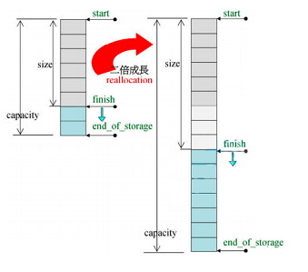

[TOC]


## Vector

```c++
template<class T, class Alloc= alloc>
class vector {
public:
    typedef T value_type;
    typedef value_type* iterator;
    typedef value_type& reference;
    typedef size_t size_type;
protected:
    iterator start;
    iterator finish;
    iterator end_of_storage;
public:
    iterator begin() { return start; }
    iterator end() { return finish; }
    size_type size() const { return size_type(end() - begin()); }
    size_type capacity() const { return size_type(end_of_storage - begin()); }
    bool empty() const { return begin() == end(); }
    reference operator[](size_type n) { return *(begin() + n); }
    reference front() { return *begin(); }
    reference back() { return *(end() - 1); }
};
```



容器vector的迭代器start指向第一个元素，迭代器finish指向最后一个元素的下一个元素，这两个迭代器对应begin()和end()的返回值,维持了前闭后开的特性。

vector对使用者是连续的，因此重载了[]运算符。

vector的实现也是连续的，因此使用指针类型做迭代器(即迭代器vector<T>::iterator的实际类型是原生指针T*。

**特点：**

- 随机访问每个元素，需要的实际为常量。
- 在末尾增加或删除所需实际与元素数目无关，在中间或开头增加或删除元素所需时间随元素个数线性变化。
- 当把超过capacity()-size()个元素插入vector中时，内存会重新分配，所有的迭代器都将失效；否则，指向当前元素以后的任何元素的迭代器都将失效。当删除元素时，指向被删除元素以后的任何元素的迭代器都将失效。


**vector的push_back是怎么做的**

1. 首先先判断该值的地址是否位于vector当前已有数据的地址范围内

2. 如果存在，计算出它与首地址的偏移量，使用这个值来初始化数据

3. 如果不存在，那么先查看当前容量是否已满

4. 如果没有可用空间了，重新申请内存（reserve）

5. 如果有可用空间，就使用construct来初始化数据

6. 最后，尾指针向后移动

7. 析构函数释放原有的vector内存


## deque

```c++
template<class T, class Alloc =alloc, size_t BufSiz = 0>
class deque {
public:
    typedef T value_type;
    typedef _deque_iterator<T, T &, T *, BufSiz> iterator;
protected:
    typedef pointer *map_pointer;   // T**
protected:
    iterator start;
    iterator finish;
    map_pointer map;		// 控制中心,数组中每个元素指向一个buffer
    size_type map_size;
public:
    iterator begin() { return start; }
    iterator end() { return finish; }
    size_type size() const { return finish - start; }
    // ...
};
```


**特点：**

随机访问每个元素，所需要的时间为常量。

在开头和末尾增加元素所需时间与元素数目无关，在中间增加或删除元素所需时间随元素数目呈线性变化。


## set和multiset

容器set和multiset以rb_tree为底层容器，因此其中元素是有序的，排序的依据是key。set和multiset元素的value和key一致。

set和multiset提供迭代器iterator用以顺序遍历容器，但无法使用iterator改变元素值，因为set和multiset使用的是内部rb_tree的const_iterator。

set元素的key必須独一无二，因此其insert()调用的是内部rb_tree的insert_unique()方法；multiset元素的key可以重复,因此其insert()调用的是内部rb_tree的insert_equal()方法。

```c++
template<class Key,
         class Compare = less<Key>,
         class Alloc = alloc>
class set {
public:
    typedef Key key_type;
    typedef Key value_type;
    typedef Compare key_compare;
    typedef Compare value_compare;
private:
    typedef rb_tree <key_type, 
    				 value_type, 
    				 identity<value_type>, 
    				 key_compare, 
    				 Alloc> rep_type;
    rep_type t;		// 内部rb_tree容器
public:
    typedef typename rep_type::const_iterator iterator;
};
```


## map和multimap

容器map和multimap以rb_tree为底层容器，因此其中元素是有序的，排序的依据是key。

map和multimap提供迭代器iterator用以顺序遍历容器。无法使用iterator改变元素的key，但可以用它来改变元素的data，因为map和multimap内部自动将key的类型设为const。

map元素的key必須独一无二，因此其insert()调用的是内部rb_tree的insert_unique()方法；multimap元素的key可以重复,因此其insert()调用的是内部rb_tree的insert_equal()方法。

```c++
template<class Key,
         class T,
         class Compare = less<Key>,
         class Alloc = alloc>
class map {
public:
    typedef Key key_type;
    typedef T data_type;
    typedef T mapped_type;
    typedef pair<const Key, T> value_type;
    typedef Compare key_compare;
private:
    typedef rb_tree <key_type, 
    				 value_type, 
    				 select1st<value_type>, 
    				 key_compare, 
    				 Alloc> rep_type;
    rep_type t;		// 内部rb_tree容器
public:
    typedef typename rep_type::iterator)
    iterator;
};
```


## unordered_map

**map**

​		map是基于红黑树实现。红黑树作为一种自平衡二叉树，保障了良好的最坏情况运行时间，即它可以做到在O(log n)时间内完成查找，插入和删除，在对单次时间敏感的场景下比较建议使用map做为容器。比如实时应用，可以保证最坏情况的运行时间也在预期之内。

​		红黑树是一种二叉查找树，二叉查找树一个重要的性质是有序，且中序遍历时取出的元素是有序的。对于一些需要用到有序性的应用场景，应使用map。

**unordered_map**

​		unordered_map是基于hash_table实现，一般是由一个大vector，vector元素节点可挂接链表来解决冲突来实现。hash_table最大的优点，就是把数据的存储和查找消耗的时间大大降低，几乎可以看成是常数时间；而代价仅仅是消耗比较多的内存。然而在当前可利用内存越来越多的情况下，用空间换时间的做法是值得的。


## 树

树是一种数据结构，它是由n（n>=0）个有限节点组成一个具有层次关系的集合，把它叫做“树”是因为它看起来像一棵倒挂的树，也就是说它是根朝上，而叶朝下的。它具有以下的特点：

- 每个节点有零个或多个子节点；
- 没有父节点的节点称为根节点；
- 每一个非根节点有且只有一个父节点；
- 除了根节点外，每个子节点可以分为多个不相交的子树。

二叉树是每个节点最多有两个子树的树结构。它有五种基本形态：二叉树可以是空集；根可以有空的左子树或右子树；或者左、右子树皆为空。

**满二叉树**

**定义**：高度为h，并且由 ![[公式]](https://www.zhihu.com/equation?tex=2%5Eh) –1个结点的二叉树，被称为满二叉树，其实不难看出，满二叉树的结点的度要么为0（叶子结点），要么为2（非叶子结点)


**完全二叉树**

**定义**：一棵二叉树中，只有最下面两层结点的度可以小于2，并且最下一层的叶结点集中在靠左的若干位置上。这样的二叉树称为完全二叉树。

**特点**：叶子结点只能出现在最下层和次下层，且最下层的叶子结点集中在树的左部。显然，一棵满二叉树必定是一棵完全二叉树，而完全二叉树未必是满二叉树。


**二叉查找树**

**定义**：二叉查找树，又被称为二叉搜索树。其特点如下：设x为二叉查找树中的一个结点，x节点包含关键字key，一句话就是左孩子比父节点小，右孩子比父节点大，还有一个特性就是”中序遍历“可以让结点有序。


## AVL树

**为什么要有平衡二叉树**

​		二叉搜索树一定程度上可以提高搜索效率，但是当原序列有序时，例如序列 A = {1，2，3，4，5，6}，依据此序列构造的二叉搜索树为右斜树，同时二叉树退化成单链表，搜索效率降低为 O(n)。

​		平衡二叉树（Balanced BinaryTree）又被称为AVL树。它具有以下性质：它是一棵空树或它的左右两个子树的高度差的绝对值不超过1，并且左右两个子树都是一棵平衡二叉树。

**平衡因子**

​		某节点的左子树与右子树的高度(深度)差即为该节点的平衡因子（BF,Balance Factor），平衡二叉树中不存在平衡因子大于 1 的节点。在一棵平衡二叉树中，节点的平衡因子只能取 0 、1 或者 -1 ，分别对应着左右子树等高，左子树比较高，右子树比较高。

**AVL树插入时的失衡与调整**

​		**平衡二叉树的失衡调整主要是通过旋转最小失衡子树来实现的**。根据旋转的方向有两种处理方式，**左旋** 与 **右旋** 。


**左旋**

（1）节点的右孩子替代此节点位置 （2）右孩子的左子树变为该节点的右子树 （3）节点本身变为右孩子的左子树


**右旋**

（1）节点的左孩子代表此节点 （2）节点的左孩子的右子树变为节点的左子树 （3）将此节点作为左孩子节点的右子树。


## B树

​		ＩＯ操作的效率很低，那么，当在大量数据存储中，查询时我们不能一下子将所有数据加载到内存中，只能逐一加载磁盘页，每个磁盘页对应树的节点。造成大量磁盘ＩＯ操作（最坏情况下为树的高度）。平衡二叉树由于树深度过大而造成磁盘IO读写过于频繁，进而导致效率低下。

所以，我们为了减少磁盘ＩＯ的次数，就你必须降低树的深度，将“瘦高”的树变得“矮胖”，一个基本的想法就是：

- **每个节点存储多个元素**
- **摒弃二叉树结构，采用多叉树**

**B 树**可以看作是对2-3查找树的一种扩展，即他允许每个节点有M-1个子节点。

- 根节点至少有两个子节点
- 每个节点有M-1个key，并且以升序排列
- 位于M-1和M key的子节点的值位于M-1 和M key对应的Value之间
- 其它节点至少有M/2个子节点


### B+树

b+树，是b树的一种变体，查询性能更好。m阶的b+树的特征：

1. 有n棵子树的非叶子结点中含有n个关键字（b树是n-1个），这些关键字不保存数据，只用来索引，所有数据都保存在叶子节点（b树是每个关键字都保存数据）。
2. 所有的叶子结点中包含了全部关键字的信息，及指向含这些关键字记录的指针，且叶子结点本身依关键字的大小自小而大顺序链接。
3. 所有的非叶子结点可以看成是索引部分，结点中仅含其子树中的最大（或最小）关键字。
4. 通常在b+树上有两个头指针，一个指向根结点，一个指向关键字最小的叶子结点。
5. 同一个数字会在不同节点中重复出现，根节点的最大元素就是b+树的最大元素。


B+树其实和B树是非常相似的，相同点：

- 根节点至少一个元素
- 非根节点元素范围：m/2 <= k <= m-1

**不同点**。

- B+树有两种类型的节点：内部结点（也称索引结点）和叶子结点。内部节点就是非叶子节点，内部节点不存储数据，只存储索引，数据都存储在叶子节点。
- 每个叶子结点都存有相邻叶子结点的指针，叶子结点本身依关键字的大小自小而大顺序链接。


**B+ 树的优点在于：**

- 由于B+树在内部节点上不好含数据信息，因此在内存页中能够存放更多的key。 数据存放的更加紧密，具有更好的空间局部性。因此访问叶子几点上关联的数据也具有更好的缓存命中率。
- B+树的叶子结点都是相链的，因此对整棵树的便利只需要一次线性遍历叶子结点即可。而且由于数据顺序排列并且相连，所以便于区间查找和搜索。而B树则需要进行每一层的递归遍历。相邻的元素可能在内存中不相邻，所以缓存命中性没有B+树好。


### B树与B+树对比

​		B树与B+树都是对磁盘友好的数据结构，能大幅降低磁盘访问次数。B树的优点在于数据存储在每个结点中，可以更快访问到，而不必须走到叶子结点，B树更多的用在文件系统中。

​		B+树的每个非叶子结点都只充当索引，所以查询必须到叶子结点结束，但它十分适合“扫库”和区间查找，而且因为大多结点只用于索引，所以并不会存储真正的数据，在内存上会更紧凑，相同的内存就可以存放更多的索引数据了。比如字典的拼音和汉字是分离的，只需要几十页就能得到完整的拼音表，但是如果拼音和汉字掺杂在一起，要得到完整的索引（拼音）表就需要整个字典。B+树的这些特性使得它更适合用来做数据库的索引。


