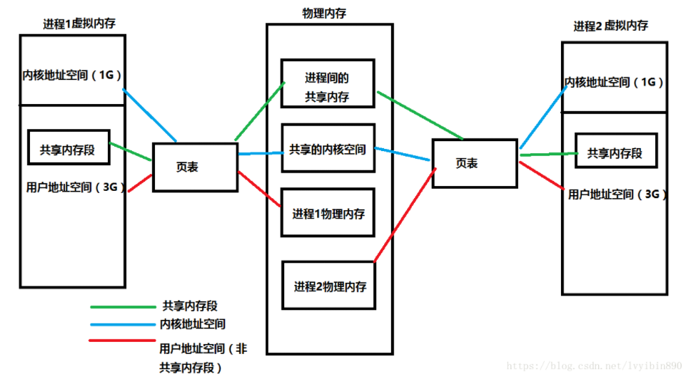

### 1、进程间通信方式

管道、信号量、信号、共享内存、消息队列、套接字


### 2、多线程怎么实现


### 3、为什么要用线程池

降低资源消耗。 通过重复利用已创建的线程降低线程创建和销毁造成的消耗。

提高响应速度。 当任务到达时，任务可以不需要等到线程创建就能立即执行。


### 4、线程进程的区别

进程是资源分配的基本单位，线程是程序运行，cpu调度的基本单位。

线程本身的数据通常只有寄存器数据，以及一个程序执行时使用的堆栈，所以线程的切换比进程的切换负担要小。

多个进程的内部数据和状态都是完全独立存在的，而多线程是共享一块内存空间和一组系统资源（同一进程内），在程序内部可以互相调用（通过对象方法）。


### 5、为什么要有线程？设计线程的目的是什么？线程解决什么问题

进程可以使多个程序能并发执行，以提高资源的利用率和系统的吞吐量；但是其具有一些缺点：

进程在同一时间只能干一件事

进程在执行的过程中如果阻塞，整个进程就会挂起，即使进程中有些工作不依赖于等待的资源，仍然不会执行。


因此，操作系统引入了比进程粒度更小的线程，作为并发执行的基本单位，从而减少程序在并发执行时所付出的时空开销，提高并发性。和进程相比，线程的优势如下：

- 从资源上来讲，线程是一种非常"节俭"的多任务操作方式。在linux系统下，启动一个新的进程必须分配给它独立的地址空间，建立众多的数据表来维护它的代码段、堆栈段和数据段，这是一种"昂贵"的多任务工作方式。
- 从切换效率上来讲，运行于一个进程中的多个线程，它们之间使用相同的地址空间，而且线程间彼此切换所需时间也远远小于进程间切换所需要的时间。据统计，一个进程的开销大约是一个线程开销的30倍左右。
- 从通信机制上来讲，线程间方便的通信机制。对不同进程来说，它们具有独立的数据空间，要进行数据的传递只能通过进程间通信的方式进行，这种方式不仅费时，而且很不方便。线程则不然，由于同一进城下的线程之间贡献数据空间，所以一个线程的数据可以直接为其他线程所用，这不仅快捷，而且方便。


### 6、死锁是什么，解决死锁方法？

所谓死锁，是指多个进程在运行过程中因争夺资源而造成的一种僵局，当进程处于这种僵持状态时，若无外力作用，它们都将无法再向前推进。 


产生死锁的必要条件：

- 互斥条件：进程要求对所分配的资源进行排它性控制，即在一段时间内某资源仅为一进程所占用。
- 请求和保持条件：当进程因请求资源而阻塞时，对已获得的资源保持不放。
- 不剥夺条件：进程已获得的资源在未使用完之前，不能剥夺，只能在使用完时由自己释放。
- 环路等待条件：在发生死锁时，必然存在一个进程--资源的环形链。
  

解决死锁

- 资源一次性分配，从而剥夺请求和保持条件
- 可剥夺资源：即当进程新的资源未得到满足时，释放已占有的资源，从而破坏不可剥夺的条件
- 资源有序分配法：系统给每类资源赋予一个序号，每个进程按编号递增的请求资源，释放则相反，从而破坏环路等待的条件


### 7、i++线程安全吗？

不安全

每个线程都有自己的工作内存，每个线程需要对共享变量操作时必须先把共享变量从主内存 load 到自己的工作内存，等完成对共享变量的操作时再 save 到主内存。

问题就出在这了，如果一个线程运算完后还没刷到主内存，此时这个共享变量的值被另外一个线程从主内存读取到了，这个时候读取的数据就是脏数据了，它会覆盖其他线程计算完的值。

**这也是经典的内存不可见问题，那么把 count 加上 volatile 让内存可见是否能解决这个问题呢？** 答案是：不能。因为 volatile 只能保证可见性，不能保证原子性。多个线程同时读取这个共享变量的值，就算保证其他线程修改的可见性，也不能保证线程之间读取到同样的值然后相互覆盖对方的值的情况。


### 8、虚拟内存和物理内存的区别和关联

每个进程都认为自己拥有4G的空间，这只是每个进程认为的，但是实际上，在虚拟内存对应的物理内存上，可能只对应的一点点的物理内存，实际用了多少内存，就会对应多少物理内存。

进程得到的这4G虚拟内存是一个**连续的地址空间（这也只是进程认为），而实际上，它通常是被分隔成多个物理内存碎片，还有一部分存储在外部磁盘存储器上，在需要时进行数据交换。**




### 9、栈和堆的区别？生长方向？

```c++
int *ptr = (int*)malloc(sizeof(int)*4);
```

在栈中存放了一个指向堆内存的指针ptr。在程序会先确定在堆中分配内存的大小，然后利用operator new分配内存，然后放回这块内存的首地址，放在栈中。

1） 空间大小不同

在32位系统中，堆的空间是4G，而栈的空间很小。

2） 分配方式不同

堆是动态分配的，没有静态分配。栈的静态分配时编译器完成的，动态分配由alloca函数分配。栈的动态分配由编译器进行释放。

3） 管理方式不同

栈是由编译器自动管理。堆的释放是由程序员控制。

4） 生长方式不同

堆的生长方式是向上的，向着内存地址增加的方向。栈的生长方式是向下的，是向着内存地址减小的方向。

5） 能否产生碎片

对于堆，频繁的new/delete会造成内存空间的不连续，从而造成大量的碎片，使程序效率降低。

6） 分配效率不同

栈是机器系统系统的数据结构，计算机会在底层对栈提供支持：分配专门的寄存器存放栈的地址，压栈出栈都有专门的指令执行，这就决定栈的效率比较高。

堆是C/C++函数库提供的，库函数会按照一定的算法，在堆内存中搜索可用的足够大小的空间，如果没有足够大小的空间（可能是由于内存碎片太多），就有可能调用系统功能去增加程序数据段的内存空间，这样就有机会分到足够大小的内存，然后进行返回。


### 10、堆可以申请多大?栈一般多大?

一个栈对应一个线程，有限制，VS2010中，默认的栈空间大小为1M（64位和32位系统），可通过CreatThread参数列表改变线程的StackSize；

堆：与64位/32位有关，与编译器有关，受限于计算机系统中有效的虚拟内存；理论上，32位系统，堆内存可以达到4G的空间，但是堆最大也没有4G,因为整个进程的映像空间有一部分被映射给操作系统,另外栈也占据了一部分,全局,静态变量再占据一部分,还有其他代码数据占据一部分.


### 11、线程切换时都有哪些内容

进程与线程的切换

进程切换涉及到虚拟地址空间，线程不会。

进程切换虚拟地址空间，切换内核栈和硬件上下文。

线程切换内核栈和硬件上下文。


### 12、寄存器SP的作用

StackPointer，SP为堆栈指针，始终指向栈顶


### 13、多线程同步的方法

互斥量Synchronized/Lock：采用互斥对象机制，只有拥有互斥对象的线程才有访问公共资源的权限。因为互斥对象只有一个，所以可以保证公共资源不会被多个线程同时访问

信号量Semphare：为控制具有有限数量的用户资源而设计的，它允许多个线程在同一时刻去访问同一个资源，但一般需要限制同一时刻访问此资源的最大线程数目。


### 14、互斥锁和信号量的区别

信号量（semaphore[ˈseməfɔ:(r)]）用在**多线程多任务同步**的，一个线程完成了某一个动作就通过信号量告诉别的线程，别的线程再进行某些动作。而互斥锁（Mutual exclusion，缩写 Mutex）是用在多线程多任务互斥的，一个线程占用了某一个资源，那么别的线程就无法访问，直到这个线程unlock，其他的线程才开始可以利用这个资源。


信号，那是多线程同步用的，一个线程完成了某一个动作就通过信号告诉别的线程，别的线程再进行某些动作。

互斥锁，这是多线程互斥用的，比如说，一个线程占用了某一个资源，那么别的线程就无法访问，知道这个线程离开，其他的线程才开始可以利用这个资源。


### 15、OS是怎么做到原子操作的

**总线锁**

多个处理器同时从各自的缓存中读取变量i，分别进行加一操作，然后分别写入系统内存当中。那么想要保证读改写共享变量的操作是原子的，就必须保证CPU1读改写共享变量的时候，CPU2不能操作缓存了该共享变量内存地址的缓存。

处理器使用总线锁就是来解决这个问题的。所谓总线锁就是使用处理器提供的一个LOCK＃信号，当一个处理器在总线上输出此信号时，其他处理器的请求将被阻塞住,那么该处理器可以独占使用共享内存。


**缓存锁**

第二个机制是通过缓存锁定保证原子性。在同一时刻我们只需保证对某个内存地址的操作是原子性即可，但总线锁定把CPU和内存之间通信锁住了，这使得锁定期间，其他处理器不能操作其他内存地址的数据，所以总线锁定的开销比较大，最近的处理器在某些场合下使用缓存锁定代替总线锁定来进行优化。

所谓“缓存锁定”就是如果缓存在处理器缓存行中内存区域在LOCK操作期间被锁定，当它执行锁操作回写内存时，处理器不在总线上声明LOCK＃信号，而是修改内部的内存地址，并允许它的缓存一致性机制来保证操作的原子性，因为缓存一致性机制会阻止同时修改被两个以上处理器缓存的内存区域数据，当其他处理器回写已被锁定的缓存行的数据时会起缓存行无效，在例1中，当CPU1修改缓存行中的i时使用缓存锁定，那么CPU2就不能同时缓存了i的缓存行。


### 16、MMU的作用

**地址翻译**

当页面命中时，CPU硬件执行的步骤：

- 处理器生成一个虚拟地址，传给MMU
- MMU生成PTE地址，并从高速缓存/主存中得到它
- 高速缓存/主存向MMU返回PTE
- MMU构造物理地址，并把它传给高速缓存/主存
- 高速缓存/主存返回所请求的数据字给处理器


### 17、TLB？

TLB（Translation Lookaside Buffer）翻译后备缓冲器

一个小型、虚拟寻址的缓存，每一行都保存一个由单个PTE组成的块


### 18、mmap

mmap的工作原理，当你发起这个调用的时候，它只是在你的虚拟空间中分配了一段空间，连真实的物理地址都不会分配的，当你访问这段空间，CPU陷入OS内核执行异常处理，然后异常处理会在这个时间分配物理内存，并用文件的内容填充这片内存，然后才返回你进程的上下文，这时你的程序才会感知到这片内存里有数据。


### 19、线程池怎么设计


### 20、线程池里的同步和调度怎么做


### 21、读写锁怎么实现的


### 22、进程的内存管理


### 23、程序的内存释放


### 24、同步和异步


### 25、协程


### 26、作业调度和页面置换算法有哪些

**进程调度**

**先来先服务**：非抢占式的调度算法，按照请求的顺序进行调度。有利于长作业，但不利于短作业，因为短作业必须一直等待前面的长作业执行完毕才能执行，而长作业又需要执行很长时间，造成了短作业等待时间过长。另外，对`I/O`密集型进程也不利，因为这种进程每次进行`I/O`操作之后又得重新排队。

**短作业优先**：非抢占式的调度算法，按估计运行时间最短的顺序进行调度。长作业有可能会饿死，处于一直等待短作业执行完毕的状态。因为如果一直有短作业到来，那么长作业永远得不到调度。

**最短剩余时间优先**：最短作业优先的抢占式版本，按剩余运行时间的顺序进行调度。 当一个新的作业到达时，其整个运行时间与当前进程的剩余时间作比较。如果新的进程需要的时间更少，则挂起当前进程，运行新的进程。否则新的进程等待。

**时间片轮转**：将所有就绪进程按 `FCFS` 的原则排成一个队列，每次调度时，把 `CPU` 时间分配给队首进程，该进程可以执行一个时间片。当时间片用完时，由计时器发出时钟中断，调度程序便停止该进程的执行，并将它送往就绪队列的末尾，同时继续把 `CPU` 时间分配给队首的进程。

时间片轮转算法的效率和时间片的大小有很大关系：因为进程切换都要保存进程的信息并且载入新进程的信息，如果时间片太小，会导致进程切换得太频繁，在进程切换上就会花过多时间。 而如果时间片过长，那么实时性就不能得到保证。 

**优先级调度**：为每个进程分配一个优先级，按优先级进行调度。为了防止低优先级的进程永远等不到调度，可以随着时间的推移增加等待进程的优先级。


**页面置换**

FIFO：跟踪页面加载进入内存的顺序，并把页面放在一个链表中。有可能删除存在时间最长但是还在使用的页面。

第二次机会：对FIFO的修改，在删除页面前检查这个页面是否仍在使用。如果页面正在使用，就会进行保留。

LRU：最近最少使用

NRU：最不经常使用


### 27、多线程和多进程有什么区别


### 28、LRU算法原理和实现

**LRU原理**

LRU的设计原理就是，当数据在最近一段时间经常被访问，那么它在以后也会经常被访问。这就意味着，如果经常访问的数据，我们需要然其能够快速命中，而不常访问的数据，我们在容量超出限制内，要将其淘汰。

每次访问的数据都会放在栈顶，当访问的数据不在内存中，且栈内数据存储满了，我们就要选择移除栈底的元素，因为在栈底部的数据访问的频率是比较低的。所以要将其淘汰。


### 29、cpu多级缓存，缓存的作用

**它是位于CPU和内存之间的临时存储器**。CPU缓存的作用主要是为了解决CPU运算速度与内存读写速度不匹配的矛盾，而缓存的容量要比内存要小的太多，但是其速度要比内存快的多，因此这样会让CPU使用很长的时间等待数据到来或把数据写入内存中。搜索在缓存中的数据是内存中的一小部分，但这一小部分是短时间内CPU即将访问的，当CPU调用大量数据时，就能够避开内存直接从缓存中调用，从而加快读取速度。


### 30、内核空间和用户空间

为了保证不同进程之间的相互独立（一个进程的崩溃不会影响其他进程，恶意进程不能读取和修改其他进程运行时的代码和数据）。

因此操作系统内核**需要拥有高于普通进程的权限**， 以此来调度和管理用户的应用程序。

于是内存空间被划分为两部分，一部分为**内核空间**，一部分为**用户空间**，内核空间存储的代码和数据具有更高级别的权限。内存访问的相关硬件在程序执行期间会进行访问控制（Access Control），使得用户空间的程序不能直接读写内核空间的内存。


### 31、系统调用

system call，指运行在使用者空间的程序向操作系统内核请求需要更高权限运行的服务。系统调用提供了用户程序与操作系统之间的接口（即系统调用是用户程序和内核交互的接口）。

操作系统中的状态分为管态（核心态）和目态（用户态）。大多数系统交互式操作需求在内核态执行。如设备IO操作或者进程间通信。特权指令：一类只能在核心态下运行而不能在用户态下运行的特殊指令。不同的操作系统特权指令会有所差异，但是一般来说主要是和硬件相关的一些指令。用户程序只在用户态下运行，有时需要访问系统核心功能，这时通过系统调用接口使用系统调用。

应用程序有时会需要一些危险的、权限很高的指令，如果把这些权限放心地交给用户程序是很危险的(比如一个进程可能修改另一个进程的内存区，导致其不能运行)，但是又不能完全不给这些权限。于是有了系统调用，<font color='red'>危险的指令被包装成系统调用，用户程序只能调用而无权自己运行那些危险的指令</font>。另外，计算机硬件的资源是有限的，为了更好的管理这些资源，所有的资源都由操作系统控制，进程只能向操作系统请求这些资源。<font color='red'>操作系统是这些资源的唯一入口，这个入口就是系统调用</font>。


