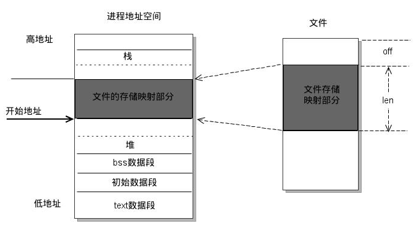

[TOC]

## 进程和线程

### 1、进程和线程的区别？

进程是系统中正在运行的一个应用程序，程序一旦运行就是进程。

- 调度：进程是资源管理的基本单位，线程是程序执行的基本单位。
- 切换：线程上下文切换比进程上下文切换要快得多。
- 拥有资源： 进程是拥有资源的一个独立单位，线程不拥有系统资源，但是可以访问隶属于进程的资源。
- 系统开销： 创建或撤销进程时，系统都要为之分配或回收系统资源，如内存空间，I/O设备等，OS所付出的开销显著大于在创建或撤销线程时的开销，进程切换的开销也远大于线程切换的开销。

多进程与多线程

| 对比维度       | 多进程                                                       | 多线程                                                       | 总结     |
| -------------- | ------------------------------------------------------------ | ------------------------------------------------------------ | -------- |
| 数据共享、同步 | 数据共享复杂，需要用IPC；数据是分开的，同步简单              | 因为共享进程数据，数据共享简单，但也是因为这个原因导致同步复杂 | 各有优势 |
| 内存、CPU      | 占用内存多，切换复杂，CPU利用率低                            | 占用内存少，切换简单，CPU利用率高                            | 线程占优 |
| 创建销毁、切换 | 创建销毁、切换复杂，速度慢                                   | 创建销毁、切换简单，速度很快                                 | 线程占优 |
| 编程、调试     | 编程简单，调试简单                                           | 编程复杂，调试复杂                                           | 进程占优 |
| 可靠性         | 进程间不会互相影响                                           | 一个线程挂掉将导致整个进程挂掉                               | 进程占优 |
| 分布式         | 适应于多核、多机分布式；如果一台机器不够，扩展到多台机器比较简单 | 适应于多核分布式                                             | 进程占优 |

### 2、协程与线程的区别？

​		协程和普通函数相比，多了个中途随时**挂起**，随后**恢复**的过程，当用户调用一个阻塞请求接口，从而让出控制权，当响应时，恢复之前的控制流，从而大大提高线程复用率，这也注意了协程只是并发的，并不是真正意义上的并行，在IO密集型场景下，协程能够很好的提高资源利用率，用少数的线程达到并发成百上万个协程的效果。

​		我们知道操作系统在线程等待IO的时候，会阻塞当前线程，切换到其它线程，这样在当前线程等待IO的过程中，其它线程可以继续执行。当系统线程较少的时候没有什么问题，但是当线程数量非常多的时候，却产生了问题。

​		**一是系统线程会占用非常多的内存空间，二是过多的线程切换会占用大量的系统时间。**

​		协程刚好可以解决上述2个问题。协程运行在线程之上，当一个协程执行完成后，可以选择主动让出，让另一个协程运行在当前线程之上。**协程并没有增加线程数量，只是在线程的基础之上通过分时复用的方式运行多个协程**，而且协程的切换在用户态完成，切换的代价比线程从用户态到内核态的代价小很多。

**什么是协程？**

协程（Coroutines）是一种比线程更加轻量级的存在，正如一个进程可以拥有多个线程一样，一个线程可以拥有多个协程。

协程不是被操作系统内核所管理的，而是完全由程序所控制，也就是在用户态执行。这样带来的好处是性能大幅度的提升，因为不会像线程切换那样消耗资源。

协程不是进程也不是线程，而是一个特殊的**函数**，这个函数可以在某个地方挂起，并且可以重新在挂起处外继续运行。所以说，协程与进程、线程相比并不是一个维度的概念。

- 线程和进程都是同步机制，而协程是异步机制。
- 线程是抢占式，而协程是非抢占式的。需要用户释放使用权切换到其他协程，因此同一时间其实只有一个协程拥有运行权，相当于单线程的能力。
- 一个线程可以有多个协程，一个进程也可以有多个协程。
- 协程不被操作系统内核管理，而完全是由程序控制。线程是被分割的CPU资源，协程是组织好的代码流程，线程是协程的资源。但协程不会直接使用线程，协程直接利用的是执行器关联任意线程或线程池。
- 协程能保留上一次调用时的状态。

### 3、进程与线程的切换流程？

进程切换分两步：

1、切换**页表**以使用新的地址空间，一旦去切换上下文，处理器中所有已经缓存的内存地址一瞬间都作废了。

2、切换内核栈和硬件上下文。

对于linux来说，线程和进程的最大区别就在于地址空间，对于线程切换，第1步是不需要做的，第2步是进程和线程切换都要做的。

因为每个进程都有自己的虚拟地址空间，而线程是共享所在进程的虚拟地址空间的，因此同一个进程中的线程进行线程切换时不涉及虚拟地址空间的转换。

### 4、为什么虚拟地址空间切换会比较耗时？

进程都有自己的虚拟地址空间，把虚拟地址转换为物理地址需要查找页表，页表查找是一个很慢的过程，因此通常使用Cache来缓存常用的地址映射，这样可以加速页表查找，这个Cache就是TLB（translation Lookaside Buffer，TLB本质上就是一个Cache，是用来加速页表查找的）。

由于每个进程都有自己的虚拟地址空间，那么显然每个进程都有自己的页表，那么**当进程切换后页表也要进行切换，页表切换后TLB就失效了**，Cache失效导致命中率降低，那么虚拟地址转换为物理地址就会变慢，表现出来的就是程序运行会变慢，而线程切换则不会导致TLB失效，因为线程无需切换地址空间，因此我们通常说线程切换要比较进程切换块，原因就在这里。

### 5、进程间通信方式有哪些？

- 管道：管道这种通讯方式有两种限制，一是半双工的通信，数据只能单向流动，二是只能在具有亲缘关系的进程间使用。进程的亲缘关系通常是指父子进程关系。

  管道可以分为两类：匿名管道和命名管道。匿名管道是单向的，只能在有亲缘关系的进程间通信；命名管道以磁盘文件的方式存在，可以实现本机任意两个进程通信。

- 信号 ： 信号是一种比较复杂的通信方式，信号可以在任何时候发给某一进程，而无需知道该进程的状态。

  >  **Linux系统中常用信号**：
  >  （1）**SIGHUP**：用户从终端注销，所有已启动进程都将收到该进程。系统缺省状态下对该信号的处理是终止进程。
  >
  >  （2）**SIGINT**：程序终止信号。程序运行过程中，按`Ctrl+C`键将产生该信号。
  >
  >  （3）**SIGQUIT**：程序退出信号。程序运行过程中，按`Ctrl+\\`键将产生该信号。
  >
  >  （4）**SIGBUS和SIGSEGV**：进程访问非法地址。
  >
  >  （5）**SIGFPE**：运算中出现致命错误，如除零操作、数据溢出等。
  >
  >  （6）**SIGKILL**：用户终止进程执行信号。shell下执行`kill -9`发送该信号。
  >
  >  （7）**SIGTERM**：结束进程信号。shell下执行`kill 进程pid`发送该信号。
  >
  >  （8）**SIGALRM**：定时器信号。
  >
  >  （9）**SIGCLD**：子进程退出信号。如果其父进程没有忽略该信号也没有处理该信号，则子进程退出后将形成僵尸进程。

- 信号量：信号量是一个**计数器**，可以用来控制多个进程对共享资源的访问。它常作为一种**锁机制**，防止某进程正在访问共享资源时，其他进程也访问该资源。因此，主要作为进程间以及同一进程内不同线程之间的同步手段。

- 消息队列：消息队列是消息的链接表，保存在内核中。有足够权限的进程可以向队列中添加消息，被赋予读权限的进程则可以读走队列中的消息。消息队列克服了信号承载信息量少，管道只能承载无格式字节流以及缓冲区大小受限等缺点。与管道相比，消息队列提供了有格式的数据，但是消息队列仍有大小限制。

- 共享内存：共享内存就是映射一段能被其他进程所访问的内存，这段共享内存由一个进程创建，但多个进程都可以访问。共享内存是最快的 IPC 方式，它是针对其他进程间通信方式运行效率低而专门设计的。它往往与其他通信机制，如信号量，配合使用，来实现进程间的同步和通信。

- Socket：不同计算机的进程之间通过socket通信，也可用于同一台计算机的不同进程。

**优缺点**：

- 管道：速度慢，容量有限；
- Socket：任何进程间都能通讯，但速度慢；
- 消息队列：容量受到系统限制，且要注意第一次读的时候，要考虑上一次没有读完数据的问题；
- 信号量：不能传递复杂消息，只能用来同步；
- 共享内存区：能够很容易控制容量，速度快，但要保持同步，比如一个进程在写的时候，另一个进程要注意读写的问题，相当于线程中的线程安全，当然，共享内存区同样可以用作线程间通讯，不过没这个必要，线程间本来就已经共享了同一进程内的一块内存。

### 6、线程间同步的方式有哪些？

**1、临界区**：任意时刻只允许一个线程对临界资源进行访问。拥有临界区对象的线程可以访问该临界资源，其他试图访问该资源的线程将被挂起，直到临界区对象被释放。

优点：保证在某一时刻只有一个线程能访问数据的简便办法。

缺点：虽然临界区同步速度很快，但却只能用来同步本进程内的线程，而不可用来同步多个进程中的线程。

**2、互斥量**：为协调共同对一个共享资源的单独访问而设计的。互斥量跟临界区很相似，比临界区复杂，互斥对象只有一个，只有拥有互斥对象的线程才具有访问资源的权限。

优点：使用互斥不仅仅能够在同一应用程序不同线程中实现资源的安全共享，而且可以在不同应用程序的线程之间实现对资源的安全共享。

缺点：

- 互斥量是可以命名的，也就是说它可以跨越进程使用，所以创建互斥量需要的资源更多，所以如果只为了在进程内部是用的话使用临界区会带来速度上的优势并能够减少资源占用量。
- 通过互斥量可以指定资源被独占的方式使用，但如果有下面一种情况通过互斥量就无法处理，比如现在一位用户购买了一份三个并发访问许可的数据库系统，可以根据用户购买的访问许可数量来决定有多少个线程/进程能同时进行数据库操作，这时候如果利用互斥量就没有办法完成这个要求，信号量对象可以说是一种资源计数器。

**3、信号量**：为控制一个具有有限数量用户资源而设计。它允许多个线程在同一时刻访问同一资源，但是需要限制在同一时刻访问此资源的最大线程数目。互斥量是信号量的一种特殊情况，当信号量的最大资源数=1就是互斥量了。

优点：适用于对Socket（套接字）程序中线程的同步。

缺点:

- 信号量机制必须有公共内存，不能用于分布式操作系统，这是它最大的弱点；
- 信号量机制功能强大，但使用时对信号量的操作分散， 而且难以控制，读写和维护都很困难，加重了程序员的编码负担；
- 核心操作P-V分散在各用户程序的代码中，不易控制和管理，一旦错误，后果严重，且不易发现和纠正。

**4、事件**： 用来通知线程有一些事件已发生，从而启动后继任务的开始。

优点：事件对象通过通知操作的方式来保持线程的同步，并且可以实现不同进程中的线程同步操作。

### 7、线程的分类？

从线程的运行空间来说，分为用户级线程（user-level thread, ULT）和内核级线程（kernel-level, KLT）

**内核级线程**：这类线程依赖于内核，又称为内核支持的线程或轻量级进程。无论是在用户程序中的线程还是系统进程中的线程，它们的创建、撤销和切换都由内核实现。比如英特尔i5-8250U是4核8线程，这里的线程就是内核级线程

**用户级线程**：它仅存在于用户级中，这种线程是**不依赖于操作系统核心**的。应用进程利用**线程库来完成其创建和管理**，速度比较快，**操作系统内核无法感知用户级线程的存在**。

### 8、什么是死锁？死锁产生的条件？

**什么是死锁**：

在两个或者多个并发进程中，如果每个进程持有某种资源而又等待其它进程释放它或它们现在保持着的资源，在未改变这种状态之前都不能向前推进，称这一组进程产生了死锁。通俗的讲就是两个或多个进程无限期的阻塞、相互等待的一种状态。

**死锁产生的四个必要条件**：（有一个条件不成立，则不会产生死锁）

- 互斥条件：一个资源一次只能被一个进程使用
- 请求与保持条件：一个进程因请求资源而阻塞时，对已获得资源保持不放
- 不剥夺条件：进程获得的资源，在未完全使用完之前，不能强行剥夺
- 循环等待条件：若干进程之间形成一种头尾相接的环形等待资源关系

**如何处理死锁问题**

常用的处理死锁的方法有：死锁预防、死锁避免、死锁检测、死锁解除、鸵鸟策略。

**（1）死锁的预防：**基本思想就是确保死锁发生的四个必要条件中至少有一个不成立：

> - ① 破除资源互斥条件
> - ② 破除“请求与保持”条件：实行资源预分配策略，进程在运行之前，必须一次性获取所有的资源。缺点：在很多情况下，无法预知进程执行前所需的全部资源，因为进程是动态执行的，同时也会降低资源利用率，导致降低了进程的并发性。
> - ③ 破除“不可剥夺”条件：允许进程强行从占有者那里夺取某些资源。当一个已经保持了某些不可被抢占资源的进程，提出新的资源请求而不能得到满足时，它必须释放已经保持的所有资源，待以后需要时再重新申请。这意味着进程已经占有的资源会被暂时被释放，或者说被抢占了。
> - ④ 破除“循环等待”条件：实行资源有序分配策略，对所有资源[排序]()编号，按照顺序获取资源，将紧缺的，稀少的采用较大的编号，在申请资源时必须按照编号的顺序进行，一个进程只有获得较小编号的进程才能申请较大编号的进程。

**（2）死锁避免：**

死锁预防通过约束资源请求，防止4个必要条件中至少一个的发生，可以通过直接或间接预防方法，但是都会导致低效的资源使用和低效的进程执行。而死锁避免则允许前三个必要条件，但是通过动态地检测资源分配状态，以确保循环等待条件不成立，从而确保系统处于安全状态。所谓安全状态是指：如果系统能按某个顺序为每个进程分配资源（不超过其最大值），那么系统状态是安全的，换句话说就是，如果存在一个安全序列，那么系统处于安全状态。银行家[算法]()是经典的死锁避免的[算法]()。

**（3）死锁检测：**

死锁预防策略是非常保守的，他们通过限制访问资源和在进程上强加约束来解决死锁的问题。死锁检测则是完全相反，它不限制资源访问或约束进程行为，只要有可能，被请求的资源就被授权给进程。但是操作系统会周期性地执行一个[算法]()检测前面的循环等待的条件。死锁检测[算法]()是通过资源分配图来检测是否存在环来实现，从一个节点出发进行深度优先搜索，对访问过的节点进行标记，如果访问了已经标记的节点，就表示有存在环，也就是检测到死锁的发生。

> - （1）如果进程-资源分配图中无环路，此时系统没有死锁。 
> - （2）如果进程-资源分配图中有环路，且每个资源类中只有一个资源，则系统发生死锁。 
> - （3）如果进程-资源分配图中有环路，且所涉及的资源类有多个资源，则不一定会发生死锁。

**（4）死锁解除：**

死锁解除的常用方法就是终止进程和资源抢占，回滚。所谓进程终止就是简单地终止一个或多个进程以打破循环等待，包括两种方式：终止所有死锁进程和一次只终止一个进程直到取消死锁循环为止；所谓资源抢占就是从一个或者多个死锁进程那里抢占一个或多个资源。

**（5）鸵鸟策略：**

把头埋在沙子里，假装根本没发生问题。因为解决死锁问题的代价很高，因此鸵鸟策略这种不采取任何措施的方案会获得更高的性能。当发生死锁时不会对用户造成多大影响，或发生死锁的概率很低，可以采用鸵鸟策略。大多数操作系统，包括 Unix，Linux 和 Windows，处理死锁问题的办法仅仅是忽略它。

### 9、线程池怎么设计

线程池的**基本思想**为：**生产者-消费者模型**。使用两个链表分别表示**生产者**（待处理的工作任务`Jobs`）和**消费者**（包括所有线程`Threads`），并通过一些同步原语来协调二者之间的工作。如下图：

线程池初始化时，会创建一定数量的线程并放入`Threads`链表中，每个线程处理函数开启一个死循环，通过**条件变量等待信号的到来**；当有新的任务到来时，会加入`Jobs`中，并同时**通过信号唤醒线程**处理相应任务。这就是一个简单的线程池设计思路。

### 10、孤儿进程和僵尸进程的区别？怎么避免这两类进程？

一般情况下，子进程是由父进程创建，而子进程和父进程的退出是无顺序的，两者之间都不知道谁先退出。正常情况下父进程先结束会调用wait或者waitpid函数等待子进程完成再退出，而一旦父进程不等待之间退出，则剩下的子进程会被init（pid=1）进程接收，成为孤儿进程。

如果子进程先退出，父进程还未结束并且没有调用wait或者waitpid函数获取子进程的状态信息，则子进程残留的状态信息，则子进程残留的状态信息（task_struct结构和少量资源信息）会变成僵尸进程。

子进程退出时向父进程SIGCHILD信号，父进程处理SIGCHILD信号。在信号处理函数中调用wait进行处理僵尸进程。

原理是将子进程成为孤儿进程，从而其父进程变成init进程，通过init进程可以处理僵尸进程。

### 11、守护进程是什么？怎么实现？

守护进程是指在后台运行，没有控制终端与之相连的进程。它独立于控制终端，通常周期性地执行某种任务或等待处理某些发生的事件。

### 12、递归锁

​		Mutex分为递归锁和非递归锁。可递归锁也可称为可重入锁，非递归锁又叫不可重入锁。区别是，同一个线程可以多次获取同一个递归锁，不会产生死锁。而如果一个线程多次获取同一个非递归锁，则会产生死锁。

### 13、怎么理解线程安全

​		线程是在多线程环境下，线程安全能够保证多个线程同时执行程序时依旧运行正确，而且要保证对于共享数据，可以由多个线程存取，但是同一时刻只能有一个线程进行存取。一般通过加锁的方式来实现。

## 虚拟内存

### 1、什么是虚拟内存？

​		虚拟内存就是说，让物理内存扩充成更大的逻辑内存，从而让程序获得更多的可用内存。虚拟内存使用部分加载的技术，让一个进程或者资源的某些页面加载进内存，从而能够加载更多的进程，甚至能加载比内存大的进程，这样看起来好像内存变大了，这部分内存其实包含了磁盘或者硬盘，并且就叫做虚拟内存。

### 2、虚拟内存的实现方式有哪些?

虚拟内存中，允许将一个作业分多次调入内存。釆用连续分配方式时，会使相当一部分内存空间都处于暂时或`永久`的空闲状态，造成内存资源的严重浪费，而且也无法从逻辑上扩大内存容量。因此，虚拟内存的实需要建立在离散分配的内存管理方式的基础上。虚拟内存的实现有以下三种方式：

- 请求分页存储管理。
- 请求分段存储管理。
- 请求段页式存储管理。

### 3、什么是分段？

**分页是为了提高内存利用率，而分段是为了满足程序员在编写代码的时候的一些逻辑需求(比如数据共享，数据保护，动态链接等)。**

分段内存管理当中，**地址是二维的，一维是段号，二维是段内地址；其中每个段的长度是不一样的，而且每个段内部都是从0开始编址的**。由于分段管理中，每个段内部是连续内存分配，但是段和段之间是离散分配的，因此也存在一个逻辑地址到物理地址的映射关系，相应的就是段表机制。

### 4、分页和分段有什区别？

- 分页对程序员是透明的，但是分段需要程序员显式划分每个段。 
- 分页的地址空间是一维地址空间，分段是二维的。 
- 页的大小不可变，段的大小可以动态改变。 
- 分页主要用于实现虚拟内存，从而获得更大的地址空间；分段主要是为了使程序和数据可以被划分为逻辑上独立的地址空间并且有助于共享和保护。

### 5、什么是交换空间？

操作系统把物理内存(physical RAM)分成一块一块的小内存，每一块内存被称为**页(page)**。当内存资源不足时，**Linux把某些页的内容转移至硬盘上的一块空间上，以释放内存空间**。硬盘上的那块空间叫做**交换空间**(swap space),而这一过程被称为交换(swapping)。**物理内存和交换空间的总容量就是虚拟内存的可用容量。**

用途：

- 物理内存不足时一些不常用的页可以被交换出去，腾给系统。
- 程序启动时很多内存页被用来初始化，之后便不再需要，可以交换出去。

### 6、内核如何为进程分配内存

1. 初始化进程控制块（PCB），例如分配pid、进程名、建立基本的文件描述符（基本输入输出）
2. PE/ELF文件头的格式，标记了程序各个分段的用途（例如text、data、bss、stack段等，他们对应的内存地址范围及权限flag）
3. 内核建立一个用户进程页表，根据PE/ELF的布局对内存进行分配，复制相关内容，建立虚拟地址到物理地址的映射，并设置相应的标志位

## 网络编程

### 1、常见的IO模型：

对于一次IO访问（以read举例），数据会先被拷贝到操作系统内核的缓冲区中，然后才会从操作系统内核的缓冲区拷贝到应用程序的地址空间。所以说，当一个read操作发生时，它会经历两个阶段：

> - 等待数据准备就绪 (Waiting for the data to be ready)
> - 将数据从内核拷贝到进程中 (Copying the data from the kernel to the process)

正式因为这两个阶段，linux系统产生了下面五种网络模式的方案：

> - 阻塞式IO模型(blocking IO model)
> - 非阻塞式IO模型(noblocking IO model)
> - IO复用式IO模型(IO multiplexing model)
> - 信号驱动式IO模型(signal-driven IO model)
> - 异步IO式IO模型(asynchronous IO model)

其中，IO多路复用模型指的是：使用单个进程同时处理多个网络连接IO，他的原理就是select、poll、epoll 不断轮询所负责的所有 socket，当某个socket有数据到达了，就通知用户进程。该模型的优势并不是对于单个连接能处理得更快，而是在于能处理更多的连接。

### 2、讲一讲IO多路复用？

**IO多路复用是指内核一旦发现进程指定的一个或者多个IO条件准备读取，它就通知该进程。IO多路复用适用如下场合**：

- 当客户处理多个描述字时（一般是交互式输入和网络套接口），必须使用I/O复用。
- 当一个客户同时处理多个套接口时，而这种情况是可能的，但很少出现。
- 如果一个TCP服务器既要处理监听套接口，又要处理已连接套接口，一般也要用到I/O复用。
- 如果一个服务器即要处理TCP，又要处理UDP，一般要使用I/O复用。
- 如果一个服务器要处理多个服务或多个协议，一般要使用I/O复用。
- 与多进程和多线程技术相比，I/O多路复用技术的最大优势是系统开销小，系统不必创建进程/线程，也不必维护这些进程/线程，从而大大减小了系统的开销。

### 3、select、poll 和 epoll 之间的区别?

（1）select：时间复杂度 O(n)

select 仅仅知道有 I/O 事件发生，但并不知道是哪几个流，所以只能无差别轮询所有流，找出能读出数据或者写入数据的流，并对其进行操作。所以 select 具有 O(n) 的无差别轮询复杂度，同时处理的流越多，无差别轮询时间就越长。

（2）poll：时间复杂度 O(n)

poll 本质上和 select 没有区别，它将用户传入的数组拷贝到内核空间，然后查询每个 fd 对应的设备状态， 但是它没有最大连接数的限制，原因是它是基于链表来存储的。

（3）epoll：时间复杂度 O(1)

epoll 可以理解为 event poll，不同于忙轮询和无差别轮询，epoll 会把哪个流发生了怎样的 I/O 事件通知我们。所以说 epoll 实际上是事件驱动（每个事件关联上 fd）的。

> select，poll，epoll 都是 IO 多路复用的机制。I/O 多路复用就是通过一种机制监视多个描述符，一旦某个描述符就绪（一般是读就绪或者写就绪），就通知程序进行相应的读写操作。但 select，poll，epoll 本质上都是同步 I/O，因为他们都需要在读写事件就绪后自己负责进行读写，也就是说这个读写过程是阻塞的，而异步 I/O 则无需自己负责进行读写，异步 I/O 的实现会负责把数据从内核拷贝到用户空间。

## 文件系统

### 1、硬链接和软链接有什么区别？

- 硬链接就是在目录下创建一个条目，记录着文件名与 `inode` 编号，这个 `inode` 就是源文件的 `inode`。删除任意一个条目，文件还是存在，只要引用数量不为 `0`。但是硬链接有限制，它不能跨越文件系统，也不能对目录进行链接。
- 符号链接文件保存着源文件所在的绝对路径，在读取时会定位到源文件上，可以理解为 `Windows` 的快捷方式。当源文件被删除了，链接文件就打不开了。因为记录的是路径，所以可以为目录建立符号链接。

### 2、mmap

​		mmap是一种内存映射文件的方法，即将一个文件或者其它对象映射到进程的地址空间，实现文件磁盘地址和进程虚拟地址空间中一段虚拟地址的一一对映关系。实现这样的映射关系后，进程就可以采用指针的方式读写操作这一段内存，而系统会自动回写脏页面到对应的文件磁盘上，即完成了对文件的操作而不必再调用read，write等系统调用函数。相反，内核空间对这段区域的修改也直接反映用户空间，从而可以实现不同进程间的文件共享。

## 其他

### 1、什么是用户态和内核态？

用户态和系统态是操作系统的两种运行状态：

> - 内核态：内核态运行的程序可以访问计算机的任何数据和资源，不受限制，包括外围设备，比如网卡、硬盘等。处于内核态的 CPU 可以从一个程序切换到另外一个程序，并且占用 CPU 不会发生抢占情况。
> - 用户态：用户态运行的程序只能受限地访问内存，只能直接读取用户程序的数据，并且不允许访问外围设备，用户态下的 CPU 不允许独占，也就是说 CPU 能够被其他程序获取。

将操作系统的运行状态分为用户态和内核态，主要是为了对访问能力进行限制，防止随意进行一些比较危险的操作导致系统的崩溃，比如设置时钟、内存清理，这些都需要在内核态下完成 。

### 2、用户态到内核态的切换

**系统调用**

这是用户进程主动要求切换到内核态的一种方式，用户进程通过系统调用申请操作系统提供的服务程序完成工作。

**异常**

当CPU在执行运行在用户态的程序时，发现了某些事件不可知的异常，这是会触发由当前运行进程切换到处理此异常的内核相关程序中，也就到了内核态，比如缺页异常。

**外围设备的中断**

当外围设备完成用户请求的操作之后，会向CPU发出相应的中断信号，这时CPU会暂停执行下一条将要执行的指令转而去执行中断信号的处理程序，如果先执行的指令是用户态下的程序，那么这个转换的过程自然也就发生了有用户态到内核态的切换。比如硬盘读写操作完成，系统会切换到硬盘读写的中断处理程序中执行后续操作等。

### 3、系统调用

​		system call，指运行在使用者空间的程序向操作系统内核请求需要更高权限运行的服务。系统调用提供了用户程序与操作系统之间的接口（即系统调用是用户程序和内核交互的接口）。

​		操作系统中的状态分为管态（核心态）和目态（用户态）。大多数系统交互式操作需求在内核态执行。如设备IO操作或者进程间通信。特权指令：一类只能在核心态下运行而不能在用户态下运行的特殊指令。不同的操作系统特权指令会有所差异，但是一般来说主要是和硬件相关的一些指令。用户程序只在用户态下运行，有时需要访问系统核心功能，这时通过系统调用接口使用系统调用。

​		应用程序有时会需要一些危险的、权限很高的指令，如果把这些权限放心地交给用户程序是很危险的(比如一个进程可能修改另一个进程的内存区，导致其不能运行)，但是又不能完全不给这些权限。于是有了系统调用，危险的指令被包装成系统调用，用户程序只能调用而无权自己运行那些危险的指令。另外，计算机硬件的资源是有限的，为了更好的管理这些资源，所有的资源都由操作系统控制，进程只能向操作系统请求这些资源。操作系统是这些资源的唯一入口，这个入口就是系统调用。

**执行一个系统调用，OS发生的过程**

1. 执行用户程序，如fork
2. 根据glibc中的函数实现，取得系统调用号并执行int $0x80H产生中断
3. 根据地址空间的转换和堆栈的切换。
4. 进行中断处理，根据系统调用表调用内核函数
5. 执行内核函数
6. 执行RESTORE_ALL并返回用户模式

### 4、中断的处理过程?

1. 保护现场：将当前执行程序的相关数据保存在寄存器中，然后入栈。
2. 开中断：以便执行中断时能响应较高级别的中断请求。
3. 中断处理
4. 关中断：保证恢复现场时不被新中断打扰
5. 恢复现场：从堆栈中按序取出程序数据，恢复中断前的执行状态。

### 5、软中断和硬中断

**硬中断：**

1. 硬中断是由硬件产生的，比如，像磁盘，网卡，键盘，时钟等。每个设备或设备集都有它自己的IRQ（中断请求）。基于IRQ，CPU可以将相应的请求分发到对应的硬件驱动上（注：硬件驱动通常是内核中的一个子程序，而不是一个独立的进程）。

2. 处理中断的驱动是需要运行在CPU上的，因此，当中断产生的时候，CPU会中断当前正在运行的任务，来处理中断。在有多核心的系统上，一个中断通常只能中断一颗CPU（也有一种特殊的情况，就是在大型主机上是有硬件通道的，它可以在没有主CPU的支持下，可以同时处理多个中断。）。

3. 硬中断可以直接中断CPU。它会引起内核中相关的代码被触发。对于那些需要花费一些时间去处理的进程，中断代码本身也可以被其他的硬中断中断。

4. 对于时钟中断，内核调度代码会将当前正在运行的进程挂起，从而让其他的进程来运行。它的存在是为了让调度代码（或称为调度器）可以调度多任务。

**软中断：**

1. 软中断的处理非常像硬中断。然而，它们仅仅是由当前正在运行的进程所产生的。
2. 通常，软中断是一些对I/O的请求。这些请求会调用内核中可以调度I/O发生的程序。对于某些设备，I/O请求需要被立即处理，而磁盘I/O请求通常可以排队并且可以稍后处理。根据I/O模型的不同，进程或许会被挂起直到I/O完成，此时内核调度器就会选择另一个进程去运行。I/O可以在进程之间产生并且调度过程通常和磁盘I/O的方式是相同。
3. 软中断仅与内核相联系。而内核主要负责对需要运行的任何其他的进程进行调度。一些内核允许设备驱动的一些部分存在于用户空间，并且当需要的时候内核也会调度这个进程去运行。
4. 软中断并不会直接中断CPU。也只有当前正在运行的代码（或进程）才会产生软中断。这种中断是一种需要内核为正在运行的进程去做一些事情（通常为I/O）的请求。有一个特殊的软中断是Yield调用，它的作用是请求内核调度器去查看是否有一些其他的进程可以运行。

### 6、OS是怎么做到原子操作的

**总线锁**

多个处理器同时从各自的缓存中读取变量i，分别进行加一操作，然后分别写入系统内存当中。那么想要保证读改写共享变量的操作是原子的，就必须保证CPU1读改写共享变量的时候，CPU2不能操作缓存了该共享变量内存地址的缓存。

处理器使用总线锁就是来解决这个问题的。所谓总线锁就是使用处理器提供的一个LOCK＃信号，当一个处理器在总线上输出此信号时，其他处理器的请求将被阻塞住,那么该处理器可以独占使用共享内存。

**缓存锁**

第二个机制是通过缓存锁定保证原子性。在同一时刻我们只需保证对某个内存地址的操作是原子性即可，但总线锁定把CPU和内存之间通信锁住了，这使得锁定期间，其他处理器不能操作其他内存地址的数据，所以总线锁定的开销比较大，最近的处理器在某些场合下使用缓存锁定代替总线锁定来进行优化。

所谓“缓存锁定”就是如果缓存在处理器缓存行中内存区域在LOCK操作期间被锁定，当它执行锁操作回写内存时，处理器不在总线上声明LOCK＃信号，而是修改内部的内存地址，并允许它的缓存一致性机制来保证操作的原子性，因为缓存一致性机制会阻止同时修改被两个以上处理器缓存的内存区域数据，当其他处理器回写已被锁定的缓存行的数据时会起缓存行无效，在例1中，当CPU1修改缓存行中的i时使用缓存锁定，那么CPU2就不能同时缓存了i的缓存行。

### 7、MMU的作用

**地址翻译**

当页面命中时，CPU硬件执行的步骤：

- 处理器生成一个虚拟地址，传给MMU
- MMU生成PTE地址，并从高速缓存/主存中得到它
- 高速缓存/主存向MMU返回PTE
- MMU构造物理地址，并把它传给高速缓存/主存
- 高速缓存/主存返回所请求的数据字给处理器

