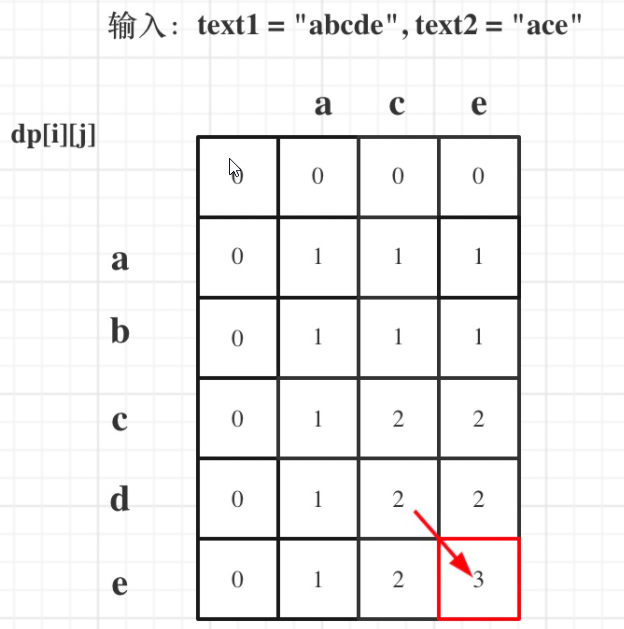
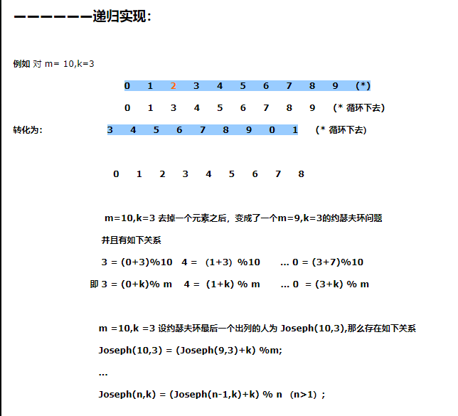

[TOC]


### 1、求根号2

```c++
double MySqrt(double n)
{
    double _max = n;
    double _min = 0.0;
    // 精度
    double p = 1e-5;
    double mid = (_max + _min)/2.0;
    // 浮点数差的绝对值与精度比较
    while(fabs(mid*mid) > n)
    {
    	if(mid*mid > n)
        {
            _max = mid;
        }
        else if(mid*mid < n)
        {
            _min = mid;
        }
        else
        	return mid;
        mid = (_max + _min)/2.0;
	}
    return mid;
}
```


### 2、至少有K个重复字符的最长字串 （lc395）

递归

```c++
class Solution {
public:
    int longestSubstring(string s, int k) {
        int n = s.size();
        if (k < 2) return n;
        if (n < k) return 0;
        int m[26] = {0};
        for (auto c : s) ++m[c-'a'];
        int i = 0;
        while (i < n && m[s[i]-'a'] >= k) ++i;
        if (i == n) return n;
        int left = longestSubstring(s.substr(0, i), k);
        while (i < n && m[s[i]-'a'] < k) ++i;
        int right = longestSubstring(s.substr(i), k);
        return max(left, right);c
    }
};
```


### 3、替换隐藏数字得到的最晚时间 （lc1736）

```c++
class Solution {
public:
    string maximumTime(string time) {
        if (time[0] == '?') {
            time[0] = ('4' <= time[1] && time[1] <= '9') ? '1' : '2';
        }
        if (time[1] == '?') {
            time[1] = (time[0] == '2') ? '3' : '9';
        }
        if (time[3] == '?') {
            time[3] = '5';
        }
        if (time[4] == '?') {
            time[4] = '9';
        }
        return time;
    }
};
```


### 4、给一个二叉搜索树的后序遍历，重建该二叉搜索树

**前序和中序**

```c++
class Solution {
private:
    unordered_map<int, int> index;

public:
    TreeNode* myBuildTree(const vector<int>& preorder, const vector<int>& inorder, int preorder_left, int preorder_right, int inorder_left, int inorder_right) {
        if (preorder_left > preorder_right) {
            return nullptr;
        }
        
        // 前序遍历中的第一个节点就是根节点
        int preorder_root = preorder_left;
        // 在中序遍历中定位根节点
        int inorder_root = index[preorder[preorder_root]];
        
        // 先把根节点建立出来
        TreeNode* root = new TreeNode(preorder[preorder_root]);
        // 得到左子树中的节点数目
        int size_left_subtree = inorder_root - inorder_left;
        // 递归地构造左子树，并连接到根节点
        // 先序遍历中「从 左边界+1 开始的 size_left_subtree」个元素就对应了中序遍历中「从 左边界 开始到 根节点定位-1」的元素
        root->left = myBuildTree(preorder, inorder, preorder_left + 1, preorder_left + size_left_subtree, inorder_left, inorder_root - 1);
        // 递归地构造右子树，并连接到根节点
        // 先序遍历中「从 左边界+1+左子树节点数目 开始到 右边界」的元素就对应了中序遍历中「从 根节点定位+1 到 右边界」的元素
        root->right = myBuildTree(preorder, inorder, preorder_left + size_left_subtree + 1, preorder_right, inorder_root + 1, inorder_right);
        return root;
    }

    TreeNode* buildTree(vector<int>& preorder, vector<int>& inorder) {
        int n = preorder.size();
        // 构造哈希映射，帮助我们快速定位根节点
        for (int i = 0; i < n; ++i) {
            index[inorder[i]] = i;
        }
        return myBuildTree(preorder, inorder, 0, n - 1, 0, n - 1);
    }
};
```


### 5、按字典序全排列输出 （lc386）

```c++
class Solution {
    vector<int> ans;
public:
    void dfs(int num, int& n) {
        if (num > n) return;
        ans.push_back(num);
        for (int i = 0; i <= 9; ++i) dfs(num * 10 + i, n);
    }

    vector<int> lexicalOrder(int n) {
        for (int i = 1; i <= 9; ++i) dfs(i, n);
        return ans;
    }
};
```


### 6、跳台阶，变种如果能跳1、2、3级台阶怎么实现？ （剑指offer10 ）

```c++
class Solution {
     public int numWays(int n) {
        int a = 1, b = 1, sum=0;
        if(n<2)return 1;
        for(int i = 1; i < n; i++){
            sum = (a + b) % 1000000007;
            a = b;
            b = sum;
        }
        return sum;
    }
}
```


### 7、股票买卖I和II


### 8、最长公共子序列 （lc 1143 ）

给定两个字符串 `text1` 和 `text2`，返回这两个字符串的最长 **公共子序列** 的长度。如果不存在 **公共子序列** ，返回 `0` 。

```
输入：text1 = "abcde", text2 = "ace" 
输出：3  
解释：最长公共子序列是 "ace" ，它的长度为 3 。
```


解：

二维动态规划



```c++
class Solution 
{
    public:
        int longestCommonSubsequence(string text1, string text2)
        {
            int M = text1.size();
            int N = text2.size();

            vector<vector<int>> dp(M+1, vector<int>(N+1, 0));
            for(int i = 1; i <=M; ++i)
            {
                for(int j = 1; j<=N; ++j)
                {
                    if(text1[i-1] == text2[j-1])
                    {
                        dp[i][j] = dp[i-1][j-1] + 1;
                    }
                    else
                    {
                        dp[i][j] = max(dp[i-1][j], dp[i][j-1]);
                    }
                }
            }
            return dp[M][N];
        }
};
```


### ~~9、无序数组找出所有K, K代表比左边大比右边小的元素（接雨水）~~


### ~~10、实现二叉树的层次遍历和后序遍历~~


### 11、给定一个sum，找出从根结点到叶子结点的路径和 = sum的所有路径 （Leetcode 113）

```c++
class Solution {
public:
    vector<vector<int>> ret;
    vector<int> path;

    void dfs(TreeNode* root, int targetSum) {
        if (root == nullptr) {
            return;
        }
        path.emplace_back(root->val);
        targetSum -= root->val;
        if (root->left == nullptr && root->right == nullptr && targetSum == 0) {
            ret.emplace_back(path);
        }
        dfs(root->left, targetSum);
        dfs(root->right, targetSum);
        path.pop_back();
    }

    vector<vector<int>> pathSum(TreeNode* root, int targetSum) {
        dfs(root, targetSum);
        return ret;
    }
};
```


### 12、合并有序链表 （lc21）

```c++
class Solution {
public:
    ListNode* mergeTwoLists(ListNode* l1, ListNode* l2) {
        if (l1 == NULL) {
            return l2;
        }
        if (l2 == NULL) {
            return l1;
        }
        if (l1->val <= l2->val) {
            l1->next = mergeTwoLists(l1->next, l2);
            return l1;
        }
        l2->next = mergeTwoLists(l1, l2->next);
        return l2;
    }
};
```


### 13、反转链表

```c++
ListNode* reverseList(ListNode* head)
{
	if(head == nullptr) return nullptr;
    ListNode* cur = head;
    ListNodee* pre = nullptr;
    while(cur != nullptr)
    {
        ListNode* node = cur->next;
        cur->next = pre;
        pre = cur;
        cur = node;
    }
    return pre;
}
```


### ~~14、求连续子序列的和的最大值~~


### 15、L0->L1->L2->....->LN，换成L0->LN->L1->LN-1->L2....  （lc143）

```c++
class Solution {
public:
    void reorderList(ListNode* head) {
        if (head == nullptr) {
            return;
        }
        ListNode* mid = middleNode(head);
        ListNode* l1 = head;
        ListNode* l2 = mid->next;
        mid->next = nullptr;
        l2 = reverseList(l2);
        mergeList(l1, l2);
    }

    ListNode* middleNode(ListNode* head) {
        ListNode* slow = head;
        ListNode* fast = head;
        while (fast->next != nullptr && fast->next->next != nullptr) {
            slow = slow->next;
            fast = fast->next->next;
        }
        return slow;
    }

    ListNode* reverseList(ListNode* head) {
        ListNode* prev = nullptr;
        ListNode* curr = head;
        while (curr != nullptr) {
            ListNode* nextTemp = curr->next;
            curr->next = prev;
            prev = curr;
            curr = nextTemp;
        }
        return prev;
    }

    void mergeList(ListNode* l1, ListNode* l2) {
        ListNode* l1_tmp;
        ListNode* l2_tmp;
        while (l1 != nullptr && l2 != nullptr) {
            l1_tmp = l1->next;
            l2_tmp = l2->next;

            l1->next = l2;
            l1 = l1_tmp;

            l2->next = l1;
            l2 = l2_tmp;
        }
    }
};
```


### 16、给定一个包含 n + 1 个整数的数组 nums，其数字都在 1 到 n 之间（包括 1 和 n），假设只有一个重复的整数，找出这个重复的数，不能排序，不能用额外空间 （lc 287）

二分查找的思路是先猜一个数（有效范围 [left..right] 里位于中间的数 mid），然后统计原始数组中 小于等于 mid 的元素的个数 cnt：

如果 cnt 严格大于 mid。根据抽屉原理，重复元素就在区间 [left..mid] 里；

否则，重复元素就在区间 [mid + 1..right] 里。

与绝大多数使用二分查找问题不同的是，这道题正着思考是容易的，即：思考哪边区间存在重复数是容易的，因为有抽屉原理做保证。

```c++
class Solution {
public:
    int findDuplicate(vector<int>& nums) {
        int n = nums.size();
        int l = 1, r = n - 1, ans = -1;
        while (l <= r) {
            int mid = (l + r) >> 1;
            int cnt = 0;
            for (int i = 0; i < n; ++i) 
            {
                if(nums[i] <= mid)
                    cnt++;
            }
            if (cnt <= mid) {
                l = mid + 1;
            } else {
                r = mid - 1;
                ans = mid;
            }
        }
        return ans;
    }
};
```


### 17、LRU

```c++
struct DLinkedNode {
    int key, value;
    DLinkedNode* prev;
    DLinkedNode* next;
    DLinkedNode(): key(0), value(0), prev(nullptr), next(nullptr) {}
    DLinkedNode(int _key, int _value): key(_key), value(_value), prev(nullptr), next(nullptr) {}
};

class LRUCache {
private:
    unordered_map<int, DLinkedNode*> cache;
    DLinkedNode* head;
    DLinkedNode* tail;
    int size;
    int capacity;

public:
    LRUCache(int _capacity): capacity(_capacity), size(0) {
        // 使用伪头部和伪尾部节点
        head = new DLinkedNode();
        tail = new DLinkedNode();
        head->next = tail;
        tail->prev = head;
    }
    
    int get(int key) {
        if (!cache.count(key)) {
            return -1;
        }
        // 如果 key 存在，先通过哈希表定位，再移到头部
        DLinkedNode* node = cache[key];
        moveToHead(node);
        return node->value;
    }
    
    void put(int key, int value) {
        if (!cache.count(key)) {
            // 如果 key 不存在，创建一个新的节点
            DLinkedNode* node = new DLinkedNode(key, value);
            // 添加进哈希表
            cache[key] = node;
            // 添加至双向链表的头部
            addToHead(node);
            ++size;
            if (size > capacity) {
                // 如果超出容量，删除双向链表的尾部节点
                DLinkedNode* removed = removeTail();
                // 删除哈希表中对应的项
                cache.erase(removed->key);
                // 防止内存泄漏
                delete removed;
                --size;
            }
        }
        else {
            // 如果 key 存在，先通过哈希表定位，再修改 value，并移到头部
            DLinkedNode* node = cache[key];
            node->value = value;
            moveToHead(node);
        }
    }

    void addToHead(DLinkedNode* node) {
        node->prev = head;
        node->next = head->next;
        head->next->prev = node;
        head->next = node;
    }
    
    void removeNode(DLinkedNode* node) {
        node->prev->next = node->next;
        node->next->prev = node->prev;
    }

    void moveToHead(DLinkedNode* node) {
        removeNode(node);
        addToHead(node);
    }

    DLinkedNode* removeTail() {
        DLinkedNode* node = tail->prev;
        removeNode(node);
        return node;
    }
};
```


### 18、最大子序列和

```c++
int maxSubArray(vector<int>& nums)
{
	int pre = 0, maxAns = nums[0];
    for(const &num : nums)
    {
        pre = max(pre+num, num);
        maxAns = max(maxAns, pre);
	}
    return maxAns;
}
```


### 19、反转字符串，单词不用反转 （lc557）

```c++
class Solution {
public:
    string reverseWords(string s) {
        string ret;
        int length = s.length();
        int i = 0;
        while (i < length) {
            int start = i;
            while (i < length && s[i] != ' ') {
                i++;
            }
            for (int p = start; p < i; p++) {
                ret.push_back(s[start + i - 1 - p]);
            }
            while (i < length && s[i] == ' ') {
                i++;
                ret.push_back(' ');
            }
        }
        return ret;
    }
};
```


### 20、 升序序列的查找出现目标target第一次出现的位置

二分


### 21、K个一组翻转链表 （lc25）

```c++
class Solution {
public:
    // 翻转一个子链表，并且返回新的头与尾
    pair<ListNode*, ListNode*> myReverse(ListNode* head, ListNode* tail) {
        ListNode* prev = tail->next;
        ListNode* p = head;
        while (prev != tail) {
            ListNode* nex = p->next;
            p->next = prev;
            prev = p;
            p = nex;
        }
        return {tail, head};
    }

    ListNode* reverseKGroup(ListNode* head, int k) {
        ListNode* hair = new ListNode(0);
        hair->next = head;
        ListNode* pre = hair;

        while (head) {
            ListNode* tail = pre;
            // 查看剩余部分长度是否大于等于 k
            for (int i = 0; i < k; ++i) {
                tail = tail->next;
                if (!tail) {
                    return hair->next;
                }
            }
            ListNode* nex = tail->next;
            // 这里是 C++17 的写法，也可以写成
            // pair<ListNode*, ListNode*> result = myReverse(head, tail);
            // head = result.first;
            // tail = result.second;
            tie(head, tail) = myReverse(head, tail);
            // 把子链表重新接回原链表
            pre->next = head;
            tail->next = nex;
            pre = tail;
            head = tail->next;
        }

        return hair->next;
    }
};
```


### 22、LFU 缓冲机制

移除使用次数最少的元素，如果存在多个使用次数最少的元素，则移除最近不使用的那个。

比较直观的想法就是我们用哈希表 key_table 以键 key 为索引存储缓存，建立一个平衡二叉树 S 来保持缓存根据 (cnt，time) 双关键字由于。在 C++ 中，我们可以使用 STL 提供的 std::set 类，set 背后的实现是红黑树：

对于 get(key) 操作，我们只要查看一下哈希表 key_table 是否有 key 这个键即可，有的话需要同时更新哈希表和集合中该缓存的使用频率以及使用时间，否则返回 -1。

对于 put(key, value) 操作，首先需要查看 key_table 中是否已有对应的键值。如果有的话操作基本等同于 get(key)，不同的是需要更新缓存的 value 值。如果没有的话相当于是新插入一个缓存，这时候需要先查看是否达到缓存容量 capacity，如果达到了的话，需要删除最近最少使用的缓存，即平衡二叉树中最左边的结点，同时删除 key_table 中对应的索引，最后向 key_table 和 S 插入新的缓存信息即可。

```c++
struct Node 
{
    int cnt, time, key, value;

    Node(int _cnt, int _time, int _key, int _value):cnt(_cnt), time(_time), key(_key), value(_value){}
    
    bool operator < (const Node& rhs) const
    {
        return cnt == rhs.cnt ? time < rhs.time : cnt < rhs.cnt;
    }
};
class LFUCache 
{
    // 缓存容量，时间戳
    int capacity, time;
    unordered_map<int, Node> key_table;
    set<Node> S;
    
public:
    LFUCache(int _capacity) 
    {
        capacity = _capacity;
        time = 0;
        key_table.clear();
        S.clear();
    }
    
    int get(int key) 
    {
        if (capacity == 0) return -1;
        auto it = key_table.find(key);
        // 如果哈希表中没有键 key，返回 -1
        if (it == key_table.end()) return -1;
        // 从哈希表中得到旧的缓存
        Node cache = it -> second;
        // 从平衡二叉树中删除旧的缓存
        S.erase(cache);
        // 将旧缓存更新
        cache.cnt += 1;
        cache.time = ++time;
        // 将新缓存重新放入哈希表和平衡二叉树中
        S.insert(cache);
        it -> second = cache;
        return cache.value;
    }
    
    void put(int key, int value) 
    {
        if (capacity == 0) return;
        
        auto it = key_table.find(key);
        
        if (it == key_table.end()) 
        {
            // 如果到达缓存容量上限
            if (key_table.size() == capacity) {
                // 从哈希表和平衡二叉树中删除最近最少使用的缓存
                key_table.erase(S.begin() -> key);
                S.erase(S.begin());
            }
            // 创建新的缓存
            Node cache = Node(1, ++time, key, value);
            // 将新缓存放入哈希表和平衡二叉树中
            key_table.insert(make_pair(key, cache));
            S.insert(cache);
        }
        else 
        {
            // 这里和 get() 函数类似
            Node cache = it -> second;
            S.erase(cache);
            cache.cnt += 1;
            cache.time = ++time;
            cache.value = value;
            S.insert(cache);
            it -> second = cache;
        }
    }
};
```


### 23、重建二叉树

**从中序、后序构造二叉树（lc 106）**

首先解决这道题我们需要明确给定一棵二叉树，我们是如何对其进行中序遍历与后序遍历的：

中序遍历的顺序是每次遍历左孩子，再遍历根节点，最后遍历右孩子。

后序遍历的顺序是每次遍历左孩子，再遍历右孩子，最后遍历根节点。

因此根据上文所述，我们可以发现**后序遍历的数组最后一个元素代表的即为根节点**。知道这个性质后，我们可以利用已知的根节点信息在中序遍历的数组中找到根节点所在的下标，然后**根据其将中序遍历的数组分成左右两部分，左边部分即左子树，右边部分为右子树**，针对每个部分可以用同样的方法继续递归下去构造。

```c++
class Solution 
{
    int post_idx;
    unordered_map<int, int> idx_map;
    
public:
    TreeNode* helper(int in_left, int in_right, vector<int>& inorder, vector<int>& postorder){
        // 如果这里没有节点构造二叉树了，就结束
        if (in_left > in_right) {
            return nullptr;
        }

        // 选择 post_idx 位置的元素作为当前子树根节点
        int root_val = postorder[post_idx];
        TreeNode* root = new TreeNode(root_val);

        // 根据 root 所在位置分成左右两棵子树
        int index = idx_map[root_val];

        // 下标减一
        post_idx--;
        // 构造右子树
        root->right = helper(index + 1, in_right, inorder, postorder);
        // 构造左子树
        root->left = helper(in_left, index - 1, inorder, postorder);
        return root;
    }
    TreeNode* buildTree(vector<int>& inorder, vector<int>& postorder) {
        // 从后序遍历的最后一个元素开始
        post_idx = (int)postorder.size() - 1;

        // 建立（元素，下标）键值对的哈希表
        int idx = 0;
        for (auto& val : inorder) {
            idx_map[val] = idx++;
        }
        return helper(0, (int)inorder.size() - 1, inorder, postorder);
    }
};
```


**前序、中序构造二叉树**

```c++
class Solution {
private:
    unordered_map<int, int> index;

public:
    TreeNode* myBuildTree(const vector<int>& preorder, const vector<int>& inorder, int preorder_left, int preorder_right, int inorder_left, int inorder_right) {
        if (preorder_left > preorder_right) {
            return nullptr;
        }
        
        // 前序遍历中的第一个节点就是根节点
        int preorder_root = preorder_left;
        // 在中序遍历中定位根节点
        int inorder_root = index[preorder[preorder_root]];
        
        // 先把根节点建立出来
        TreeNode* root = new TreeNode(preorder[preorder_root]);
        // 得到左子树中的节点数目
        int size_left_subtree = inorder_root - inorder_left;
        // 递归地构造左子树，并连接到根节点
        // 先序遍历中「从 左边界+1 开始的 size_left_subtree」个元素就对应了中序遍历中「从 左边界 开始到 根节点定位-1」的元素
        root->left = myBuildTree(preorder, inorder, preorder_left + 1, preorder_left + size_left_subtree, inorder_left, inorder_root - 1);
        // 递归地构造右子树，并连接到根节点
        // 先序遍历中「从 左边界+1+左子树节点数目 开始到 右边界」的元素就对应了中序遍历中「从 根节点定位+1 到 右边界」的元素
        root->right = myBuildTree(preorder, inorder, preorder_left + size_left_subtree + 1, preorder_right, inorder_root + 1, inorder_right);
        return root;
    }

    TreeNode* buildTree(vector<int>& preorder, vector<int>& inorder) {
        int n = preorder.size();
        // 构造哈希映射，帮助我们快速定位根节点
        for (int i = 0; i < n; ++i) {
            index[inorder[i]] = i;
        }
        return myBuildTree(preorder, inorder, 0, n - 1, 0, n - 1);
    }
};
```


**前序、后序构造二叉树**

```c++
class Solution {
public:
    TreeNode* constructFromPrePost(vector<int>& pre, vector<int>& post) {
        return helper(pre, post, 0, pre.size() - 1, 0, post.size() - 1);
    }

    TreeNode* helper(vector<int>& pre, vector<int>& post, int prestart, int preend, int poststart, int postend) {
        if (prestart > preend) {
            return NULL;
        }
        TreeNode* root = new TreeNode(pre[prestart]);
        if (prestart == preend) { //只有一个，直接返回
            return root;
        }
        int i = poststart; 
        while (i < postend && post[i] != pre[prestart + 1]) { //确定分界点，左子树的根节点
            i++; 
        }
        int len = i - poststart + 1; //左子树长度
        root->left = helper(pre, post, prestart + 1, prestart + len, poststart, i);
        root->right = helper(pre, post, prestart + 1 + len, preend, i + 1, postend - 1);
        return root;
    }
};
```


### 24、字典序

```c++
class Solution 
{
    vector<int> ans;
public:
    void dfs(int num, int& n) 
    {
        if (num > n) return;
        ans.push_back(num);
        for (int i = 0; i <= 9; ++i) dfs(num * 10 + i, n);
    }

    vector<int> lexicalOrder(int n) 
    {
        for (int i = 1; i <= 9; ++i) dfs(i, n);
        return ans;
    }
};
```


### 25、最小覆盖字串（lc 76）


​		我们可以用滑动窗口的思想解决这个问题。在滑动窗口类型的问题中都会有两个指针，一个用于「延伸」现有窗口的 rr 指针，和一个用于「收缩」窗口的 ll 指针。在任意时刻，只有一个指针运动，而另一个保持静止。我们在 ss 上滑动窗口，通过移动 rr 指针不断扩张窗口。当窗口包含 tt 全部所需的字符后，如果能收缩，我们就收缩窗口直到得到最小窗口。

```c++
class Solution 
{
public:
    string minWindow(string s, string t) 
    {
        vector<int> chars(128, 0);
        vector<bool> flag(128, false);

        //记录t种字符的情况
        for(int i = 0; i < t.size(); ++i)
        {
            flag[t[i]] = true;
            ++chars[t[i]];
        }

        int cnt = 0, left = 0, min_l = 0, min_size = s.size()+1;
        for(int r = 0; r< s.size(); ++r)
        {
            if(flag[s[r]])
            {
                if(--chars[s[r]] >=0)
                ++cnt;
            }

            //若滑动窗口已经包含全部t中字符
            //尝试将l右移，在不影响结果的情况获得最短字符串
            while(cnt == t.size())
            {
                if(r-left+1 < min_size)
                {
                    min_l = left;
                    min_size = r-left+1;
                }
                if(flag[s[left]] && ++chars[s[left]] > 0)
                {
                    --cnt;
                }
                ++left;
            }
        }
        return min_size > s.size() ? string() : s.substr(min_l, min_size);
    }
};
```


### 26、字符串转数字

```c++

int myAtoi(string str) 
{
        if(str.length() == 0) return 0; //空串
 
        bool isNeg = false;
        long re = 0;
        int i=0,cnt;
        for(;i<str.length(); i++) if(str[i] != ' ') break; //跳过字符串前全部的空格
 
        if(str[i] == '-')  //推断正负
            isNeg = true;
        else if (str[i] == '+') isNeg = false;
        else if(str[i] >= '0' && str[i] <= '9')
            re = str[i] - '0',cnt=1;  //记录数字的位数
        else return 0;
 
        i++;   
        for(; i < str.length(); i++)
        {
            if (cnt > 10) break; //大于整数所表示的最大位数，跳出循环
            if(str[i] < '0' || str[i] > '9')  break;  
            re = re*10 + (str[i] - '0'),cnt++;
        }
 
        //溢出推断
        if(re > INT_MAX && !isNeg) return INT_MAX; 
        else if(isNeg &&re*(-1) < INT_MIN) return INT_MIN;
        return isNeg?re*(-1):re;
}
```


### 27、rand5生成rand7

我们不可能用rand5()直接产生 1- 7 的数，不管你用加减乘除都不行。所以，我们要构造一个更大的范围，使得范围里每一个值被生成的概率是一样的，而且这个范围是7的倍数。

先产生一个均匀分布的 0， 5， 10， 15， 20的数，再产生一个均匀分布的 0， 1， 2， 3， 4 的数。相加以后，会产生一个 0到24的数，而且每个数（除0外）生成的概率是一样的。我们只取 1 - 21 这一段，和7 取余以后+1就能得到完全均匀分布的1-7的随机数了。

```
int rand7() {  
        while (1) {  
                int rand = 5 * (rand5() -1) ;  
                rand = rand + rand5() -1;  
                if (rand < 22 && ran > 0) {  
                             return rand%7 + 1 ;  
                }  
         }  
}  
```


### 28、无序数组中比左边大比右边小的元素

```c++
#include <iostream>
using namespace std;

void printPivotElements(int data[], int len) {
	// 从右往左，寻找每个位置及其之后的最小数
	int* rightMin = new int[len];
	int rMin = data[len - 1];
	for (int i = len - 1; i >= 0; --i) {
		if (data[i]<rMin) rMin = data[i];
		rightMin[i] = rMin;
	}

	// 从左往右，寻找比左边大且比右边小的数
	int max = data[0];
	for (int i = 1; i < len - 1; ++i) {
		if (data[i] > max) {
			max = data[i];
			if (data[i] < rightMin[i+1]) cout << data[i] << endl;
		}
	}
}

int main() {
	int iTestArray[] = { 1,8,6,9,10,15,12,20 };
	printPivotElements(iTestArray, sizeof(iTestArray) / sizeof(iTestArray[0]));
}
```


### 29、约瑟夫环



```c++
int Joseph(int m,int k)
{
    if(m<=0||k<=0)
    {
        cout<<"error!"<<endl;
        return -1;
    }else
    {
        if(m==1)
        {
            return 0;
        }else
        {
            return ((Joseph(m-1,k)+k)%m);
        }
    }
}
```


### 30、字符串实现，Strcpy

```c++
#include <iostream>
#include <cstring>

using namespace std;

class String{
public:
    // 默认构造函数
    String(const char *str = nullptr);
    // 拷贝构造函数
    String(const String &str);
    // 析构函数
    ~String();
    // 字符串赋值函数
    String& operator=(const String &str);

private:
    char *m_data;
    int m_size;
};

// 构造函数
String::String(const char *str)
{
    if(str == nullptr)  // 加分点：对m_data加NULL 判断
    {
        m_data = new char[1];   // 得分点：对空字符串自动申请存放结束标志'\0'的
        m_data[0] = '\0';
        m_size = 0;
    }
    else
    {
        m_size = strlen(str);
        m_data = new char[m_size + 1];
        strcpy(m_data, str);
    }
}

// 拷贝构造函数
String::String(const String &str)   // 得分点：输入参数为const型
{
    m_size = str.m_size;
    m_data = new char[m_size + 1];  //加分点：对m_data加NULL 判断
    strcpy(m_data, str.m_data);
}

// 析构函数
String::~String()
{
    delete[] m_data;
}

// 字符串赋值函数
/*
我们先用delete释放了实例m_data的内存，如果此时内存不足导致new char抛出异常，则m_data将是一个空指针，
这样非常容易导致程序崩溃。违背了异常安全性原则。
*/
String& String::operator=(const String &str)  // 得分点：输入参数为const
{
    if(this == &str)    //得分点：检查自赋值
        return *this;

    delete[] m_data;    //得分点：释放原有的内存资源
    m_size = strlen(str.m_data);
    m_data = new char[m_size + 1];  //加分点：对m_data加NULL 判断
    strcpy(m_data, str.m_data);
    return *this;       //得分点：返回本对象的引用
}

// 字符串赋值函数（推荐使用）
// 保证了异常安全性
String& String::operator=(const String &str)
{
    if(this != &str)
    {
        String strTemp(str);

        char* pTemp = strTemp.m_data;
        strTemp.m_data = m_data;
        m_data = pTemp;
    }
    return *this;
}
```

**Strcpy实现**

```c++
char *myStrcpy(char *dest, const char *src) {
    assert(dest != NULL && src != NULL);
    if (dest == NULL || src == NULL) {
        return NULL;
    }
    if (dest == src) {
        return dest;
    }
    int i = 0;
    while (src[i] != '\0') {
        dest[i] = src[i];
        i++;
    }
    dest[i] = '\0';
    return dest;
}
```

