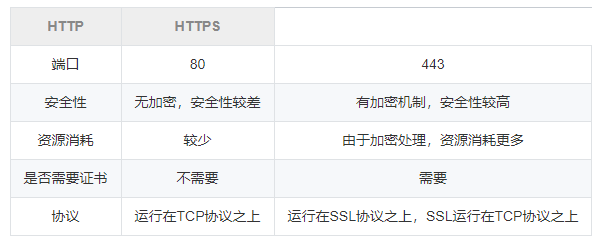
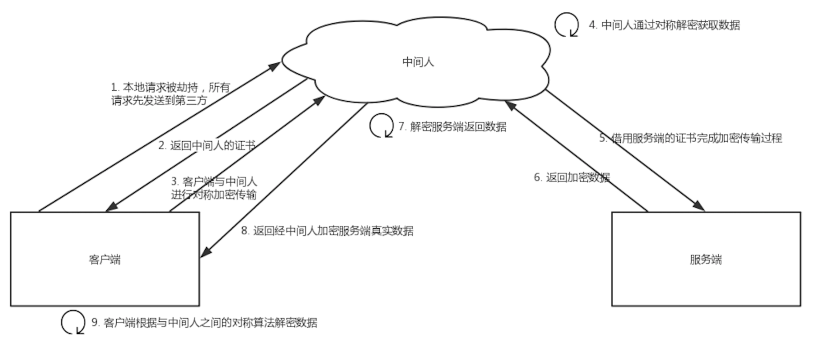

[TOC]

## HTTP篇

### 1、HTTP和HTTPS的区别，HTTPS握手的过程



握手过程：

1. 客户端请求 HTTPS 网址，然后连接到 server 的 443 端口 (HTTPS 默认端口，类似于 HTTP 的80端口)。

   采用 HTTPS 协议的服务器必须要有一套数字 CA (Certification Authority)证书。颁发证书的同时会产生一个私钥和公钥。私钥由服务端自己保存，不可泄漏。公钥则是附带在证书的信息中，可以公开的。证书本身也附带一个证书电子签名，这个签名用来验证证书的完整性和真实性，可以防止证书被篡改。

2. 服务器响应[客户端]()请求，将证书传递给[客户端]()，证书包含公钥和大量其他信息，比如证书颁发机构信息，公司信息和证书有效期等。

3. [客户端]()解析证书并对其进行验证。如果证书不是可信机构颁布，或者证书中的域名与实际域名不一致，或者证书已经过期，就会向访问者显示一个警告，由其选择是否还要继续通信。

4. 如果证书没有问题，[客户端]()就会从服务器证书中取出服务器的公钥A。然后[客户端]()还会生成一个随机码 KEY，并使用公钥A将其加密。

5. [客户端]()把加密后的随机码 KEY 发送给服务器，作为后面对称加密的密钥。

6. 服务器在收到随机码 KEY 之后会使用私钥B将其解密。经过以上这些步骤，[客户端]()和服务器终于建立了安全连接，完美解决了对称加密的密钥泄露问题，接下来就可以用对称加密愉快地进行通信了。

7. 服务器使用密钥 (随机码 KEY)对数据进行对称加密并发送给[客户端]()，[客户端]()使用相同的密钥 (随机码 KEY)解密数据。

8. 双方使用对称加密愉快地传输所有数据。


### 2、证书可靠性

在说校验数字证书是否可信的过程前，我们先来看看数字证书是什么，一个数字证书通常包含了：

- 公钥；
- 持有者信息；
- 证书认证机构（CA）的信息；
- CA 对这份文件的数字签名及使用的算法；
- 证书有效期；
- 还有一些其他额外信息；

**CA签发证书的流程：**

1. 首先 CA 会把持有者的公钥、用途、颁发者、有效时间等信息打成一个包，然后对这些信息进行 Hash 计算，得到一个 Hash 值；
2. 然后 CA 会使用自己的私钥将该 Hash 值加密，生成 Certificate Signature，也就是 CA 对证书做了签名；
3. 最后将 Certificate Signature 添加在文件证书上，形成数字证书；

**客户端校验服务端的数字证书的过程：**

1. 首先客户端会使用同样的 Hash 算法获取该证书的 Hash 值 H1；
2. 通常浏览器和操作系统中集成了 CA 的公钥信息，浏览器收到证书后可以使用 CA 的公钥解密 Certificate Signature 内容，得到一个 Hash 值 H2 ；
3. 最后比较 H1 和 H2，如果值相同，则为可信赖的证书，否则则认为证书不可信。

**浏览器如何验证证书的合法性？**

浏览器发起HTTPS请求时，服务器会返回网站的SSL证书，浏览器需要对证书做以下验证：

1. 验证域名、有效期等信息是否正确。证书上都有包含这些信息，比较容易完成验证；
2. 判断证书来源是否合法。每份签发证书都可以根据验证链查找到对应的根证书，操作系统、浏览器会在本地存储权威机构的根证书，利用本地根证书可以对对应机构签发证书完成来源验证；
3. 判断证书是否被篡改。需要与CA服务器进行校验；
4. 判断证书是否已吊销。通过CRL（Certificate Revocation List 证书注销列表）和 OCSP（Online Certificate Status Protocol 在线证书状态协议）实现，其中 OCSP 可用于第3步中以减少与CA服务器的交互，提高验证效率。


### 3、HTTP1.1 和 HTTP2.0 的区别

**HTTP1.1**

- 使用TCP长连接的方式改善了1.0短连接的性能开销
- 支持管道网络传输，只要第一个请求发出去了，不必等其回来，就可以发第二个请求出去，减少整体的响应时间
- HTTP/1.1 引入了更多的缓存控制策略
- HTTP 1.1开始有Host（域） 这个概念

**HTTP2.0**

HTTP/1.1 存在的问题  

- 不会压缩请求和响应的首部，导致不必要的网络流量 
- 不支持有效的资源优先级 
- 需要使用多个连接才能实现并发和缩短延迟 

HTTP/2.0 的特性有哪些？

- 采用二进制格式而非文本格式，将所有传输的信息分割为更小的消息和帧（二进制帧） 
- 采用**多路复用**，而非有序并阻塞的，只需一个连接即可实现并行，多路复用允许单一的 HTTP/2 连接同时发起多重的请求-响应消息 
- **首部压缩**，使用报头压缩，降低开销 
- 支持**服务器推送**。可以将响应主动"推送"到客户端缓存中（服务器可以对一个客户端请求发送多个响应，例如请求了 HTML，可以响应需要的 CSS 和 JavaScript）


### 4、http的长连接是什么策略，长连接会一直保持着吗？

在HTTP/1.0中默认使用短连接。也就是说，客户端和服务器每进行一次HTTP操作，就建立一次连接，任务结束就中断连接。当客户端浏览器访问的某个HTML或其他类型的Web页中包含有其他的Web资源（如JavaScript文件、图像文件、CSS文件等），每遇到这样一个Web资源，浏览器就会重新建立一个HTTP会话。

而从HTTP/1.1起，默认使用长连接，用以保持连接特性。使用长连接的HTTP协议，会在响应头加入这行代码：

```
Connection:keep-alive
```

在使用长连接的情况下，当一个网页打开完成后，客户端和服务器之间用于传输HTTP数据的TCP连接不会关闭，客户端再次访问这个服务器时，会继续使用这一条已经建立的连接。Keep-Alive不会永久保持连接，它有一个保持时间，可以在不同的服务器软件（如Apache）中设定这个时间。实现长连接需要客户端和服务端都支持长连接。

HTTP协议的长连接和短连接，实质上是TCP协议的长连接和短连接。


### 5、cookie和session

**Cookie**

HTTP Cookie（也叫 Web Cookie或浏览器 Cookie）是服务器发送到用户浏览器并保存在本地的一小块数据，它会在浏览器下次向同一服务器再发起请求时被携带并发送到服务器上。通常，它用于告知服务端两个请求是否来自同一浏览器，如保持用户的登录状态。Cookie 使基于无状态的 HTTP 协议记录稳定的状态信息成为了可能。

1. 浏览器第一次发送请求到服务器端。
2. 服务器端会创建cookie，该cookie中包含着用户的登录信息，再将cookie响应到客户端浏览器。
3. 当用户再次访问时，服务器端会将之前创建的cookie响应到客户端
4. 服务器端可以通过cookie来区分不同的用户


**Session**

Session 代表着服务器和客户一次会话的过程。Session 对象存储特定用户会话所需的属性及配置信息。这样，当用户在应用程序的 Web 页之间跳转时，存储在 Session 对象中的变量将不会丢失，而是在整个用户会话中一直存在下去。当客户端关闭会话，或者 Session 超时失效时会话结束。

1. 当浏览器第一次发送请求到服务器端，服务器端会创建一个Session对象，Session对象会分配一个sessionld ，同时也会创建一个特殊的Cookie对象，会以set-Cookie的方式将id传回浏览器，浏览器保存起来。
2. 当浏览器再不关闭的情况下，浏览器端发送第二次及以上的请求到服务器端,浏览器端访问服务器端时就会携带该name为JSESSIONID的Cookie对象，服务器端会将ame为JSESSIONID的Cookie对象取服务器端查询，以便来区分用户。


**Cookie和Session的区别是什么？**

- 作用范围不同，Cookie 保存在客户端（浏览器），Session 保存在服务器端。 
- 存取方式的不同，Cookie 只能保存 ASCII，Session 可以存任意数据类型，一般情况下我们可以在 Session 中保持一些常用变量信息，比如说 UserId 等。 
- 有效期不同，Cookie 可设置为长时间保持，比如我们经常使用的默认登录功能，Session 一般失效时间较短，客户端关闭或者 Session 超时都会失效。 
- 隐私策略不同，Cookie 存储在客户端，比较容易遭到不法获取，早期有人将用户的登录名和密码存储在 Cookie 中导致信息被窃取；Session 存储在服务端，安全性相对 Cookie 要好一些。 
- 存储大小不同， 单个 Cookie 保存的数据不能超过 4K，Session 可存储数据远高于 Cookie。


### 6、中间人攻击

​		中间人攻击是指攻击者与通讯的两端分别创建独立的联系，并交换其所收到的数据，使通讯的两端认为他们正在通过一个私密的连接与对方直接对话，但事实上整个会话都被攻击者完全控制。



过程原理：

1. 本地请求被劫持（如DNS劫持等），所有请求均发送到中间人的服务器
2. 中间人服务器返回中间人自己的证书
3. 客户端创建随机数，通过中间人证书的公钥对随机数加密后传送给中间人，然后凭随机数构造对称加密对传输内容进行加密传输
4. 中间人因为拥有客户端的随机数，可以通过对称加密算法进行内容解密
5. 中间人以客户端的请求内容再向正规网站发起请求
6. 因为中间人与服务器的通信过程是合法的，正规网站通过建立的安全通道返回加密后的数据
7. 中间人凭借与正规网站建立的对称加密算法对内容进行解密
8. 中间人通过与客户端建立的对称加密算法对正规内容返回的数据进行加密传输
9. 客户端通过与中间人建立的对称加密算法对返回结果数据进行解密

由于缺少对证书的验证，所以客户端虽然发起的是 HTTPS 请求，但客户端完全不知道自己的网络已被拦截，传输内容被中间人全部窃取。

**https 是如何防止中间人攻击的**

​		在https中需要证书，证书的作用是为了防止"中间人攻击"的。 如果有个中间人M拦截客户端请求,然后M向客户端提供自己的公钥，M再向服务端请求公钥,作为"中介者" 这样客户端和服务端都不知道,信息已经被拦截获取了。这时候就需要证明服务端的公钥是正确的。

​		CA是专门对公钥进行认证，进行担保的，也就是专门给公钥做担保的担保公司。 全球知名的CA也就100多个，这些CA都是全球都认可的，比如VeriSign、GlobalSign等，国内知名的CA有WoSign。


### 7、HTTP请求由哪几部分组成

**<font color='red'>请求行</font>**

​		请求报文的起始行，或称为请求行，包含了一个方法和一个请求URL，这个方法描述了服务器应该执行的操作，请求URL描述了要对哪个资源执行这个方法。请求行中还包含HTTP 的版本，用来告知服务器，客户端使用的是哪种HTTP。所有这些字段都由空格符分隔。

例如：POST /infoNewsAction_uploadxheditorfile.action?immediate=1 HTTP/1.1

**<font color='red'>首部</font>**

每个HTTP 首部都有一种简单的语法：名字后面跟着冒号（：），然后跟上可选的空格，再跟上字段值，最后是一个CRLF。（或者换行符）

例如：Date:Tue,3Oct 1997 02:16:03 GMT	Content-Type: image/gif 	Content-Length: 8572	Accept: image/gif, image/jpeg, text/html

**<font color='red'>请求数据</font>**

post方法中，会把数据以key value形式发送请求


### 8、GET和POST的区别

- get是从服务器上获取数据，post是向服务器传送数据。
- get是将参数数据加到URL中，用户可以看到。post是将内容放置在http请求信息体内传送，用户看不到这个过程。
- 对于get方法，服务器端是用Request.QueryString获取变量的值，对于post方法，服务器端用Request.Form获取提交的数据。
- get传送的数据量较小，不能大于2kb。post传送的数据量较大，一般被默认为不受限制。但理论上，IIS4中最大量为80kb，IIS5中为100kb。
- get安全性非常低，post安全性较高。但是执行效率却比post方法好。

仅用于POST请求 在以下情况只能用POST请求

1. 无法使用缓存文件；

2. 向服务器发送大量数据；

3. 发送包含未知字符的用户输入时，post比get更稳定也更可靠

建议使用get方法的情况：

1. et方式的安全性较Post方式要差些，包含机密信息的话，建议用Post数据提交方式
2. 在做数据查询时，建议用Get方式；而在做数据添加、修改或删除时，建议用Post方式；


## TCP篇

### 1、TCP三次握手和四次挥手

**三次握手**

- 发送端**首先发送一个带SYN（synchronize）标志的数据包**给接收方【**第一次的seq序列号是随机产生的**，这样是为了**网络安全**，如果不是随机产生初始序列号，黑客将会以很容易的方式获取到你与其他主机之间的初始化序列号，并且伪造序列号进行攻击】 。
- 接收端收到后，**回传一个带有SYN/ACK（acknowledgement）标志的数据包**以示传达确认信息【**SYN 是为了告诉发送端，发送方到接收方的通道没问题**；**ACK 用来验证接收方到发送方的通道没问题**】 。
- 最后，**发送端再回传一个带ACK标志的数据包**，代表握手结束若在握手某个过程中某个阶段莫名中断，TCP协议会再次以相同的顺序发送相同的数据包。

**四次挥手**

- 主动断开方——发送一个 FIN，用来关闭主动断开方到被动断开方的数据传送 。
- 被动断开方——收到这个 FIN，它发回一 个 ACK，确认序号为收到的序号加1 。和 SYN 一样，一个 FIN 将占用一个序号 。
- 被动点开方——关闭与主动断开方的连接，发送一个FIN给主动断开方。
- 主动断开方——发回 ACK 报文确认，并将确认序号设置为收到序号加1。


### 2、TCP和UDP的区别

- TCP**面向连接**的，**可靠的**数据传输服务；UDP面向**无连接的**，尽最大努力的数据传输服务，**不保证数据传输的可靠性**
- **TCP面向字节流，UDP面向报文**
  - 应用进程交给 UDP 多长的报文， UDP 就照样发送，一次发送一个报文
  - TCP 在发送时采取的方式完全不同：TCP 根据对方给出的窗口值和当前网络拥塞的程度来决定一个报文段应该包含多少个字节。如果报文太长，TCP会将其拆分再发送，如果报文太短，TCP会等待积累足够多的字节后再构成报文段发送出去
- TCP数据传输慢，UDP数据传输快
- TCP有**拥塞控制**，UDP没有拥塞控制，因此网络出现拥塞不会使源主机的发送速率降低（对实时应用很有效，如直播，实时视频会议等）
- TCP 只能是一对一的通信（TCP连接的端点是套接字socket），而 UDP 支持一对一、一对多、多对一和多对多的通信
- TCP 的首部开销大，有 20 个字节，比 UDP 的 8 个字节的首部要长。
- TCP提供可靠**全双功**的通信服务。UDP是半双功，只能单向传播。

TCP主要提供了检验和、序列号/确认应答、超时重传、滑动窗口、拥塞控制和 流量控制等方法实现了可靠性传输。


### 3、假设客户端和服务器通过TCP通信，这时客户端突然断电，服务器是如何关闭这个连接的？

定时器+超时重试机制

TCP 设有一个保活计时器。服务器每收到一次客户端的数据，都会重新复位这个计时器，时间通常是设置为 2 小时。若 2 小时还没有收到客户端的任何数据，服务器就开始重试：每隔 75 秒发送一个探测报文段，若一连发送 10 个探测报文后客户端依然没有回应，那么服务器就认为连接已经断开了。


### 4、浏览器输入URL到显示网页，发生了什么？

1. 域名解析（域名www.baidu.com变为 ip 地址）。
2. **浏览器搜索自己的DNS缓存**（维护一张域名与IP的对应表）；若没有，则搜索**操作系统的DNS缓存**（维护一张域名与IP的对应表）；若没有，则搜索操作系统的**hosts文件**（维护一张域名与IP的对应表）。
3. 若都没有，则找 tcp/ip 参数中设置的首选 dns 服务器，即**本地 dns 服务器**（递归查询），**本地域名服务器查询自己的dns缓存**，如果没有，则进行迭代查询。将本地dns服务器将IP返回给操作系统，同时缓存IP。
4. 发起 tcp 的三次握手，建立 tcp 连接。浏览器会以一个随机端口（1024-65535）向服务端的 web 程序 **80** 端口发起 tcp 的连接。
5. 建立 tcp 连接后发起 http 请求。
6. 服务器响应 http 请求，客户端得到 html 代码。服务器 web 应用程序收到 http 请求后，就开始处理请求，处理之后就返回给浏览器 html 文件。
7. 浏览器解析 html 代码，并请求 html 中的资源。
8. 浏览器对页面进行渲染，并呈现给用户。


### 5、拥塞控制和流量控制

**拥塞控制：**在数据传输过程中，可能由于网络状态的问题，造成网络拥堵，此时引入拥塞控制机制，在保证TCP可靠性的同时，提高性能。

**流量控制：**如果主机A 一直向主机B发送数据，不考虑主机B的接受能力，则可能导致主机B的接受缓冲区满了而无法再接受数据，从而会导致大量的数据丢包，引发重传机制。而在重传的过程中，若主机B的接收缓冲区情况仍未好转，则会将大量的时间浪费在重传数据上，降低传送数据的效率。所以引入流量控制机制，主机B通过告诉主机A自己接收缓冲区的大小，来使主机A控制发送的数据量。流量控制与TCP协议报头中的窗口大小有关。


### 6、TCP协议报文的字段有哪些？它们的作用？ 

1、端口号：用来标识同一台计算机的不同的应用进程。

- 源端口：源端口和IP地址的作用是标识报文的返回地址。

- 目的端口：端口指明接收方计算机上的应用程序接口。


说明：TCP报头中的**源端口号和目的端口号**同IP数据报中的**源IP与目的IP**唯一确定一条TCP连接。

2、序号和确认号：是TCP可靠传输的关键部分。序号是本报文段发送的数据组的第一个字节的序号。在TCP传送的流中，每一个字节一个序号。e.g.一个报文段的序号为300，此报文段数据部分共有100字节，则下一个报文段的序号为400。所以序号确保了TCP传输的有序性。确认号即ACK，指明下一个期待收到的字节序号，表明该序号之前的所有数据已经正确无误的收到。确认号只有当ACK标志为1时才有效。比如建立连接时，SYN报文的ACK标志位为0。

3、数据偏移／首部长度：4bits。由于首部可能含有可选项内容，因此TCP报头的长度是不确定的，报头不包含任何任选字段则长度为20字节，4位首部长度字段所能表示的最大值为1111，转化为10进制为15，15*32/8 = 60，故报头最大长度为60字节。首部长度也叫数据偏移，是因为首部长度实际上指示了数据区在报文段中的起始偏移值。


### 7、UDP怎么实现可靠传输

传输层无法保证数据的可靠传输，只能通过应用层来实现了。实现的方式可以参照tcp可靠性传输的方式，只是实现不在传输层，实现转移到了应用层。

关键在于两点，从应用层角度考虑：

1. 提供超时重传，能避免数据报丢失。
2. 提供确认序列号，可以对数据报进行确认和排序。

本端：首先在UDP数据报定义一个首部，首部包含确认序列号和时间戳，时间戳是用来计算RTT(数据报传输的往返时间)，从何计算出合适的RTO(重传的超时时间)。然后以等-停的方式发送数据报，即收到对端的确认之后才发送下一个的数据报。当时间超时，本端重传数据报，同时RTO扩大为原来的两倍，重新开始计时。

对端：接受到一个数据报之后取下该数据报首部的时间戳和确认序列号，并添加本端的确认数据报首部之后发送给对端。根据此序列号对已收到的数据报进行排序并丢弃重复的数据报。


### 8、TCP定时器有哪些

**（1）重传计时器：**

重传定时器：为了控制丢失的报文段或丢弃的报文段，也就是对报文段确认的等待时间。当TCP发送报文段时，就创建这个特定报文段的重传计时器，可能发生两种情况：若在计时器超时之前收到对报文段的确认，则撤销计时器；若在收到对特定报文段的确认之前计时器超时，则重传该报文，并把计时器复位；

重传时间=2*RTT；

RTT的值应该动态计算。常用的公式是：RTT=previous RTT*i + （1-i）*current RTT。i的值通常取90%，即新的RTT是以前的RTT值的90%加上当前RTT值的10%。

Karn算法：对重传报文，在计算新的RTT时，不考虑重传报文的RTT。因为无法推理出：发送端所收到的确认是对上一次报文段的确认还是对重传报文段的确认。干脆不计入。

**（2）坚持计时器：persistent timer**

专门为对付零窗口通知而设立的。

当发送端收到零窗口的确认时，就启动坚持计时器，当坚持计时器截止期到时，发送端TCP就发送一个特殊的报文段，叫探测报文段，这个报文段只有一个字节的数据。探测报文段有序号，但序号永远不需要确认，甚至在计算对其他部分数据的确认时这个序号也被忽略。探测报文段提醒接收端TCP，确认已丢失，必须重传。

坚持计时器的截止期设置为重传时间的值，但若没有收到从接收端来的响应，则发送另一个探测报文段，并将坚持计时器的值加倍和并复位，发送端继续发送探测报文段，将坚持计时器的值加倍和复位，知道这个值增大到阈值为止（通常为60秒）。之后，发送端每隔60s就发送一个报文段，直到窗口重新打开为止。

**（3）保活计时器：keeplive timer**

每当服务器收到客户的信息，就将keeplive timer复位，超时通常设置2小时，若服务器超过2小时还没有收到来自客户的信息，就发送探测报文段，若发送了10个探测报文段（没75秒发送一个）还没收到响应，则终止连接。

**（4）时间等待计时器：Time_Wait Timer**

在连接终止期使用，当TCP关闭连接时，并不认为这个连接就真正关闭了，在时间等待期间，连接还处于一种中间过度状态。这样就可以时重复的fin报文段在到达终点后被丢弃，这个计时器的值通常设置为一格报文段寿命期望值的两倍。


## 其他

### 1、DNS解析过程

- 浏览器先检查自身缓存中有没有被解析过的这个域名对应的IP地址，如果有，解析结束。

- 如果浏览器中没有，浏览器会检查操作系统中有没有对应的已解析过的结果，而操作系统也有一个域名解析过程。在window下是一个hosts的文件。

- 到现在还没有命中，则向本地域名服务器请求解析域名。

- 如果本地DNS服务器本地区域文件与缓存解析都失效，则根据本地DNS服务器的设置，采用递归或者迭代查询，直至解析完成。

  本地服务器采用迭代查询，向一个根域名服务器查询；

  根域名服务器告诉本地服务器，下一个要查询的顶级域名服务器的IP地址；

  本地服务器向顶级域名服务器查询；

  顶级域名服务器告诉本地域名服务器，下一个要查询的权限域名服务器的IP地址；

  本地服务器向权限域名服务器查询；

  权限域名服务器返回IP地址。


**ipconfig /displaydns #显示本地缓存dns内容**


### 2、reactor是什么?跟proactor的区别? 

**Reactor**

要求主线程，只负责监听文件描述上是否有事件发生，有的话就立即将该事件通知工作线程。除此之外，主线程不做任何其他实质性的工作。读写数据，接受新的连接，以及处理客户请求均在工作线程中完成。


**Proactor**

将所有I/O操作都交给主线程和内核来处理，工作线程仅负责业务逻辑。


### 3、IO多路复用解决了什么问题

​		一个服务器进程和一个客户端进程通信,服务器端read(sockfd1,bud,bufsize)，此时客户端进程没有发送数据，那么read(阻塞调用)将阻塞，直到客户端调用write(sockfd,but,size)发来数据，在一个客户和服务器通信时这没什么问题。

​		当多个客户与服务器通信时当多个客户与服务器通信时,若服务器阻塞于其中一个客户sockfd1，当另一个客户的数据到达套接字sockfd2时，服务器不能处理，仍然阻塞在read(sockfd1,...)上。

**IO多路复用：**

​		同时监听多个客户连接，socket1、socket2...当其中有一个发来消息就从select阻塞中返回，然后调用read读取，再回到select循环，这样就不会阻塞在其中一个上而不能处理其他客户消息。该模型的优势并不是对于单个连接能处理得更快，而是在于能处理更多的连接。


### 4、select，poll，epoll

**select**

在一段时间内，监听用户感兴趣的文件描述符上的可读、可写和异常等事件，成功时返回就绪文件描述符的总数。


**poll**

和select类似，只是描述fd集合的方式不同，poll使用pollfd结构而不是select的fd_set结构。没有最大连接数的限制。


**epoll**

使用一组函数来完成任务，而不是单个函数，epoll把用户关心的文件描述符上的事件放在内核的一个事件表里，无须像select和poll每次调用都要重复传入文件描述符集或事件集。


**区别**

（1）select：时间复杂度 O(n)

select 仅仅知道有 I/O 事件发生，但并不知道是哪几个流，所以只能无差别轮询所有流，找出能读出数据或者写入数据的流，并对其进行操作。所以 select 具有 O(n) 的无差别轮询复杂度，同时处理的流越多，无差别轮询时间就越长。

（2）poll：时间复杂度 O(n)

poll 本质上和 select 没有区别，它将用户传入的数组拷贝到内核空间，然后查询每个 fd 对应的设备状态， 但是它没有最大连接数的限制，原因是它是基于链表来存储的。

（3）epoll：时间复杂度 O(1)

epoll 可以理解为 event poll，不同于忙轮询和无差别轮询，epoll 会把哪个流发生了怎样的 I/O 事件通知我们。所以说 epoll 实际上是事件驱动（每个事件关联上 fd）的。


### 5、7层和5层模型


应用层：**为应用程序提供交互服务**。在互联网中的应用层协议很多，如域名系统DNS，支持万维网应用的HTTP协议，支持电子邮件的SMTP协议等。

表示层：主要负责数据格式的转换，如加密解密、转换翻译、压缩解压缩等。

会话层：负责在网络中的两节点之间建立、维持和终止通信，如服务器验证用户登录便是由会话层完成的。

运输层：有时也译为传输层，**向主机进程提供通用的数据传输服务**。该层主要有以下两种协议：

- TCP：提供面向连接的、可靠的数据传输服务；
- UDP：提供无连接的、尽最大努力的数据传输服务，但不保证数据传输的可靠性。

网络层：**选择合适的路由和交换结点**，确保数据及时传送。主要包括IP协议。

数据链路层：数据链路层通常简称为链路层。将网络层传下来的IP数据包组装成帧，并再相邻节点的链路上传送帧。

物理层：实现相邻节点间比特流的透明传输，尽可能屏蔽传输介质和通信手段的差异。

