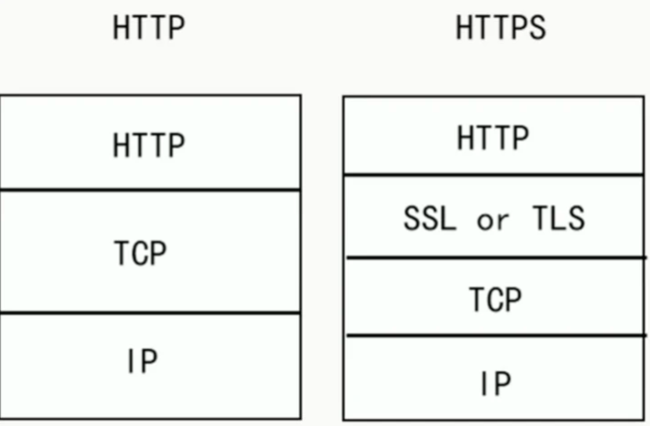
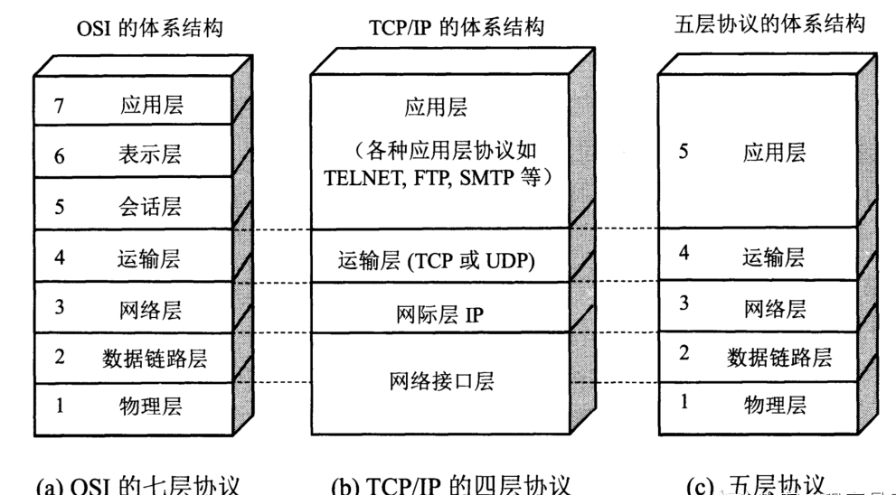
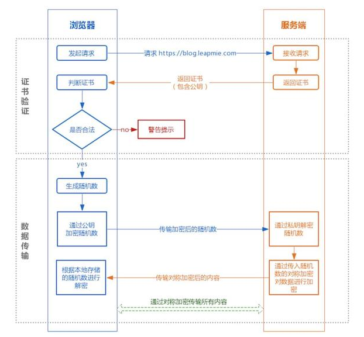

### 1、DNS解析过程

- 浏览器先检查自身缓存中有没有被解析过的这个域名对应的IP地址，如果有，解析结束。

- 如果浏览器中没有，浏览器会检查操作系统中有没有对应的已解析过的结果，而操作系统也有一个域名解析过程。在window下是一个hosts的文件。

- 到现在还没有命中，则向本地域名服务器请求解析域名。

- 如果本地DNS服务器本地区域文件与缓存解析都失效，则根据本地DNS服务器的设置，采用递归或者迭代查询，直至解析完成。

  本地服务器采用迭代查询，向一个根域名服务器查询；

  根域名服务器告诉本地服务器，下一个要查询的顶级域名服务器的IP地址；

  本地服务器向顶级域名服务器查询；

  顶级域名服务器告诉本地域名服务器，下一个要查询的权限域名服务器的IP地址；

  本地服务器向权限域名服务器查询；

  权限域名服务器返回IP地址。


### 2、HTTP和HTTPS的区别，HTTPS握手的过程

端口 ：**HTTP的URL由“http://”起始且默认使用端口80，而HTTPS的URL由“https://”起始且默认使用端口443**。 

安全性和资源消耗： **HTTP协议运行在TCP之上，所有传输的内容都是明文**，客户端和服务器端都无法验证对方的身份。**HTTPS是运行在SSL/TLS之上的HTTP协议**，SSL/TLS 运行在TCP之上。**所有传输的内容都经过加密，加密采用对称加密，但对称加密的密钥用服务器方的证书进行了非对称加密**。所以说，HTTP 安全性没有 HTTPS高，但是**HTTPS 比HTTP耗费更多服务器资源**。  

- 对称加密：**密钥只有一个，加密解密为同一个密码，且加解密速度快**，**典型的对称加密算法有DES**、AES等； 
- 非对称加密：**密钥成对出现（且根据公钥无法推知私钥，根据私钥也无法推知公钥），加密解密使用不同密钥**（公钥加密需要私钥解密，私钥加密需要公钥解密），相对对称加密速度较慢，**典型的非对称加密算法有RSA**、DSA等。
  密 

对称加密算法（私钥加密）
有AES、DES、3DES、TDEA、Blowfish、RC4、RC5、IDEA等。加密使用的密钥和解密使用的密钥是同一个密钥。由于加密算法是公开的，若要保证安全性，密钥不能对外公开。通常用来加密消息体。


### 3、TCP三次握手和四次挥手

**三次握手**

- 发送端**首先发送一个带SYN（synchronize）标志的数据包**给接收方【**第一次的seq序列号是随机产生的**，这样是为了**网络安全**，如果不是随机产生初始序列号，黑客将会以很容易的方式获取到你与其他主机之间的初始化序列号，并且伪造序列号进行攻击】 。
- 接收端收到后，**回传一个带有SYN/ACK（acknowledgement）标志的数据包**以示传达确认信息【**SYN 是为了告诉发送端，发送方到接收方的通道没问题**；**ACK 用来验证接收方到发送方的通道没问题**】 。
- 最后，**发送端再回传一个带ACK标志的数据包**，代表握手结束若在握手某个过程中某个阶段莫名中断，TCP协议会再次以相同的顺序发送相同的数据包。


**四次挥手**

- 主动断开方——发送一个 FIN，用来关闭主动断开方到被动断开方的数据传送 。
- 被动断开方——收到这个 FIN，它发回一 个 ACK，确认序号为收到的序号加1 。和 SYN 一样，一个 FIN 将占用一个序号 。
- 被动点开方——关闭与主动断开方的连接，发送一个FIN给主动断开方。
- 主动断开方——发回 ACK 报文确认，并将确认序号设置为收到序号加1。


### 4、TCP和UDP的区别，TCP怎么保证可靠

**TCP和UDP的区别**

- TCP**面向连接**的，**可靠的**数据传输服务；UDP面向**无连接的**，尽最大努力的数据传输服务，**不保证数据传输的可靠性**
- **TCP面向字节流，UDP面向报文**
  - 应用进程交给 UDP 多长的报文， UDP 就照样发送，一次发送一个报文
  - TCP 在发送时采取的方式完全不同：TCP 根据对方给出的窗口值和当前网络拥塞的程度来决定一个报文段应该包含多少个字节。如果报文太长，TCP会将其拆分再发送，如果报文太短，TCP会等待积累足够多的字节后再构成报文段发送出去
- TCP数据传输慢，UDP数据传输快
- TCP有**拥塞控制**，UDP没有拥塞控制，因此网络出现拥塞不会使源主机的发送速率降低（对实时应用很有效，如直播，实时视频会议等）
- TCP 只能是一对一的通信（TCP连接的端点是套接字socket），而 UDP 支持一对一、一对多、多对一和多对多的通信
- TCP 的首部开销大，有 20 个字节，比 UDP 的 8 个字节的首部要长。
- TCP提供可靠**全双功**的通信服务。UDP是半双功，只能单向传播。


TCP主要提供了检验和、序列号/确认应答、超时重传、滑动窗口、拥塞控制和 流量控制等方法实现了可靠性传输。


### 5、IP路由器寻址过程


### 6、HTTPS加密的方式，加密的究竟是什么


### 7、对称加密与非对称加密的区别？ 

**什么是对称加密？**

简单说就是有一个密钥，它可以加密一段信息，也可以对加密后的信息进行解密，和我们日常生活中用的钥匙作用差不多。


**什么是非对称加密？**

简单说就是有两把密钥，通常一把叫做公钥、一把叫私钥，用公钥加密的内容必须用私钥才能解开，同样，私钥加密的内容只有公钥能解开。


### 8、具体证书是怎么获取的？密钥如何分发？ 

https证书获取途径有两种：自己签发和由受信任的CA机构签发。

- 自己给自己签发而来的证书也叫自签名ssl证书，这种类型的证书可以随意签发，不受任何约束和监督，也不受各大浏览器的信任，基本没什么安全性可言，所以https证书获取不建议使用这种。
- 而由受信任的CA机构签发的https证书，才是用户们正确的选择。这种CA机构签发证书需要经过一系列的审核，而且是有有效期的，一般不超过2年，能兼容市面上大部分的浏览器，也就是受各大浏览器的信任，安全性有保障。目前比较受欢迎的几大国际品牌有Symantec、Geotrust、Comodo、Thawte以及RapidSSL等。想要获取靠谱的https证书可以从他们当中选择一款。


**密钥交换**

1. 某网站拥有用于非对称加密的公钥A、私钥A’。
2. 浏览器向网站服务器请求，服务器把公钥A明文给传输浏览器。
3. 浏览器随机生成一个用于对称加密的密钥X，用公钥A加密后传给服务器。
4. 服务器拿到后用私钥A’解密得到密钥X。
5. 这样双方就都拥有密钥X了，且别人无法知道它。之后双方所有数据都通过密钥X加密解密即可。


### 9、通信过程中安全性如何保证


### 10、reactor是什么?跟proactor的区别? 

**Reactor**

要求主线程，只负责监听文件描述上是否有事件发生，有的话就立即将该事件通知工作线程。除此之外，主线程不做任何其他实质性的工作。读写数据，接受新的连接，以及处理客户请求均在工作线程中完成。


**Proactor**

将所有I/O操作都交给主线程和内核来处理，工作线程仅负责业务逻辑。


### 11、IO多路复用解决了什么问题

一个服务器进程和一个客户端进程通信,服务器端read(sockfd1,bud,bufsize)，此时客户端进程没有发送数据，那么read(阻塞调用)将阻塞，直到客户端调用write(sockfd,but,size)发来数据，在一个客户和服务器通信时这没什么问题。

当多个客户与服务器通信时当多个客户与服务器通信时,若服务器阻塞于其中一个客户sockfd1，当另一个客户的数据到达套接字sockfd2时，服务器不能处理，仍然阻塞在read(sockfd1,...)上。


IO多路复用：

同时监听多个客户连接，socket1、socket2...当其中有一个发来消息就从select阻塞中返回，然后调用read读取，再回到select循环，这样就不会阻塞在其中一个上而不能处理其他客户消息。该模型的优势并不是对于单个连接能处理得更快，而是在于能处理更多的连接。


### 12、select，poll，epoll

**select**

在一段时间内，监听用户感兴趣的文件描述符上的可读、可写和异常等事件，成功时返回就绪文件描述符的总数。


**poll**

和select类似，只是描述fd集合的方式不同，poll使用pollfd结构而不是select的fd_set结构。没有最大连接数的限制。


**epoll**

使用一组函数来完成任务，而不是单个函数，epoll把用户关心的文件描述符上的事件放在内核的一个事件表里，无须像select和poll每次调用都要重复传入文件描述符集或事件集。


**区别**

（1）select：时间复杂度 O(n)

select 仅仅知道有 I/O 事件发生，但并不知道是哪几个流，所以只能无差别轮询所有流，找出能读出数据或者写入数据的流，并对其进行操作。所以 select 具有 O(n) 的无差别轮询复杂度，同时处理的流越多，无差别轮询时间就越长。

（2）poll：时间复杂度 O(n)

poll 本质上和 select 没有区别，它将用户传入的数组拷贝到内核空间，然后查询每个 fd 对应的设备状态， 但是它没有最大连接数的限制，原因是它是基于链表来存储的。

（3）epoll：时间复杂度 O(1)

epoll 可以理解为 event poll，不同于忙轮询和无差别轮询，epoll 会把哪个流发生了怎样的 I/O 事件通知我们。所以说 epoll 实际上是事件驱动（每个事件关联上 fd）的。

### 13、有限状态机


### ~~14、线程调度~~


### 15、https的SSL建连过程会导致效率下降要怎么优化 


### 16、https整个握手交互的过程总共花了多少rtt

2个RTT


### 17、TSL握手过程 



SSL 和 TLS 协议可以为通信双方提供识别和认证通道，从而保证通信的机密性和数据完整性。TLS 协议是从Netscape SSL 3.0协议演变而来的，不过这两种协议并不兼容，SSL 已经逐渐被 TLS 取代，所以下文就以 TLS 指代安全层。

TLS 握手是启动 HTTPS 通信的过程，类似于 TCP 建立连接时的三次握手。 在 TLS 握手的过程中，通信双方交换消息以相互验证，相互确认，并确立它们所要使用的加密算法以及会话密钥 (用于对称加密的密钥)。可以说，TLS 握手是 HTTPS 通信的基础部分。

> SSL / TLS 握手详细过程

1. **"client hello"消息：**客户端通过发送"client hello"消息向服务器发起握手请求，该消息包含了客户端所支持的 TLS 版本和密码组合以供服务器进行选择，还有一个"client random"随机字符串。
2. **"server hello"消息：**服务器发送"server hello"消息对客户端进行回应，该消息包含了数字证书，服务器选择的密码组合和"server random"随机字符串。
3. **验证：**客户端对服务器发来的证书进行验证，确保对方的合法身份，验证过程可以细化为以下几个步骤：
   1. 检查数字签名
   2. 验证证书链 (这个概念下面会进行说明)
   3. 检查证书的有效期
   4. 检查证书的撤回状态 (撤回代表证书已失效)
4. **"premaster secret"字符串：**客户端向服务器发送另一个随机字符串"premaster secret (预主密钥)"，这个字符串是经过服务器的公钥加密过的，只有对应的私钥才能解密。
5. **使用私钥：**服务器使用私钥解密"premaster secret"。
6. **生成共享密钥**：客户端和服务器均使用 client random，server random 和 premaster secret，并通过相同的算法生成相同的共享密钥 **KEY**。
7. **客户端就绪：**客户端发送经过共享密钥 **KEY**加密过的"finished"信号。
8. **服务器就绪：**服务器发送经过共享密钥 **KEY**加密过的"finished"信号。
9. **达成安全通信：**握手完成，双方使用对称加密进行安全通信。

[参考文章](https://segmentfault.com/a/1190000021559557)


### 18、https还有什么安全问题

DNS劫持，简单的说黑客为了绕过HTTPS，采用了SSL层剥离的技术，黑客阻止用户和使用HTTPS请求的网站之间建立SSL连接，使用户和代理服务器（攻击者所控制的服务器）之间使用了未加密的HTTP通信。


### 19、https怎么保证证书可靠性


### 20、假设客户端和服务器通过TCP通信，这时客户端突然断电，服务器是如何关闭这个连接的？

定时器+超时重试机制

TCP 设有一个保活计时器。服务器每收到一次客户端的数据，都会重新复位这个计时器，时间通常是设置为 2 小时。若 2 小时还没有收到客户端的任何数据，服务器就开始重试：每隔 75 秒发送一个探测报文段，若一连发送 10 个探测报文后客户端依然没有回应，那么服务器就认为连接已经断开了。


### 21、浏览器输入URL到显示网页，发生了什么？

1. 浏览器要**将URL解析为IP地址**，解析域名就要用到DNS协议，首先主机会查询DNS的缓存，如果没有就给本地DNS发送查询请求。DNS查询分为两种方式，一种是递归查询，一种是迭代查询。如果是迭代查询，本地的DNS服务器，向根域名服务器发送查询请求，根域名服务器告知该域名的一级域名服务器，然后本地服务器给该一级域名服务器发送查询请求，然后依次类推直到查询到该域名的IP地址。DNS服务器是基于UDP的，因此会用到UDP协议。

2. 得到IP地址后，浏览器就要与服务器**建立一个http连接**。因此要用到http协议，http协议报文格式上面已经提到。http生成一个get请求报文，将该报文传给TCP层处理，所以还会用到TCP协议。如果采用https还会使用https协议先对http数据进行加密。TCP层如果有需要先将HTTP数据包分片，分片依据路径MTU和MSS。TCP的数据包然后会发送给IP层，用到IP协议。IP层通过路由选路，一跳一跳发送到目的地址。当然在一个网段内的寻址是通过以太网协议实现(也可以是其他物理层协议，比如PPP，SLIP)，以太网协议需要直到目的IP地址的物理地址，有需要ARP协议。


DNS协议，http协议，https协议属于应用层

TCP/UDP属于传输层

IP协议，ARP协议属于网络层


### 22、DNS查询，本地有存放域名和IP地址的映射吗，在哪里？

ipconfig /displaydns #显示本地缓存dns内容


### 23、HTTP1.1 和 HTTP2.0 的区别

**HTTP1.1**

- **默认使用长连接**（connection:keep-alive）。**解决了TCP复用问题**，可以减少TCP的三次握手开销。
- HTTP 1.1开始支持获取文件的部分内容，这支持了**并行下载**和**断点续传**。
- HTTP/1.1 引入了更多的缓存控制策略
- HTTP 1.1开始有Host（域） 这个概念

**HTTP2.0**

HTTP/1.1 存在的问题  

- 不会压缩请求和响应的首部，导致不必要的网络流量 
- 不支持有效的资源优先级 
- 需要使用多个连接才能实现并发和缩短延迟 

HTTP/2.0 的特性有哪些？

- 采用二进制格式而非文本格式，将所有传输的信息分割为更小的消息和帧（二进制帧） 
- 采用**多路复用**，而非有序并阻塞的，只需一个连接即可实现并行，多路复用允许单一的 HTTP/2 连接同时发起多重的请求-响应消息 
- **首部压缩**，使用报头压缩，降低开销 
- 支持**服务器推送**。可以将响应主动"推送"到客户端缓存中（服务器可以对一个客户端请求发送多个响应，例如请求了 HTML，可以响应需要的 CSS 和 JavaScript）


### 24、GET和POST的区别

GET表示客户端以只读的方式来申请资源；POST可能会影响服务器：服务器可能根据收到的数据动态创建新的资源，或更新现有资源。

GET产生一个TCP数据包；POST产生两个TCP数据包。

- 对于GET方式的请求，浏览器会把http header和data一并发送出去，服务器响应200（返回数据）
- 而对于POST，浏览器先发送header，服务器响应100 continue，浏览器再发送data，服务器响应200 ok（返回数据）


### 25、拥塞控制和流量控制

**拥塞控制：**在数据传输过程中，可能由于网络状态的问题，造成网络拥堵，此时引入拥塞控制机制，在保证TCP可靠性的同时，提高性能。

**流量控制：**如果主机A 一直向主机B发送数据，不考虑主机B的接受能力，则可能导致主机B的接受缓冲区满了而无法再接受数据，从而会导致大量的数据丢包，引发重传机制。而在重传的过程中，若主机B的接收缓冲区情况仍未好转，则会将大量的时间浪费在重传数据上，降低传送数据的效率。所以引入流量控制机制，主机B通过告诉主机A自己接收缓冲区的大小，来使主机A控制发送的数据量。流量控制与TCP协议报头中的窗口大小有关。


### 26、7层和5层模型




应用层：**为应用程序提供交互服务**。在互联网中的应用层协议很多，如域名系统DNS，支持万维网应用的HTTP协议，支持电子邮件的SMTP协议等。

表示层：主要负责数据格式的转换，如加密解密、转换翻译、压缩解压缩等。

会话层：负责在网络中的两节点之间建立、维持和终止通信，如服务器验证用户登录便是由会话层完成的。

运输层：有时也译为传输层，**向主机进程提供通用的数据传输服务**。该层主要有以下两种协议：

- TCP：提供面向连接的、可靠的数据传输服务；
- UDP：提供无连接的、尽最大努力的数据传输服务，但不保证数据传输的可靠性。

网络层：**选择合适的路由和交换结点**，确保数据及时传送。主要包括IP协议。

数据链路层：数据链路层通常简称为链路层。将网络层传下来的IP数据包组装成帧，并再相邻节点的链路上传送帧。

物理层：实现相邻节点间比特流的透明传输，尽可能屏蔽传输介质和通信手段的差异。


### 27、TCP协议报文的字段有哪些？它们的作用？ 

1、端口号：用来标识同一台计算机的不同的应用进程。

- 源端口：源端口和IP地址的作用是标识报文的返回地址。

- 目的端口：端口指明接收方计算机上的应用程序接口。


说明：TCP报头中的**源端口号和目的端口号**同IP数据报中的**源IP与目的IP**唯一确定一条TCP连接。

2、序号和确认号：是TCP可靠传输的关键部分。序号是本报文段发送的数据组的第一个字节的序号。在TCP传送的流中，每一个字节一个序号。e.g.一个报文段的序号为300，此报文段数据部分共有100字节，则下一个报文段的序号为400。所以序号确保了TCP传输的有序性。确认号即ACK，指明下一个期待收到的字节序号，表明该序号之前的所有数据已经正确无误的收到。确认号只有当ACK标志为1时才有效。比如建立连接时，SYN报文的ACK标志位为0。

3、数据偏移／首部长度：4bits。由于首部可能含有可选项内容，因此TCP报头的长度是不确定的，报头不包含任何任选字段则长度为20字节，4位首部长度字段所能表示的最大值为1111，转化为10进制为15，15*32/8 = 60，故报头最大长度为60字节。首部长度也叫数据偏移，是因为首部长度实际上指示了数据区在报文段中的起始偏移值。


### 28、http的长连接是什么策略，长连接会一直保持着吗？

在HTTP/1.0中默认使用短连接。也就是说，客户端和服务器每进行一次HTTP操作，就建立一次连接，任务结束就中断连接。当客户端浏览器访问的某个HTML或其他类型的Web页中包含有其他的Web资源（如JavaScript文件、图像文件、CSS文件等），每遇到这样一个Web资源，浏览器就会重新建立一个HTTP会话。

而从HTTP/1.1起，默认使用长连接，用以保持连接特性。使用长连接的HTTP协议，会在响应头加入这行代码：

```
Connection:keep-alive
```

在使用长连接的情况下，当一个网页打开完成后，客户端和服务器之间用于传输HTTP数据的TCP连接不会关闭，客户端再次访问这个服务器时，会继续使用这一条已经建立的连接。Keep-Alive不会永久保持连接，它有一个保持时间，可以在不同的服务器软件（如Apache）中设定这个时间。实现长连接需要客户端和服务端都支持长连接。

HTTP协议的长连接和短连接，实质上是TCP协议的长连接和短连接。


### 29、select、poll、epoll的应用场景

有了epoll，为什么还要用select、poll

1. 文件描述符数量比较少；
2. 每个连接的活跃度都比较高；


### 30、cookie和session

**Cookie**

1. 浏览器第一次发送请求到服务器端。
2. 服务器端会创建cookie，该cookie中包含着用户的登录信息，再将cookie响应到客户端浏览器。
3. 当用户再次访问时，服务器端会将之前创建的cookie响应到客户端
4. 服务器端可以通过cookie来区分不同的用户


**Session**

1. 当浏览器第一次发送请求到服务器端，服务器端会创建一个Session对象，Session对象会分配一个Jsessionld ，同时也会创建一个特殊的Cookie对象，会以set-Cookie的方式将id传回浏览器，浏览器保存起来。
2. 当浏览器再不关闭的情况下，浏览器端发送第二次及以上的请求到服务器端,浏览器端访问服务器端时就会携带该name为JSESSIONID的Cookie对象，服务器端会将ame为JSESSIONID的Cookie对象取服务器端查询，以便来区分用户。


**Cookie和Session的区别是什么？**

1. cookie是将数据信息保存在客户端或浏览器，session是将数据信息保存的服务端。
2. session存储数据信息比cookie存储的信息容量大。
3. session是将数据保存在服务器端，数据信息相对于cookie来说安全性更高。


### 31、中间人攻击



**为什么需要CA认证机构颁发证书？**

HTTP协议被认为不安全是因为传输过程容易被监听者窃听、伪造服务器，而HTTPS协议主要解决的就是网络传输的安全性问题。假设不存在认证机构，任何人都可以伪造证书，这带来的安全风险便是中间人攻击问题。


**服务端在发送浏览器的公钥中加入CA证书，浏览器可以验证CA证书的有效性**

- 制作证书：作为服务端的A，首先把自己的公钥key1发给证书颁发机构，向证书颁发机构进行申请证书；证书颁发机构有一套自己的公私钥，CA通过自己的私钥来加密key1,并且通过服务端网址等信息生成一个证书签名，证书签名同样使用机构的私钥进行加密；制作完成后，机构将证书发给A；
- 校验证书真伪：当B向服务端A发起请求通信的时候，A不再直接返回自己的公钥，而是返回一个证书；
  说明：各大浏览器和操作系统已经维护了所有的权威证书机构的名称和公钥。B只需要知道是哪个权威机构发的证书，使用对应的机构公钥，就可以解密出证书签名；接下来，B使用同样的规则，生成自己的证书签名，如果两个签名是一致的，说明证书是有效的；
  签名验证成功后，B就可以再次利用机构的公钥，解密出A的公钥key1;接下来的操作，就是和之前一样的流程了；
- 中间人是否会拦截发送假证书到B呢？
  因为证书的签名是由服务器端网址等信息生成的，并且通过第三方机构的私钥加密中间人无法篡改； 所以最关键的问题是证书签名的真伪；


### 32、DNS劫持

浏览器使用https协议在与XXXXX.com进行数据交互之前，需要获取域名对应证书，此时地址的服务器返回一个假的证书，接着向CA或者本地跟证书验证对应域名证书合法性，浏览器必然会显示证书安全有问题，此时用户如果点击信任该证书并且继续浏览，则便进入了被劫持的页面。但这个安全提示还是可以有效的抑制对https域名的dns劫持。
