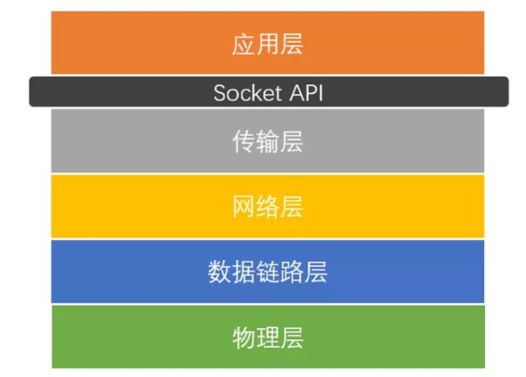
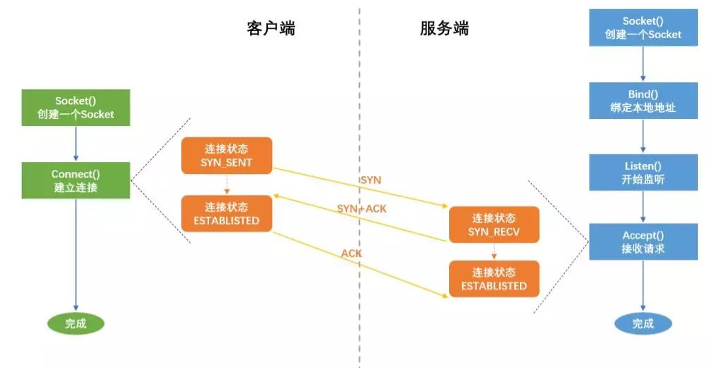
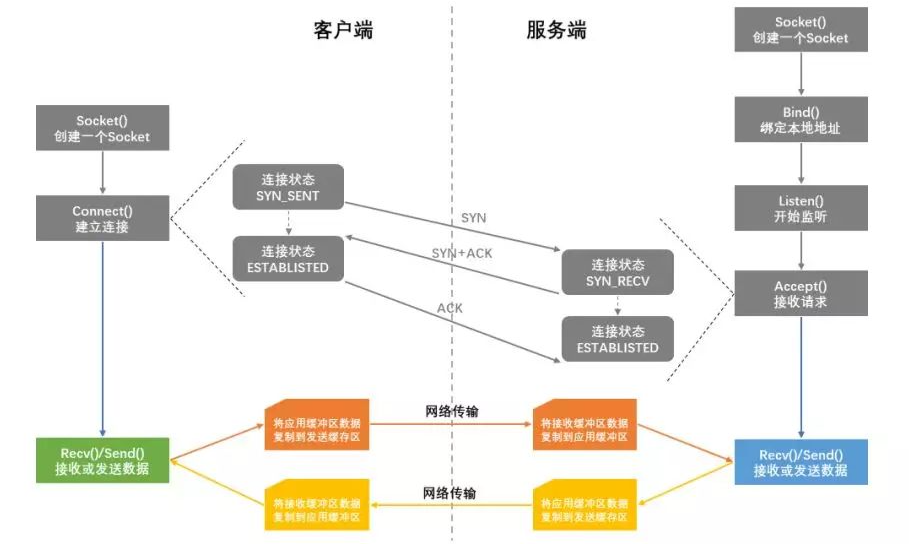
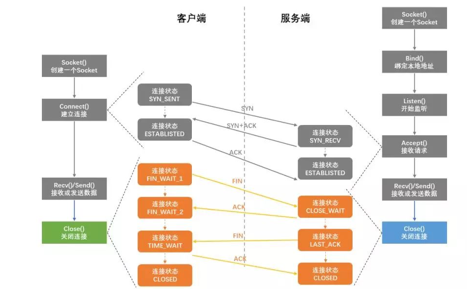

### 什么是Socket？

socket是对TCP/IP协议的封装，它的出现使得程序员更方便地使用TCP/IP协议栈而已。socket本身不是协议，它是应用层与TCP/IP协议族通信的中间软件抽象层，是一组调用接口（TCP/IP网络的API函数）


“TCP/IP只是一个协议栈，就像操作系统的运行机制一样，必须要具体实现，同时还要提供对外的操作接口。这个就像操作系统会提供标准的编程接口，比如win32编程接口一样。**TCP/IP也要提供可供程序员做网络开发所用的接口，这就是Socket编程接口**。”


维基对socket的定义

socket是计算机网络中用于在节点内发送或接受数据的内部端点。具体来说，它是网络软件（协议栈）中这个端点的一种表示，包含通信协议、目标地址、状态等，是系统资源的一种形式。



socket 的诞生是为了应用程序能够更方便的将数据经由传输层来传输，所以它本质上就是对 TCP/IP 的运用进行了一层封装，然后应用程序直接调用 socket API 即可进行通信。那么它是如何工作的呢？它分为 2 个部分，服务端需要建立 socket 来监听指定的地址，然后等待客户端来连接。而客户端则需要建立 socket 并与服务端的 socket 地址进行连接。



**三次握手**



**数据传输**，传输的过程涉及到数据 Copy，不过这些 Copy 是必不可少的。其中的发送缓冲区和接收缓冲区就是套接字缓存 (socket buffer)。



**四次挥手**

简单总结一下 socket。socket 是进程间数据传输的媒介，为了保证连接的可靠，你需要特别注意建立连接和关闭连接的过程。为了确保准确、完整的数据传输，客户端和服务端来回进行了多次网络通信才得以完成连接的创建和关闭，这同时也是你在运用一个连接时所花费的额外成本。


### Socket编程中服务器和客户端主要用到的函数

套接字( socket ) ： 套接口也是一种进程间通信机制，与其他通信机制不同的是，它可用于不同机器间的进程通信。

#### 命名socket

SOCK_STREAM 式本地套接字的通信双方均需要具有本地地址，其中服务器端的本地地址需要明确指定，指定方法是使用 struct sockaddr_un 类型的变量。


#### 绑定

SOCK_STREAM 式本地套接字的通信双方均需要具有本地地址，其中服务器端的本地地址需要明确指定，指定方法是使用 struct sockaddr_un 类型的变量，将相应字段赋值，再将其绑定在创建的服务器套接字上，绑定要使用 bind 系统调用，其原形如下：

```c++
int bind(int socket, const struct sockaddr *address, size_t address_len);
```

其中 socket表示服务器端的套接字描述符，address 表示需要绑定的本地地址，是一个 struct sockaddr_un 类型的变量，address_len 表示该本地地址的字节长度。


#### 监听

服务器端套接字创建完毕并赋予本地地址值（名称，本例中为Server Socket）后，需要进行监听，等待客户端连接并处理请求，**监听使用 listen 系统调用，接受客户端连接使用accept系统调用**，它们的原形如下：

```c++
int listen(int socket, int backlog);

int accept(int socket, struct sockaddr *address, size_t *address_len);
```

其中 socket 表示服务器端的套接字描述符；backlog 表示排队连接队列的长度（若有多个客户端同时连接，则需要进行排队）；address 表示当前连接客户端的本地地址，该参数为输出参数，是客户端传递过来的关于自身的信息；address_len 表示当前连接客户端本地地址的字节长度，这个参数既是输入参数，又是输出参数。


#### 连接服务器

客户端套接字创建完毕并赋予本地地址值后，需要连接到服务器端进行通信，让服务器端为其提供处理服务。

对于SOCK_STREAM类型的流式套接字，需要客户端与服务器之间进行连接方可使用。连接要使用 connect 系统调用，其原形为

```c++
int connect(int socket, const struct sockaddr *address, size_t address_len);
```

其中socket为客户端的套接字描述符，address表示当前客户端的本地地址，是一个 struct sockaddr_un 类型的变量，address_len 表示本地地址的字节长度。


#### 相互发送接收数据

无论客户端还是服务器，都要和对方进行数据上的交互，这种交互也正是我们进程通信的主题。一个进程扮演客户端的角色，另外一个进程扮演服务器的角色，两个进程之间相互发送接收数据，这就是基于本地套接字的进程通信。发送和接收数据要使用 write 和 read 系统调用，它们的原形为：

```c++
int read(int socket, char *buffer, size_t len);
int write(int socket, char *buffer, size_t len);
```

其中 socket 为套接字描述符；len 为需要发送或需要接收的数据长度；

对于 read 系统调用，buffer 是用来存放接收数据的缓冲区，即接收来的数据存入其中，是一个输出参数；

对于 write 系统调用，buffer 用来存放需要发送出去的数据，即 buffer 内的数据被发送出去，是一个输入参数；返回值为已经发送或接收的数据长度。


#### 断开连接

交互完成后，需要将连接断开以节省资源，使用close系统调用，其原形为：

```c++
int close(int socket);
```


