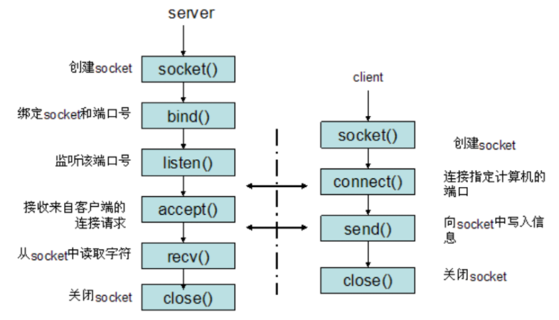

### 什么是Socket？

socket是对TCP/IP协议的封装，它的出现使得程序员更方便地使用TCP/IP协议栈而已。socket本身不是协议，它是应用层与TCP/IP协议族通信的中间软件抽象层，是一组调用接口（TCP/IP网络的API函数）

“TCP/IP只是一个协议栈，就像操作系统的运行机制一样，必须要具体实现，同时还要提供对外的操作接口。这个就像操作系统会提供标准的编程接口，比如win32编程接口一样。**TCP/IP也要提供可供程序员做网络开发所用的接口，这就是Socket编程接口**。”

维基对socket的定义

socket是计算机网络中用于在节点内发送或接受数据的内部端点。具体来说，它是网络软件（协议栈）中这个端点的一种表示，包含通信协议、目标地址、状态等，是系统资源的一种形式。

socket 的诞生是为了应用程序能够更方便的将数据经由传输层来传输，所以它本质上就是对 TCP/IP 的运用进行了一层封装，然后应用程序直接调用 socket API 即可进行通信。那么它是如何工作的呢？它分为 2 个部分，服务端需要建立 socket 来监听指定的地址，然后等待客户端来连接。而客户端则需要建立 socket 并与服务端的 socket 地址进行连接。

**三次握手**

**数据传输**，传输的过程涉及到数据 Copy，不过这些 Copy 是必不可少的。其中的发送缓冲区和接收缓冲区就是套接字缓存 (socket buffer)。

**四次挥手**

简单总结一下 socket。socket 是进程间数据传输的媒介，为了保证连接的可靠，你需要特别注意建立连接和关闭连接的过程。为了确保准确、完整的数据传输，客户端和服务端来回进行了多次网络通信才得以完成连接的创建和关闭，这同时也是你在运用一个连接时所花费的额外成本。

### Socket编程中服务器和客户端主要用到的函数

1）基于TCP的socket：

1、服务器端程序：

1创建一个socket，用函数**socket()**

2绑定IP地址、端口等信息到socket上，用函数**bind()**

3设置允许的最大连接数，用函数**listen()**

4接收客户端上来的连接，用函数**accept()**

5收发数据，用函数send()和recv()，或者read()和write()

6关闭网络连接

2、客户端程序：

1创建一个socket，用函数**socket()**

2设置要连接的对方的IP地址和端口等属性

3连接服务器，用函数**connect()**

4收发数据，用函数send()和recv()，或read()和write()

5关闭网络连接

