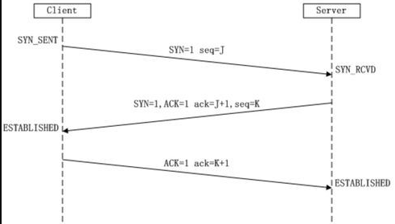
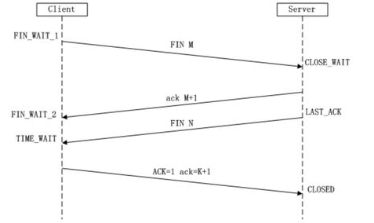

### TCP三次握手的过程

建立TCP连接，就是指建立一个TCP连接时，需要客户端和服务端总共发送3个包以确认连接的建立。在socket编程中，这一过程由客户端执行connect来触发。

在TCP/IP协议中，TCP协议提供可靠的连接服务，采用三次握手建立一个连接。

第一次握手：Client将标志位SYN置为1，随机产生一个值seq=J，并将该数据包发送给Server，Client进入SYN_SENT状态，**等待Server确认**。

SYN：同步序列编号(Synchronize Sequence Numbers)

第二次握手：Server收到数据包后由标志位SYN=1知道Client请求建立连接，Server将标志位SYN和ACK都置为1，ack=J+1，随机产生一个值seq=K，并将该数据包发送给Client以**确认连接请求**，Server进入SYN_RCVD状态。

第三次握手：Client收到确认后，检查ack是否为J+1，ACK是否为1，如果正确则将标志位ACK置为1，ack=K+1，并将该数据包发送给Server，Server检查ack是否为K+1，ACK是否为1，如果正确则连接建立成功，Client和Server进入ESTABLISHED状态，完成三次握手，随后Client与Server之间可以开始传输数据了。

### 为什么需要三次握手

如果client发出的第一个连接请求没有丢失，而是在某个网络节点长时间逗留了，以致于延误到连接释放以后的某个时间才到达server。本来这是一个早已失效的报文段。但server收到此失效的连接请求报文后，就误以为client再次发出一个新的连接请求。于是向client发出确认报文段，同意建立连接。

假如不采用三次握手，那么只要server发出确认就建立连接，由于当前client并没有发出新的建立连接请求，因此不会理睬server的确认，也不会向server发送数据。但是server认为已经建立新的连接请求，并一直等待client发来的数据。这样server的很多资源就被浪费了。

转自：https://www.zhihu.com/question/24853633/answer/63668444

在Google Groups的[TopLanguage](https://link.zhihu.com/?target=https%3A//groups.google.com/forum/%23!forum/pongba)中看到一帖讨论TCP“三次握手”觉得很有意思。贴主提出“[TCP建立连接为什么是三次握手？](https://link.zhihu.com/?target=https%3A//groups.google.com/d/topic/pongba/kF6O7-MFxM0/discussion)”的问题，

在众多回复中，有[一条回复](https://link.zhihu.com/?target=https%3A//groups.google.com/d/msg/pongba/kF6O7-MFxM0/5S7zIJ4yqKUJ)写道：

“这个问题的本质是, **信道不可靠, 但是通信双发需要就某个问题达成一致. 而要解决这个问题,  无论你在消息中包含什么信息, 三次通信是理论上的最小值**。所以三次握手不是TCP本身的要求, 而是为了满足"在不可靠信道上可靠地传输信息"这一需求所导致的. 请注意这里的本质需求,信道不可靠, 数据传输要可靠. 三次达到了, 那后面你想接着握手也好, 发数据也好, 跟进行可靠信息传输的需求就没关系了. 因此,如果信道是可靠的, 即无论什么时候发出消息, 对方一定能收到, 或者你不关心是否要保证对方收到你的消息, 那就能像UDP那样直接发送消息就可以了.”。这可视为对“三次握手”目的的另一种解答思路。

### TCP四次挥手的过程

- 第一次挥手：Client发送一个FIN，用来**关闭Client到Server的数据传送**，Client进入FIN_WAIT_1状态。
- 第二次挥手：Server收到FIN后，发送一个ACK给Client，确认序号为收到序号+1（与SYN相同，一个FIN占用一个序号），Server进入CLOSE_WAIT状态。
- 第三次挥手：Server发送一个FIN，用来**关闭Server到Client的数据传送**，Server进入LAST_ACK状态。
- 第四次挥手：Client收到FIN后，Client进入**TIME_WAIT**状态，接着发送一个ACK给Server，确认序号为收到序号+1， Server进入CLOSED状态，完成四次挥手。

