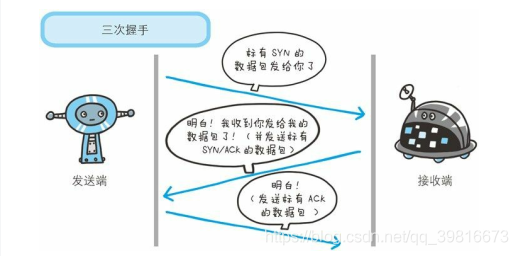

https://blog.csdn.net/qq_39816673/article/details/89528185

一个页面从输入 URL 到页面加载显示完成，这个过程中都发生了什么？

把这个问题拆解成两个过程：

1. 用户输入 url ---> 客户端（浏览器）拿到服务端的数据

2. 浏览器拿到数据 ---> 呈现页面（也就是浏览器工作过程）

   

### 一. TCP/IP协议族通信

**应用层**，应用层决定了向用户提供应用服务时通信的活动，TCP/IP协议族内预存了各类通用的应用服务，比如，FTP（文件传输协议）和DNS(域名系统)服务，当然HTTP就属于这一层。

**传输层**，传输层对上层应用层，提供处于网络连接中的两台计算机之间的数据传输。在传输层有两个不同性质的协议：TCP（传输控制协议）和UDP（用户数据报协议）

**网络层**，网络层用来处理在网络上流动的数据包，数据包是网络传输的最小数据单位，该层规定了通过怎样的路径（所谓的传输路线）到达对方计算机，并把数据包传送给对方。

**链路层**（又名数据链路层），用来处理网络的硬件部分，包括控制操作系统，硬件的设备驱动等，硬件的范畴均在链路层的作用范围之内。

#### DNS解析

首先呢，如果你输入的网址不是ip地址的话，会通过应用层的DNS服务，根据输入网站的域名进行查找，查找到对应的ip地址，为什么必须要通过DNS服务找到对应的ip地址才才能建立连接呢，是因为每台计算机的唯一标识是ip地址，但是ip地址不容易记，所以才用一个网址来代替ip地址，这样一来，大家就比较容易记得住。

#### 应用层

判断是哪种应用程序格式，那么浏览网页用的是HTTP协议，客户端就会发送HTTP请求报文。

#### 传输层

利用TCP协议进行连接，提供可靠的字节流服务。所谓的字节流服务（Byte Stream Service） 是指， 为了方便传输， 将大块数据分割成以报文段（segment） 为单位的数据包进行管理。 而可靠的传输服务是指， 能够把数据准确可靠地传给对方。 

一言以蔽之，TCP 协议为了更容易传送大数据才把数据分割， 而且 TCP 协议能够确认数据最终是否送达到对方。为了准确无误地将数据送达目标处， TCP 协议采用了三次握手策略。握手过程中使用了 TCP 的标志SYN（synchronize） 和ACK（acknowledgement） 。发送端首先发送一个带 SYN 标志的数据包给对方。 接收端收到后，回传一个带有 SYN/ACK 标志的数据包以示传达确认信息。 最后， 发送端再回传一个带 ACK 标志的数据包， 代表“握手”结束。若在握手过程中某个阶段莫名中断， TCP 协议会再次以相同的顺序发送相同的数据。

#### 网络层

现在确认连接上了，ip协议就开始行动了，ip协议主要作用就是把各种数据包传送给对方，而要保证传送到对方那里，最重要的两个条件是**ip地址和MAC地址**，那么怎么获取对方的MAC的地址呢？是利用**ARP（地址解析协议）**，根据ip地址解析出MAC地址，从而进行通信，当通信的双方不在同一个局域网时，需要连接处的网管多次中转才能到达最终的目标，在中转的过程中需要通过下一个中转站的MAC地址来搜索下一个中转目标。

#### 数据链接层

在网络层找到对方的MAC地址后，就将数据发送到数据链路层传输，由于以太网数据包的数据部分，最大长度为1500字节，而最终的数据包远远不止，所以需要分割为多个包进行发送。

#### 服务器端

服务器端将收到的多个包拼起来，取出完整的TCP数据包，然后读出里面的”HTTP请求“，然后做出”HTTP响应“，再通过TCP/IP通信协议回传，当客户端收到回复，一个完整的TCP/IP通信就完成了

#### 页面渲染

