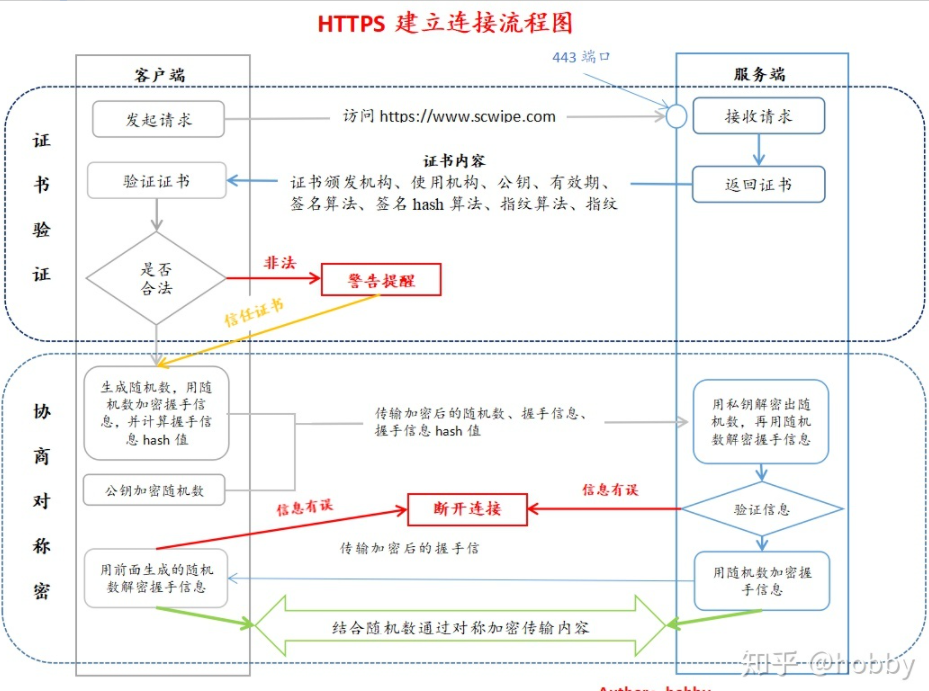

## **为什么需要加密？**

因为http的内容是明文传输的，明文数据会经过中间代理服务器、路由器、wifi热点、通信服务运营商等多个物理节点，如果信息在传输过程中被劫持，传输的内容就完全暴露了。劫持者还可以篡改传输的信息且不被双方察觉，这就是`中间人攻击`。所以我们才需要对信息进行加密。最容易理解的就是`对称加密` 。

## **什么是对称加密？**

简单说就是有一个密钥，它可以加密一段信息，也可以对加密后的信息进行解密，和我们日常生活中用的钥匙作用差不多。

## **用对称加密可行吗？**

**如果通信双方都各自持有同一个密钥，且没有别人知道，这两方的通信安全当然是可以被保证的（除非密钥被破解）。**

然而最大的问题就是**这个密钥怎么让传输的双方知晓，同时不被别人知道**。如果由服务器生成一个密钥并传输给浏览器，那在这个传输过程中密钥被别人劫持到手了怎么办？之后他就能用密钥解开双方传输的任何内容了，所以这么做当然不行。

换种思路？试想一下，如果浏览器内部就预存了网站A的密钥，且可以确保除了浏览器和网站A，不会有任何外人知道该密钥，那理论上用对称加密是可以的，这样浏览器只要预存好世界上所有HTTPS网站的密钥就行了！这么做显然不现实。
怎么办？所以我们就需要`非对称加密` 。

## **什么是非对称加密？**

简单说就是有两把密钥，通常一把叫做公钥、一把叫私钥，用公钥加密的内容必须用私钥才能解开，同样，私钥加密的内容只有公钥能解开。

## 用非对称加密可行吗？

鉴于非对称加密的机制，我们可能会有这种思路：服务器先把公钥以明文方式传输给浏览器，之后浏览器向服务器传数据前都先用这个公钥加密好再传，这条数据的安全似乎可以保障了！**因为只有服务器有相应的私钥能解开公钥加密的数据**。

然而反过来**由服务器到浏览器的这条路怎么保障安全？**如果服务器用它的私钥加密数据传给浏览器，那么浏览器用公钥可以解密它，而这个公钥是一开始通过明文传输给浏览器的，若这个公钥被中间人劫持到了，那他也能用该公钥解密服务器传来的信息了。所以**目前似乎只能保证由浏览器向服务器传输数据的安全性**（其实仍有漏洞，下文会说），那利用这点你能想到什么解决方案吗？

## **非对称加密+对称加密？**

既然非对称加密耗时，那非对称加密+对称加密结合可以吗？而且得尽量减少非对称加密的次数。当然是可以的，且非对称加密、解密各只需用一次即可。
请看一下这个过程：

1. 某网站拥有用于非对称加密的公钥A、私钥A’。
2. 浏览器向网站服务器请求，服务器把公钥A明文给传输浏览器。
3. 浏览器随机生成一个用于对称加密的密钥X，用公钥A加密后传给服务器。
4. 服务器拿到后用私钥A’解密得到密钥X。
5. 这样双方就都拥有密钥X了，且别人无法知道它。之后双方所有数据都通过密钥X加密解密即可。

### Reference

https://zhuanlan.zhihu.com/p/43789231