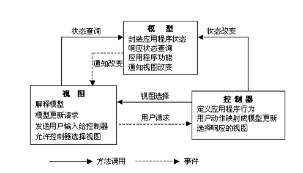

### 框架和设计模式的区别

MVC是一种框架模式，MVC（Model-View-Controller），是模型Model—视图View—控制器Controller，一种软件设计典范，用一种业务逻辑、数据、界面显示分离的方法组织代码，将业务逻辑聚集到一个部件里，在改进和个性化定制界面及用户交互的同时，不需要重新编写业务逻辑。

框架、设计模式这两个概念总容易被混淆，其实它们之间还是有区别的。框架通常是**代码重用**，而设计模式是**设计重用**，架构则介于两者之间，部分代码重用，部分设计重用，有时分析也可重用。

在软件生产中有三种级别的重用：内部重用，即在同一应用中能公共使用的抽象块；代码重用，即将通用模块组合成库或工具集，以便在多个应用和领域都能使用；应用框架的重用，即为专用领域提供通用的或现成的基础结构，以获得最高级别的重用性。

框架与设计模式虽然相似，但却有着根本的不同。**设计模式是对在某种环境中反复出现的问题以及解决该问题的方案的描述**，它比框架更抽象；框架可以用代码表示，也能直接执行或复用，而对模式而言只有实例才能用代码表示;设计模式是比框架更小的元素，一个框架中往往含有一个或多个设计模式，框架总是针对某一特定应用领域，但同一模式却可适用于各种应用。可以说，框架是软件，而设计模式是软件的知识。

框架模式有哪些？

MVC、MTV、[MVP](https://baike.baidu.com/item/MVP/3714550)、CBD、[ORM](https://baike.baidu.com/item/ORM)等等；

框架有哪些？

[C++](https://baike.baidu.com/item/C%2B%2B)语言的QT、MFC、gtk，Java语言的[SSH](https://baike.baidu.com/item/SSH) 、**[SSI](https://baike.baidu.com/item/SSI)**，[php](https://baike.baidu.com/item/php)语言的 smarty(MVC模式)，[python](https://baike.baidu.com/item/python)语言的django(MTV模式)等等

设计模式有哪些？

[工厂模式](https://baike.baidu.com/item/工厂模式)、[适配器模式](https://baike.baidu.com/item/适配器模式/10218946)、策略模式等等

简而言之：框架是大智慧，用来对软件设计进行分工；设计模式是小技巧，对具体问题提出解决方案，以提高代码复用率，降低耦合度。

一个框架里可能有多个设计模式，但是一个设计模式不能够统称为框架。

### Model-View-Controller(模型-视图-控制器模式)

- **Model（模型）** - 模型代表一个存取数据的对象或 JAVA POJO。它也可以带有逻辑，在数据变化时更新控制器。
- **View（视图）** - 视图代表模型包含的数据的可视化。
- **Controller（控制器）** - 控制器作用于模型和视图上。它控制数据流向模型对象，并在数据变化时更新视图。它使视图与模型分离开。

​		**模型（Model）**：封装的是数据源和所有基于对这些数据的操作。在一个组件中，Model往往表示组件的状态和操作状态的方法。
​		**视图（View）**：封装的是对数据源Model的一种显示。一个模型可以由多个视图，而一个视图理论上也可以同不同的模型关联起来。
​		**控制器（Control）**：封装的是外界作用于模型的操作。通常，这些操作会转发到模型上，并调用模型中相应的一个或者多个方法。一般Controller在Model和View之间起到了沟通的作用，处理用户在View上的输入，并转发给Model。这样Model和View两者之间可以做到松散耦合，甚至可以彼此不知道对方，而由Controller连接起这两个部分。

在设计模式中，MVC实际上是一个比较高层的模式，它由多个更基本的设计模式组合而成，**Model-View的关系实际上是Observer模式，模型的状态和试图的显示相互响应，而View-Controller则是由Strategy模式所描述的，View用一个特定的Controller的实例来实现一个特定的响应策略，更换不同的Controller，可以改变View对用户输入的响应。而其它的一些设计模式也很容易组合到这个体系中。比如，通过Composite模式，可以将多个View嵌套组合起来；通过FactoryMethod模式来指定View的Controller，等等**。在GOF书的 Introduction中，有一小节是“Design Patterns in Smalltalk MVC”即介绍在MVC模式里用到的设计模式。它大概向我们传达了这样的信息：合成模式+策略模式+观察者模式约等于MVC模式（当然MVC模式要多一些 东西）。

**优点：**使用MVC的好处，一方面，分离数据和其表示，使得添加或者删除一个用户视图变得很容易，甚至可以在程序执行时动态的进行。Model和View能够单独的开发，增加了程序了可维护性，可扩展性，并使测试变得更为容易。另一方面，将控制逻辑和表现界面分离，允许程序能够在运行时根据工作流、用户习惯或者模型状态来动态选择不同的用户界面。因此，MVC模式广泛用于Web程序、GUI程序的架构。