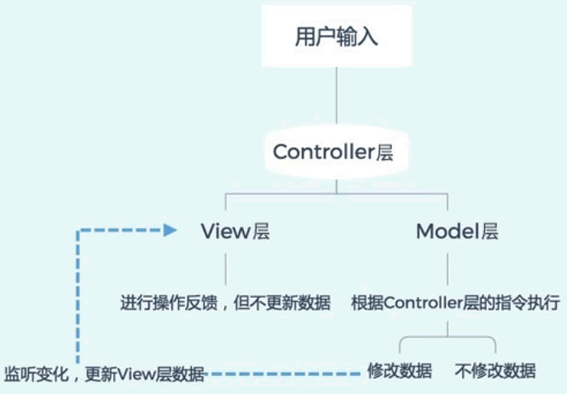
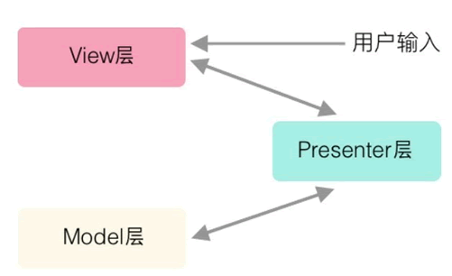
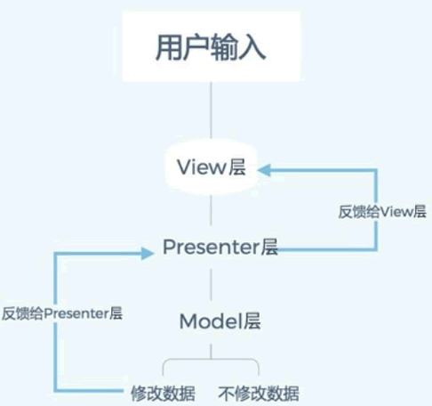
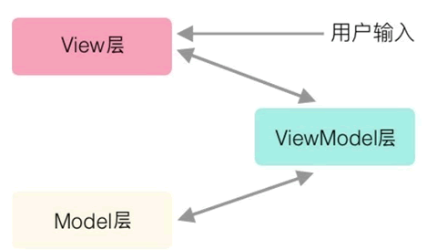
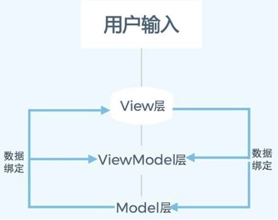
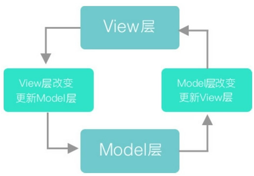

### 框架和设计模式的区别

MVC是一种框架模式，MVC（Model-View-Controller），是模型Model—视图View—控制器Controller，一种软件设计典范，用一种业务逻辑、数据、界面显示分离的方法组织代码，将业务逻辑聚集到一个部件里，在改进和个性化定制界面及用户交互的同时，不需要重新编写业务逻辑。

框架、设计模式这两个概念总容易被混淆，其实它们之间还是有区别的。框架通常是**代码重用**，而设计模式是**设计重用**，架构则介于两者之间，部分代码重用，部分设计重用，有时分析也可重用。

在软件生产中有三种级别的重用：内部重用，即在同一应用中能公共使用的抽象块；代码重用，即将通用模块组合成库或工具集，以便在多个应用和领域都能使用；应用框架的重用，即为专用领域提供通用的或现成的基础结构，以获得最高级别的重用性。

框架与设计模式虽然相似，但却有着根本的不同。**设计模式是对在某种环境中反复出现的问题以及解决该问题的方案的描述**，它比框架更抽象；框架可以用代码表示，也能直接执行或复用，而对模式而言只有实例才能用代码表示;设计模式是比框架更小的元素，一个框架中往往含有一个或多个设计模式，框架总是针对某一特定应用领域，但同一模式却可适用于各种应用。可以说，框架是软件，而设计模式是软件的知识。

框架模式有哪些？

MVC、MTV、[MVP](https://baike.baidu.com/item/MVP/3714550)、CBD、[ORM](https://baike.baidu.com/item/ORM)等等；

框架有哪些？

[C++](https://baike.baidu.com/item/C%2B%2B)语言的QT、MFC、gtk，Java语言的[SSH](https://baike.baidu.com/item/SSH) 、**[SSI](https://baike.baidu.com/item/SSI)**，[php](https://baike.baidu.com/item/php)语言的 smarty(MVC模式)，[python](https://baike.baidu.com/item/python)语言的django(MTV模式)等等

设计模式有哪些？

[工厂模式](https://baike.baidu.com/item/工厂模式)、[适配器模式](https://baike.baidu.com/item/适配器模式/10218946)、策略模式等等

简而言之：框架是大智慧，用来对软件设计进行分工；设计模式是小技巧，对具体问题提出解决方案，以提高代码复用率，降低耦合度。

一个框架里可能有多个设计模式，但是一个设计模式不能够统称为框架。

### MVC框架（Model-View-Controller）

**模型（Model）**：封装的是数据源和所有基于对这些数据的操作。在一个组件中，Model往往表示组件的状态和操作状态的方法。

**视图（View）**：封装的是对数据源Model的一种显示。一个模型可以由多个视图，而一个视图理论上也可以同不同的模型关联起来。

**控制器（Control）**：封装的是外界作用于模型的操作。通常，这些操作会转发到模型上，并调用模型中相应的一个或者多个方法。一般Controller在Model和View之间起到了沟通的作用，处理用户在View上的输入，并转发给Model。这样Model和View两者之间可以做到松散耦合，甚至可以彼此不知道对方，而由Controller连接起这两个部分。

**特点**

　　MVC重要特点就是两种分离：

　　视图和数据模型的分离：使用不同的视图对相同的数据进行展示；分离可视和不可视的组件，能够对模型进行独立测试。因为分离了可视组件减少了外部依赖利于测试。（数据库也是一种外部组件）

　　视图和表现逻辑(Controller)的分离：Controller是一个表现逻辑的组件，并非一个业务逻辑组件。MVC可以作为表现模式也可以作为建构模式，意味这Controller也可以是业务逻辑。分离逻辑和具体展示，能够对逻辑进行独立测试。

　　优点：耦合性低；重用性高；生命周期成本低；部署块；可维护性高；有利软件工程化管理。

　　缺点：没有明确的定义；不适合小型，中等规模的应用程序；增加系统结构和实现的复用性；视图与控制器间的过于紧密的连接；视图对模型数据的低效率访问；一般高级的界面工具或构造器不支持模式。

**MVC的缺点**

​		在MVC里，View是可以直接访问Model的！从而，View里会包含Model信息，不可避免的还要包括一些业务逻辑。 在MVC模型里，更关注的Model的不变，而同时有多个对Model的不同显示，及View。所以，在MVC模型里，Model不依赖于View，但是View是依赖于Model的。不仅如此，因为有一些业务逻辑在View里实现了，导致要更改View也是比较困难的，至少那些业务逻辑是无法重用的。

​		在Android开发中，Activity并不是一个标准的MVC模式中的Controller，它的首要职责是加载应用的布局和初始化用户界面，并接受并处理来自用户的操作请求，进而作出响应。随着界面及其逻辑的复杂度不断提升，Activity类的职责不断增加，以致变得庞大臃肿。

### MVP框架（Model-View-Presenter）

​		在 MVC 框架中，View 层可以通过访问 Model 层来更新，但在 MVP 框架中，View 层不能再直接访问 Model 层，必须通过 Presenter 层提供的接口，然后 Presenter 层再去访问 Model 层。

这看起来有点多此一举，但用处着实不小，主要有两点：

- 首先是因为 Model 层和 View 层都必须通过 Presenter 层来传递信息，所以完全分离了 View 层和 Model 层，也就是说，View 层与 Model 层一点关系也没有，双方是不知道彼此存在的，在它们眼里，只有 Presenter 层。
- 其次，因为 View 层与 Model 层没有关系，所以 View 层可以抽离出来做成组件，在复用性上比 MVC 模型好很多。

​		View 层与 Model 层确实互不干涉，View 层也自由了很多。但还是有问题，因为 View 层和 Model 层都需经过 Presenter 层，致使 Presenter 层比较复杂，维护起来会有一定的问题。而且因为没有绑定数据，所有数据都需要 Presenter 层进行“手动同步”，代码量比较大，虽然比 MVC 模型好很多，但也是有比较多的冗余部分。

​		为了让 View 层和 Model 的数据始终保持一致，避免同步，MVVM 框架出现了。

### MVVM框架

​		MVVM 最早是由微软在使用 Windows Presentation Foundation 和 SilverLight 时定义的，2005 年微软正式宣布 MVVM 的存在。VM 是 ViewModel 层，ViewModel 层把 Model 层和 View 层的数据同步自动化了，解决了 MVP 框架中数据同步比较麻烦的问题，不仅减轻了 ViewModel 层的压力，同时使得数据处理更加方便——只需告诉 View 层展示的数据是 Model 层中的哪一部分即可。

​		读者可能感觉 MVVM 的框架图与 MVP 的框架图相似，确实如此，两者都是从 View 层开始触发用户的操作，之后经过第三层，最后到达 Model 层。但是关键问题是这第三层的内容， ViewModel 层双向绑定了 View 层和 Model 层，因此，随着 View 层的数据变化，系统会自动修改 Model 层的数据，反之同理。而 Presenter 层是采用手动写方法来调用或者修改 View 层和 Model 层，两者孰优孰劣不言而喻。

至于双向数据绑定，可以这样理解：双向数据绑定是一个模板引擎，它会根据数据的变化实时渲染。这种说法可能不是很恰当，但是很好理解，如图8所示。

MVVM 模型中数据绑定方法一般有以下3种：

- 数据劫持
- 发布-订阅模式
- 脏值检查

Vue.js 使用的是数据劫持和发布-订阅模式两种方法。

首先来了解三个概念：

- Observer：数据监听器
- Compiler：指定解析器
- Watcher：订阅者

​        Observer 用于监听数据变化，如果数据发生改变，不论是在 View 层还是 Model 层， Oberver 都会知道，然后告诉 Watcher。Compiler 的作用是对数据进行解析，之后绑定指定的事件，在这里主要用于更新视图。

​        Vue.js 数据绑定的流程：首先将需要绑定的数据用数据劫持方法找出来，之后用 Observer 监听这堆数据，如果数据发生变化，Observer 就会告诉 Watcher，然后 Watcher 会决定让哪个 Compiler 去做出相应的操作，这样就完成了数据的双向绑定。
